LearnTrack ProのAPIテスト環境（Apidog）の構築・運用に関する包括的なドキュメントです。

環境変数の設定から動的値の管理、境界値テストまで、APIテストに必要なすべての情報を網羅しています。

## 目的

1. **効率的なAPIテスト**: 動的値を活用した再利用可能なテストケースの構築
2. **品質保証**: 境界値テストによるバリデーションの網羅的な検証
3. **開発効率化**: 環境変数とスクリプトによる手動作業の削減

---

## ドキュメント一覧

各APIの詳細仕様は以下のドキュメントを参照してください。

### 1. 認証・ユーザー関連API

- [auth-user-api.md](./auth-user-api.md)
- [Notion](https://www.notion.so/API-28a9d86c12e88029a8b0f5076ae4cd50?pvs=21)
- **エンドポイント**: `/sanctum/csrf-cookie`, `/fortify/register`, `/fortify/login`, `/fortify/logout`, `/api/user`
- **ポイント**: CSRF保護、セッション認証、プロフィール更新

### 2. マスターデータAPI

- [master-data-api.md](./master-data-api.md)
- [Notion](https://www.notion.so/API-28a9d86c12e880de9bb5c896c4339848?pvs=21)
- **エンドポイント**: `/api/categories`, `/api/technologies`
- **ポイント**: カテゴリー・技術スタックの取得

### 3. 学習内容管理API

- [learning-contents-api.md](./learning-contents-api.md)
- [Notion](https://www.notion.so/API-28a9d86c12e880d78bc8d04755d4714c?pvs=21)
- **エンドポイント**: `/api/learning-contents`
- **ポイント**: CRUD操作、完了・再開処理

### 4. セクション管理API

- [sections-api.md](./sections-api.md)
- [Notion](https://www.notion.so/API-28a9d86c12e88041b2aec3bf8541859f?pvs=21)
- **エンドポイント**: `/api/learning-contents/{id}/sections`, `/api/sections`
- **ポイント**: 一括更新、順序管理

### 5. 学習記録API

- [learning-sessions-api.md](./learning-sessions-api.md)
- [Notion](https://www.notion.so/API-28a9d86c12e8809aa196dcd5a7bff5c0?pvs=21)
- **エンドポイント**: `/api/learning-sessions`
- **ポイント**: 学習時間の記録と管理

### 6. レポート・統計API

- [reports-api.md](./reports-api.md)
- [Notion](https://www.notion.so/API-28a9d86c12e8808f8669dc4bc3bca1a5?pvs=21)
- **エンドポイント**: `/api/reports/*`
- **ポイント**: 統計データの集計と取得

---

## 全体像

### テストフロー

```mermaid
graph TD
    A[1. CSRF Token取得] --> B[2. ユーザー登録/ログイン]
    B --> C[3. 学習内容作成]
    C --> D[4. セクション操作]
    D --> E[5. 学習記録作成]
    E --> F[6. レポート取得]
    
    A --> A1[XSRF_TOKEN設定]
    B --> B1[auth_email設定]
    C --> C1[learning_content_id設定]
    D --> D1[section_id設定]
    E --> E1[learning_session_id設定]
    
    style A fill:#e1f5ff
    style B fill:#fff3e1
    style C fill:#e8f5e9
    style D fill:#f3e5f5
    style E fill:#ffe1e1
    style F fill:#e1f5e1
```



### 環境変数の依存関係

```mermaid
graph LR
    subgraph 認証系
        XSRF[XSRF_TOKEN]
        AUTH[auth_email]
        IS_AUTH[is_authenticated]
    end
    
    subgraph リソース系
        LC[learning_content_id]
        SEC[section_id]
        LS[learning_session_id]
    end
    
    subgraph セクション管理
        SEC1[section_id_1]
        SEC2[section_id_2]
        SEC3[section_id_3]
        NEXT[next_section_order]
        TOTAL[total_sections]
    end
    
    LC --> SEC
    LC --> SEC1
    LC --> SEC2
    LC --> SEC3
    LC --> NEXT
    LC --> TOTAL
    
    style XSRF fill:#e1f5ff
    style LC fill:#e8f5e9
    style SEC fill:#f3e5f5
```

---

## 環境構築

### 環境の新規作成

- 環境名: ローカルMock
- 環境名: 開発環境

### 環境変数一覧

**基本変数**

| 変数名 | 初期値 | 用途 |
| --- | --- | --- |
| `base_url` | [`http://localhost:8000`](http://localhost:8000) | APIベースURL |
| `frontend_url` | [`http://localhost:5173`](http://localhost:5173) | フロントエンドURL（Referer用） |

**認証系変数（自動設定）**

| 変数名 | 設定タイミング | 用途 |
| --- | --- | --- |
| `XSRF_TOKEN` | CSRF Cookie取得時 | CSRF保護用トークン |
| `auth_email` | ユーザー登録時 | 認証ユーザーのメールアドレス |
| `is_authenticated` | ログイン/ログアウト時 | 認証状態の管理 |

**リソース系変数（自動設定）**

| 変数名 | 設定タイミング | 初期化タイミング |
| --- | --- | --- |
| `learning_content_id` | 学習内容作成時 | 学習内容削除時 |
| `section_id` | 学習内容詳細取得/セクション作成時 | セクション削除時 |
| `section_id_1〜3` | 学習内容詳細取得時 | セクション一括更新時（削除） |
| `next_section_order` | 学習内容詳細取得時 | - |
| `total_sections` | 学習内容詳細取得時 | - |
| `learning_session_id` | 学習記録作成時 | 学習記録削除時 |

**データベース接続用変数**

| 変数名 | 設定値の参照元 |
| --- | --- |
| `db_host` | [`localhost`](http://localhost) |
| `db_name` | **docker-compose.yml**を確認 |
| `db_username` | **docker-compose.yml**を確認 |
| `db_password` | **docker-compose.yml**を確認 |

---

## 共通スクリプト

左メニューの「設定」→「プロジェクトリリース」→「共通スクリプト」から設定

<aside>
📌

**適用範囲の重要事項**

- XSRF-Tokenの取得エンドポイントを除く、すべての処理に適用が必須
</aside>

### Pre-processor: 認証設定

```jsx
// XSRF-TOKEN自動設定
const xsrfToken = pm.environment.get('XSRF_TOKEN');

if (xsrfToken) {
    pm.request.headers.upsert({
        key: 'X-XSRF-TOKEN',
        value: xsrfToken
    });
    console.log("✅ X-XSRF-TOKEN自動設定");
}
```

### Post-processor: 環境変数更新

```jsx
// すべてのAPIレスポンスで実行される共通処理
const newXsrfToken = pm.cookies.get('XSRF-TOKEN');

if (newXsrfToken) {
    const currentToken = pm.environment.get('XSRF_TOKEN');
    if (newXsrfToken !== currentToken) {
        pm.environment.set('XSRF_TOKEN', newXsrfToken);
        console.log("✅ XSRF-TOKEN自動更新");
    }
}
```

---

## 個別スクリプト一覧

### 認証系

**ユーザー登録（POST /fortify/register）Post-processor**

```jsx
if (pm.response.code === 201) {
    const requestBody = JSON.parse(pm.request.body.raw);
    if ([requestBody.email](http://requestBody.email)) {
        pm.environment.set('auth_email', [requestBody.email](http://requestBody.email));
        console.log("✅ auth_email 設定:", [requestBody.email](http://requestBody.email));
    }
}
```

**ログイン（POST /fortify/login）Post-processor**

```jsx
if (pm.response.code === 200) {
    pm.environment.set('is_authenticated', 'true');
    const requestBody = JSON.parse(pm.request.body.raw);
    if ([requestBody.email](http://requestBody.email)) {
        pm.environment.set('auth_email', [requestBody.email](http://requestBody.email));
        console.log("✅ auth_email 設定:", [requestBody.email](http://requestBody.email));
    }
    console.log("✅ ログイン成功");
}
```

**ログアウト（POST /fortify/logout）Post-processor**

```jsx
if (pm.response.code === 204) {
    pm.environment.set('is_authenticated', 'false');
    pm.environment.set('auth_email', '');
    console.log("✅ ログアウト成功");
    console.log("🗑️ auth_email 初期化");
}
```

### 学習内容系

**学習内容作成（POST /api/learning-contents）Post-processor**

```jsx
const response = pm.response.json();

if (pm.response.code === 201 && [response.data](http://response.data) && [response.data.id](http://response.data.id)) {
    pm.environment.set('learning_content_id', [response.data.id](http://response.data.id));
    console.log("✅ learning_content_id 設定:", [response.data.id](http://response.data.id));
    
    if ([response.data](http://response.data).sections && [response.data](http://response.data).sections.length > 0) {
        pm.environment.set('section_id', [response.data](http://response.data).sections[0].id);
        console.log("✅ section_id 設定:", [response.data](http://response.data).sections[0].id);
    }
}
```

**学習内容詳細取得 / セクション一覧取得（GET）Post-processor**

```jsx
const response = pm.response.json();

if (pm.response.code === 200) {
    const sections = [response.data](http://response.data)?.sections || [response.data](http://response.data) || response.sections || response;
    
    if (Array.isArray(sections) && sections.length > 0) {
        pm.environment.set('section_id', sections[0].id);
        console.log("✅ section_id 設定:", sections[0].id);
        
        sections.slice(0, 3).forEach((section, index) => {
            pm.environment.set(`section_id_${index + 1}`, [section.id](http://section.id));
        });
        console.log("✅ section_id_1〜" + Math.min(sections.length, 3) + " 設定完了");
        
        pm.environment.set('total_sections', sections.length);
        console.log("✅ total_sections 設定:", sections.length);
        
        const maxOrder = Math.max(...[sections.map](http://sections.map)(s => s.order));
        pm.environment.set('next_section_order', maxOrder + 1);
        console.log("✅ next_section_order 設定:", maxOrder + 1);
    }
}
```

**学習内容削除（DELETE /api/learning-contents/{id}）Post-processor**

```jsx
if (pm.response.code === 200 || pm.response.code === 204) {
    pm.environment.set('learning_content_id', '');
    pm.environment.set('section_id', '');
    console.log("🗑️ learning_content_id 初期化");
    console.log("🗑️ section_id 初期化");
}
```

### セクション系

**セクション作成（POST /api/sections）Post-processor**

```jsx
const response = pm.response.json();

if (pm.response.code === 201 && [response.data](http://response.data) && [response.data.id](http://response.data.id)) {
    pm.environment.set('section_id', [response.data.id](http://response.data.id));
    console.log("✅ section_id 設定:", [response.data.id](http://response.data.id));
}
```

**セクション削除（DELETE /api/sections/{id}）Post-processor**

```jsx
if (pm.response.code === 200 || pm.response.code === 204) {
    pm.environment.set('section_id', '');
    console.log("🗑️ section_id 初期化");
}
```

**セクション一括更新（PUT）Post-processor**

```jsx
if (pm.response.code === 200) {
    pm.environment.unset('section_id_1');
    pm.environment.unset('section_id_2');
    pm.environment.unset('section_id_3');
    console.log("🗑️ section_id_1〜3 削除（一括更新完了）");
}
```

### 学習記録系

**学習記録作成（POST /api/learning-sessions）Post-processor**

```jsx
const response = pm.response.json();

if (pm.response.code === 201 && [response.data](http://response.data) && [response.data.id](http://response.data.id)) {
    pm.environment.set('learning_session_id', [response.data.id](http://response.data.id));
    console.log("✅ learning_session_id 設定:", [response.data.id](http://response.data.id));
}
```

**学習記録削除（DELETE /api/learning-sessions/{id}）Post-processor**

```jsx
if (pm.response.code === 200 || pm.response.code === 204) {
    pm.environment.set('learning_session_id', '');
    console.log("🗑️ learning_session_id 初期化");
}
```

---

## 境界値テストガイド

### テストケース作成時のチェックリスト

```markdown
- [ ] 正常値（代表値）
- [ ] 最小値
- [ ] 最大値
- [ ] 最小値-1（エラー期待）
- [ ] 最大値+1（エラー期待）
- [ ] NULL/空文字/未定義
- [ ] 型違い（文字列に数値、数値に文字列）
```

### テスト項目の定義

| テスト項目 | 説明 | 期待結果 | 優先度 |
| --- | --- | --- | --- |
| **上限値ちょうど** | 最大文字数ちょうどの値 | ✅ 200 OK | ⭐⭐⭐ |
| **上限値+1** | 最大文字数を1文字超過 | ❌ 422 Error | ⭐⭐⭐⭐⭐ |
| **下限値ちょうど** | 最小文字数ちょうどの値 | ✅ 200 OK | ⭐⭐⭐ |
| **下限値-1** | 最小文字数を1文字下回る | ❌ 422 Error | ⭐⭐⭐ |

### API別境界値一覧

**ユーザー登録（POST /fortify/register）**

| フィールド | 上限値ちょうど | 上限値+1 | 下限値ちょうど | 下限値-1 |
| --- | --- | --- | --- | --- |
| **名前** | 50文字（OK） | 51文字（NG） | 1文字（OK） | 0文字（NG） |
| **メールアドレス** | 255文字（OK） | 256文字（NG） | - | - |
| **パスワード** | 255文字（OK） | 256文字（NG） | 8文字（OK） | 7文字（NG） |

**学習内容作成（POST /api/learning-contents）**

| フィールド | 上限値ちょうど | 上限値+1 |
| --- | --- | --- |
| **タイトル** | 50文字（OK） | 51文字（NG） |
| **概要** | 500文字（OK） | 501文字（NG） |
| **セクション数** | 50個（OK） | 51個（NG） |

**学習記録作成（POST /api/learning-sessions）**

| フィールド | 上限値ちょうど | 上限値+1 | 下限値ちょうど | 下限値-1 |
| --- | --- | --- | --- | --- |
| **メモ** | 500文字（OK） | 501文字（NG） | - | - |
| **学習時間** | 1439分（OK） | 1440分（NG） | 1分（OK） | 0分（NG） |
| **調子評価** | 5（OK） | 6（NG） | 1（OK） | 0（NG） |

### テスト実施の推奨順序

**Phase 0（必須）**

- ✅ **上限値+1テスト**: 最も重要な異常系テスト
    - 全Create/Update APIで実施
    - 422エラーと適切なエラーメッセージの確認

**Phase 1（推奨）**

- **上限値ちょうどテスト**: 正常に登録できることを確認
    - 主要なAPIで実施（ユーザー登録、学習内容作成、学習記録作成）

**Phase 2（オプション）**

- **下限値テスト**: 最小値の動作確認
    - パスワード（8文字/7文字）
    - 学習時間（1分/0分）

---

## テスト実行チェックリスト

### 認証系

- [ ]  CSRF Cookie取得が成功する
- [ ]  ユーザー登録後に `auth_email` が設定される
- [ ]  ログイン後に `is_authenticated` が `true` になる
- [ ]  ログアウト後に `auth_email` が初期化される

### 学習内容系

- [ ]  学習内容作成後に `learning_content_id` が設定される
- [ ]  学習内容詳細取得後に `section_id_1〜3` が設定される
- [ ]  学習内容削除後に `learning_content_id` が初期化される

### セクション系

- [ ]  セクション作成時に `next_section_order` を使用して重複エラーが発生しない
- [ ]  セクション一括更新後に `section_id_1〜3` が削除される

### 学習記録系

- [ ]  学習記録作成後に `learning_session_id` が設定される
- [ ]  学習記録削除後に `learning_session_id` が初期化される

---

## トラブルシューティング

### よくある問題と解決策

- **XSRF-TOKENエラー** → CSRF Cookie取得を最初に実行する
- **認証エラー（401）** → ログイン状態を確認、`is_authenticated` の値をチェック
- **重複エラー（セクションorder）** → 学習内容詳細取得を実行して `next_section_order` を更新
- **環境変数が空** → 対応するAPIを実行して自動設定させる

### 詳細なトラブルシューティング

- 認証関連
  -  [auth-user-api.md](./auth-user-api.md)
  -  [Notion](https://www.notion.so/API-28a9d86c12e88029a8b0f5076ae4cd50?pvs=21)
- 学習内容関連
  -  [learning-contents-api.md](./learning-contents-api.md)
  -  [Notion](https://www.notion.so/API-28a9d86c12e880d78bc8d04755d4714c?pvs=21)
- セクション関連
  -  [sections-api.md](./sections-api.md)
  -  [Notion](https://www.notion.so/API-28a9d86c12e88041b2aec3bf8541859f?pvs=21)
- 学習記録関連
  -  [learning-sessions-api.md](./learning-sessions-api.md)
  -  [Notion](https://www.notion.so/API-28a9d86c12e8809aa196dcd5a7bff5c0?pvs=21)

---

## 参考資料

### 関連ドキュメント

- [OpenAPI Specプロンプト集](https://www.notion.so/OpenAPI-Spec-2689d86c12e8804e8675f773fe7feb09?pvs=21) - Apidog設計時の参考
- テーブル定義書 - データベース設計
  - [database-schema-definition.md](../../databases/database-schema-definition.md)
  - [Notion](https://www.notion.so/2479d86c12e881b7b449dd88e5e6b809?pvs=21)

### 外部リンク

- [Apidog公式ドキュメント](https://docs.apidog.com/)
- [Laravel Sanctum](https://laravel.com/docs/sanctum)

---
