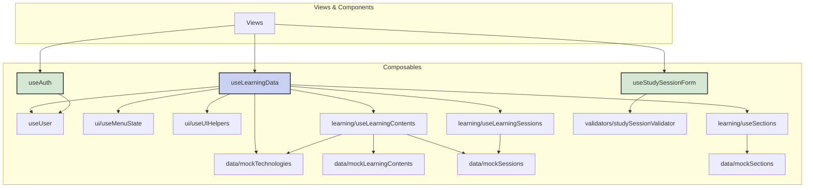

## 相互リンク

[Vueアプリケーションディレクトリ構造](https://www.notion.so/Vue-25a9d86c12e8805483b2e52ec251ff87?pvs=21)

.gemini/docs/architectures/Vueアプリケーションディレクトリ構造.md

---

## 基本方針

このプロジェクトの規模（MVP + 拡張機能）を考慮し、シンプルさと整理のバランスを重視した構造を採用します。

---

## 構造更新プロンプト

```markdown
.gemini/docs/architectures/Vueアプリケーションディレクトリ構造.md

## 指示
`## 現在のディレクトリ構造`と`インポート関係図 `を、現在のディレクトリ構造と突き合わせて更新してください。

### 現在のディレクトリ構造の注意点
- 現時点で未作成のディレクトリやファイルはコメントアウトのまま残してください
- 新しく追加した項目には、必ずそのファイルやディレクトリの役割を簡潔にコメントとして追記してください
- 既存の項目もコメントが不足している場合は補足してください

### **インポート関係図
- composables と validators を中心に、views/components/layouts との依存関係を明示してください
- ダミーデータや将来実装予定の部分は、コメントアウトまたはラベルで区別してください

```

---

## 現在のディレクトリ構造

```bash
src/
├── views/              # ルーティング対象のページ
│   ├── auth/          # 認証関連ページ
│   │   ├── Login.vue
│   │   ├── PasswordReset.vue
│   │   └── Register.vue
│   ├── learning/      # 学習管理関連ページ
│   │   ├── LearningContentCreate.vue
│   │   ├── LearningContentDetail.vue
│   │   ├── LearningContentEdit.vue
│   │   ├── SectionStudyRecords.vue
│   │   ├── StudySessionEdit.vue
│   │   ├── StudySessionForm.vue
│   │   └── StudyProgress.vue
│   ├── user/          # ユーザー関連ページ
│   │   ├── Profile.vue
│   │   └── ProfileEdit.vue
│   ├── Dashboard.vue
│   ├── NotFound.vue
│   └── Reports.vue
│
├── components/         # 再利用可能なUIコンポーネント
│   ├── auth/          # 認証関連コンポーネント
│   ├── charts/        # グラフ関連コンポーネント
│   │   ├── BarChart.vue
│   │   ├── LineChart.vue
│   │   └── PieChart.vue
│   ├── common/        # 汎用コンポーネント
│   │   ├── AppHeader.vue
│   │   ├── AppSidebar.vue
│   │   ├── BaseButton.vue
│   │   ├── ConfirmModal.vue
│   │   ├── DatePickerModal.vue
│   │   ├── Pagination.vue
│   │   ├── SectionSelector.vue
│   │   ├── TimeInputModal.vue
│   │   ├── UserAvatar.vue
│   │   └── buttons/
│   │       ├── BackButton.vue
│   │       ├── CancelButton.vue
│   │       └── DeleteButton.vue
│   └── learning/      # 学習管理関連コンポーネント
│       ├── LearningContentCard.vue
│       ├── StatsOverview.vue
│       ├── StudySessionFormFields.vue
│       └── wizard/
│           ├── SectionListEditor.vue
│           ├── TechnologySelector.vue
│           ├── WizardNavigation.vue
│           └── WizardStepIndicator.vue
│
├── composables/       # 共有ロジック・状態管理 (リファクタリング後)
│   ├── data/          # モックデータ管理
│   │   ├── mockLearningContents.js
│   │   ├── mockSections.js
│   │   ├── mockSessions.js
│   │   └── mockTechnologies.js
│   ├── learning/      # 学習ドメインのコアロジック
│   │   ├── useLearningContents.js
│   │   ├── useLearningSessions.js
│   │   └── useSections.js
│   ├── ui/            # UI状態とヘルパー
│   │   ├── useMenuState.js
│   │   └── useUIHelpers.js
│   ├── useAuth.js     # 認証関連のロジック
│   ├── useLearningContentForm.js # 学習内容フォームのロジック
│   ├── useLearningData.js # 全ての学習データを集約・提供するFacade
│   ├── useStudySessionForm.js # 学習記録フォームのロジック
│   ├── useUser.js     # ユーザー情報の状態管理
│   └── useWizardForm.js # ウィザードフォームのロジック
│
├── layouts/           # レイアウトコンポーネント
│   ├── AuthLayout.vue
│   └── DefaultLayout.vue
│
├── utils/             # ユーティリティ関数
│   └── chartColors.js
│
├── validators/        # バリデーションロジック
│   ├── profileValidator.js
│   └── studySessionValidator.js
│
├── assets/
├── router.js
├── App.vue
├── main.js
└── style.css
```

---

## インポート関係図



---

## なぜこの構造が良いか

1. **直感的な配置**
    - ページは`views/`
    - 部品は`components/`
    - ロジックは`composables/`
2. **適度な整理**
    - 認証関連：`views/auth/`と`components/auth/`
    - 学習関連：`components/learning/`
    - 機能ごとにまとまっているが、過度に複雑ではない
3. **現実的な規模感**
    - `features/`のような深い階層は避ける
    - MVPの規模に適している
    - 将来の拡張も可能

---

## 各ディレクトリの役割

## /views

- ルーターで直接アクセスされるページコンポーネント
- 各ページはレイアウトとコンポーネントを組み合わせる

## /components

- 再利用可能なUIコンポーネント
- 機能別にサブフォルダで整理（auth, learning, common）

## /composables

- Vue 3 Composition APIを使った共有ロジック
- 状態管理、API通信、バリデーションなど

## /layouts

- ページ全体のレイアウトを定義
- ヘッダー、サイドバー、フッターの配置
