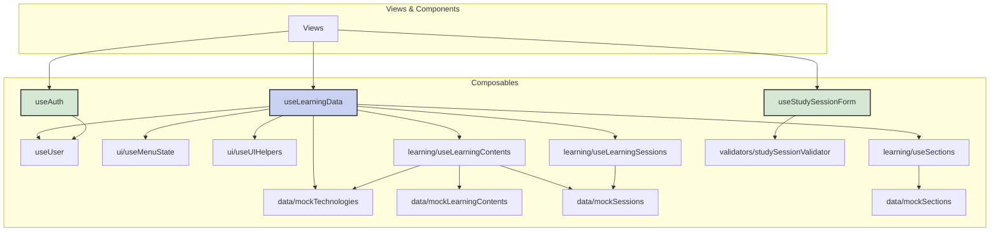

## 相互リンク

[Vueアプリケーションディレクトリ構造](https://www.notion.so/Vue-25a9d86c12e8805483b2e52ec251ff87?pvs=21)

.gemini/docs/architectures/Vueアプリケーションディレクトリ構造.md

---

## 基本方針

このプロジェクトの規模（MVP + 拡張機能）を考慮し、シンプルさと整理のバランスを重視した構造を採用します。

---

## 構造更新プロンプト

```markdown
.gemini/docs/architectures/Vueアプリケーションディレクトリ構造.md

## 指示
`## 現在のディレクトリ構造`と`インポート関係図 `を、現在のディレクトリ構造と突き合わせて更新してください。

### 現在のディレクトリ構造の注意点
- 現時点で未作成のディレクトリやファイルはコメントアウトのまま残してください
- 新しく追加した項目には、必ずそのファイルやディレクトリの役割を簡潔にコメントとして追記してください
- 既存の項目もコメントが不足している場合は補足してください

### **インポート関係図
- composables と validators を中心に、views/components/layouts との依存関係を明示してください
- ダミーデータや将来実装予定の部分は、コメントアウトまたはラベルで区別してください

```

---

## 現在のディレクトリ構造

```bash
src/
├── views/              # ルーティング対象のページ
│   ├── auth/          # 認証関連ページ
│   │   ├── Login.vue          # ログイン画面
│   │   ├── PasswordReset.vue  # パスワードリセット画面
│   │   └── Register.vue       # 新規登録画面
│   ├── learning/      # 学習管理関連ページ
│   │   ├── LearningContentCreate.vue  # 学習内容新規作成画面
│   │   ├── LearningContentDetail.vue  # 学習内容詳細画面
│   │   ├── LearningContentEdit.vue    # 学習内容編集画面
│   │   ├── SectionStudyRecords.vue    # セクション別学習記録一覧画面
│   │   ├── StudyProgress.vue          # 個別レポート画面
│   │   ├── StudySessionEdit.vue       # 学習記録編集画面
│   │   └── StudySessionForm.vue       # 学習記録作成画面
│   ├── user/          # ユーザー関連ページ
│   │   ├── Profile.vue        # プロフィール表示画面
│   │   └── ProfileEdit.vue    # プロフィール編集画面
│   ├── Dashboard.vue   # ダッシュボード画面
│   ├── NotFound.vue    # 404 Not Found画面
│   └── Reports.vue     # 全体レポート画面
│
├── components/         # 再利用可能なUIコンポーネント
│   ├── auth/          # 認証関連コンポーネント (未実装)
│   ├── charts/        # グラフ関連コンポーネント
│   │   ├── BarChart.vue   # 棒グラフコンポーネント
│   │   ├── LineChart.vue  # 折れ線グラフコンポーネント
│   │   └── PieChart.vue   # 円グラフコンポーネント
│   ├── common/        # 汎用コンポーネント
│   │   ├── AppHeader.vue      # アプリケーションヘッダー
│   │   ├── AppSidebar.vue     # アプリケーションサイドバー
│   │   ├── BaseButton.vue     # 基本ボタンコンポーネント
│   │   ├── ConfirmModal.vue   # 確認モーダルコンポーネント
│   │   ├── DatePickerModal.vue # 日付選択モーダルコンポーネント
│   │   ├── Pagination.vue     # ページネーションコンポーネント
│   │   ├── SectionSelector.vue # セクション選択ドロップダウン
│   │   ├── TimeInputModal.vue # 時間入力モーダルコンポーネント
│   │   ├── UserAvatar.vue     # ユーザーアバターコンポーネント
│   │   └── buttons/           # ボタン群
│   │       ├── BackButton.vue   # 戻るボタン
│   │       ├── CancelButton.vue # キャンセルボタン
│   │       └── DeleteButton.vue # 削除ボタン
│   └── learning/      # 学習管理関連コンポーネント
│       ├── LearningContentCard.vue    # 学習コンテンツカード
│       ├── StatsOverview.vue          # 統計概要コンポーネント
│       ├── StudySessionFormFields.vue # 学習記録フォームフィールド
│       └── wizard/                    # ウィザード形式のコンポーネント
│           ├── SectionListEditor.vue    # セクションリスト編集
│           ├── TechnologySelector.vue   # 技術選択ドロップダウン
│           ├── WizardNavigation.vue     # ウィザードナビゲーションボタン
│           └── WizardStepIndicator.vue  # ウィザードステップインジケーター
│
├── composables/       # 共有ロジック・状態管理
│   ├── data/          # モックデータ管理
│   │   ├── mockLearningContents.js # モック学習コンテンツデータ
│   │   ├── mockSections.js         # モックセクションデータ
│   │   ├── mockSessions.js         # モック学習セッションデータ
│   │   └── mockTechnologies.js     # モック技術データ
│   ├── learning/      # 学習ドメインのコアロジック
│   │   ├── useLearningContents.js  # 学習コンテンツ関連ロジック
│   │   ├── useLearningSessions.js  # 学習セッション関連ロジック
│   │   └── useSections.js          # セクション関連ロジック
│   ├── ui/            # UI状態とヘルパー
│   │   ├── useMenuState.js # メニュー状態管理ロジック
│   │   └── useUIHelpers.js # UIヘルパー関数
│   ├── useAuth.js     # 認証関連のロジック（ログイン、ログアウト、ユーザー登録など）
│   ├── useLearningContentForm.js # 学習内容フォームのロジックとバリデーション
│   ├── useLearningData.js # 全ての学習データを集約・提供するFacade（データ操作のハブ）
│   ├── useStudySessionForm.js # 学習記録フォームのロジックとバリデーション
│   ├── useUser.js     # ユーザー情報の状態管理とプロフィール更新ロジック
│   └── useWizardForm.js # ウィザード形式のフォームのステップ管理とバリデーション
│
├── layouts/           # レイアウトコンポーネント
│   ├── AuthLayout.vue      # 認証画面用レイアウト
│   ├── DashboardLayout.vue # ダッシュボード画面用レイアウト
│   ├── DefaultLayout.vue   # デフォルトレイアウト
│   └── DetailLayout.vue    # 詳細画面用レイアウト
│
├── utils/             # ユーティリティ関数
│   ├── chartColors.js # チャートの色定義
│   └── dateFormatters.js # 日付と時刻のフォーマット関数
│
├── validators/        # バリデーションロジック
│   ├── profileValidator.js    # プロフィール関連のバリデーション
│   └── studySessionValidator.js # 学習セッション関連のバリデーション
│
├── assets/            # 静的アセット
├── router.js          # Vue Router設定
├── App.vue            # ルートコンポーネント
├── main.js            # エントリーポイント
└── style.css          # グローバルスタイル
```

---

## インポート関係図



---

## なぜこの構造が良いか

1. **直感的な配置**
    - ページは`views/`
    - 部品は`components/`
    - ロジックは`composables/`
2. **適度な整理**
    - 認証関連：`views/auth/`と`components/auth/`
    - 学習関連：`components/learning/`
    - 機能ごとにまとまっているが、過度に複雑ではない
3. **現実的な規模感**
    - `features/`のような深い階層は避ける
    - MVPの規模に適している
    - 将来の拡張も可能

---

## 各ディレクトリの役割

## /views

- ルーターで直接アクセスされるページコンポーネント
- 各ページはレイアウトとコンポーネントを組み合わせる

## /components

- 再利用可能なUIコンポーネント
- 機能別にサブフォルダで整理（auth, learning, common）

## /composables

- Vue 3 Composition APIを使った共有ロジック
- 状態管理、API通信、バリデーションなど

## /layouts

- ページ全体のレイアウトを定義
- ヘッダー、サイドバー、フッターの配置
