## 相互リンク

[Vueアプリケーションディレクトリ構造](https://www.notion.so/Vue-25a9d86c12e8805483b2e52ec251ff87?pvs=21)

.gemini/docs/architectures/Vueアプリケーションディレクトリ構造.md

---

## 基本方針

このプロジェクトの規模（MVP + 拡張機能）を考慮し、シンプルさと整理のバランスを重視した構造を採用します。

---

## 構造更新プロンプト

```markdown
.gemini/docs/architectures/Vueアプリケーションディレクトリ構造.md

## 指示
1. `tree ./resources/js/ -a -L 3 --dirsfirst -I 'node_modules|.git|*.backup'`コマンドを実行してください。
2. `## 現在のディレクトリ構造`を、treeコマンドの結果と突き合わせて更新してください。
3. 追加ファイルとディレクトリがない場合は報告してください。

### 注意点
- 更新する際はディレクトリの並び順は変更しないでください
- 新しく追加した項目には、必ずそのファイルやディレクトリの役割を簡潔にコメントとして追記してください
- 既存の項目もコメントが不足している場合は補足してください。ただし現在のコメントのように簡潔な内容を心がけてください
```

```markdown
.gemini/docs/architectures/Vueアプリケーションディレクトリ構造.md

## 指示
- インポート関係図 `を、現在のディレクトリ構造と突き合わせて更新してください。

### 注意点
- composables と validators を中心に、views/components/layouts との依存関係を明示してください
- ダミーデータや将来実装予定の部分は、コメントアウトまたはラベルで区別してください

```

---

## 現在のディレクトリ構造

```bash
resources/js/
├── api/                                     # APIクライアント定義
│   ├── learningContent.js                   # 学習コンテンツ関連API
│   ├── learningSession.js                   # 学習セッション関連API
│   ├── reports.js                           # レポート関連API
│   └── sections.js                          # セクション関連API
│
├── components/                              # 再利用可能なUIコンポーネント
│   ├── charts/                              # グラフ関連コンポーネント
│   │   ├── BarChart.vue                     # 棒グラフコンポーネント
│   │   ├── LineChart.vue                    # 折れ線グラフコンポーネント
│   │   └── PieChart.vue                     # 円グラフコンポーネント
│   │
│   ├── common/                              # 汎用コンポーネント
│   │   ├── buttons/                         # ボタン群
│   │   │   ├── BackButton.vue               # 戻るボタン
│   │   │   ├── CancelButton.vue             # キャンセルボタン
│   │   │   └── DeleteButton.vue             # 削除ボタン
│   │   ├── AppHeader.vue                    # アプリケーションヘッダー
│   │   ├── AppSidebar.vue                   # アプリケーションサイドバー
│   │   ├── BaseButton.vue                   # 基本ボタンコンポーネント
│   │   ├── ConfirmModal.vue                 # 確認モーダルコンポーネント
│   │   ├── DatePickerModal.vue              # 日付選択モーダルコンポーネント
│   │   ├── LoadingSpinner.vue               # ローディングスピナー
│   │   ├── Pagination.vue                   # ページネーションコンポーネント
│   │   ├── SectionSelector.vue              # セクション選択ドロップダウン
│   │   ├── TimeInputModal.vue               # 時間入力モーダルコンポーネント
│   │   └── UserAvatar.vue                   # ユーザーアバターコンポーネント
│   │
│   ├── layout/                              # レイアウト関連コンポーネント
│   │   ├── DetailBreadcrumb.vue             # 詳細画面のパンくずリスト
│   │   └── DetailSectionHeader.vue          # 詳細画面のセクションヘッダー
│   │
│   └── learning/                            # 学習管理関連コンポーネント
│       ├── wizard/                          # ウィザード形式のコンポーネント
│       │   ├── SectionListEditor.vue        # セクションリスト編集
│       │   ├── TechnologySelector.vue       # 技術選択ドロップダウン
│       │   ├── WizardNavigation.vue         # ウィザードナビゲーションボタン
│       │   └── WizardStepIndicator.vue      # ウィザードステップインジケーター
│       ├── LearningContentCard.vue          # 学習コンテンツカード
│       ├── StatsOverview.vue                # 統計概要コンポーネント
│       └── StudySessionFormFields.vue       # 学習記録フォームフィールド
│
├── composables/                             # 共有ロジック・状態管理（Vue Composition APIを活用）
│   ├── data/                                # アプリケーションのモックデータ管理
│   │   ├── mockCategories.js                # カテゴリーのモックデータ定義
│   │   ├── mockLearningContents.js          # 学習コンテンツのモックデータ定義
│   │   ├── mockSessions.js                  # 学習セッションのモックデータ定義
│   │   ├── mockTechnologies.js              # 技術のモックデータ定義
│   │   └── mockUsers.js                     # ユーザーのモックデータ定義
│   │
│   ├── learning/                            # 学習ドメイン固有のコアロジック
│   │   ├── useLearningContents.js           # 学習コンテンツのCRUD操作と関連ロジック
│   │   ├── useLearningSessions.js           # 学習セッション（記録）のCRUD操作と関連ロジック
│   │   └── useSections.js                   # セクションのCRUD操作と関連ロジック
│   │
│   ├── ui/                                  # UIの状態管理とヘルパー関数
│   │   ├── useLoading.js                    # ローディング状態管理
│   │   └── useMenuState.js                  # グローバルなメニュー開閉状態管理ロジック
│   ├── .DS_Store                            # macOSの隠しファイル
│   ├── useAuth.js                           # 認証（ログイン、ログアウト、登録）と認証状態管理ロジック
│   ├── useLearningContentForm.js            # 学習内容フォームのデータ管理、初期化、バリデーションロジック
│   ├── useLearningData.js                   # 全ての学習関連データを集約・提供するファサード（データ操作のハブ）
│   ├── useSectionStatus.js                  # セクションのステータス管理、完了判定、統計計算ロジック
│   ├── useStudySessionForm.js               # 学習記録フォームのデータ管理、初期化、バリデーションロジック
│   ├── useUser.js                           # ユーザー情報の状態管理、プロフィール更新、イニシャル生成ロジック
│   └── useWizardForm.js                     # ウィザード形式フォームのステップ管理とバリデーション実行ロジック
│
├── layouts/                                 # レイアウトコンポーネント
│   ├── AuthLayout.vue                       # 認証画面用レイアウト
│   ├── DashboardLayout.vue                  # ダッシュボード画面用レイアウト
│   ├── DefaultLayout.vue                    # デフォルトレイアウト
│   ├── DetailLayout.vue                     # 詳細画面用レイアウト
│   └── MultiCardDetailLayout.vue            # 複数カード表示用レイアウト
│
├── stores/                                  # Piniaストア
│   ├── auth.js                              # 認証状態管理ストア
│   ├── learningContent.js                   # 学習コンテンツの状態管理ストア
│   ├── learningSession.js                   # 学習セッションの状態管理ストア
│   ├── masterData.js                        # マスターデータ（カテゴリー、技術）の状態管理ストア
│   ├── reports.js                           # レポート関連ストア
│   └── sections.js                          # セクションの状態管理ストア
│
├── utils/                                   # ユーティリティ関数
│   ├── chartColors.js                       # チャートの色定義
│   └── dateFormatters.js                    # 日付と時刻のフォーマット関数
│
├── validators/                              # フォーム入力のバリデーションロジック
│   ├── profileValidator.js                  # ユーザープロフィール関連の入力値バリデーション
│   └── studySessionValidator.js             # 学習セッション（記録）関連の入力値バリデーション
│
├── views/                                   # ルーティング対象のページ
│   ├── auth/                                # 認証関連ページ
│   │   ├── Login.vue                        # ログイン画面
│   │   ├── PasswordReset.vue                # パスワードリセット画面
│   │   └── Register.vue                     # 新規登録画面
│   │
│   ├── learning/                            # 学習管理関連ページ
│   │   ├── LearningContentCreate.vue        # 学習内容新規作成画面
│   │   ├── LearningContentDetail.vue        # 学習内容詳細画面
│   │   ├── LearningContentEdit.vue          # 学習内容編集画面
│   │   ├── SectionStudyRecords.vue          # セクション別学習記録一覧画面
│   │   ├── StudyProgress.vue                # 個別レポート画面
│   │   ├── StudySessionEdit.vue             # 学習記録編集画面
│   │   └── StudySessionForm.vue             # 学習記録作成画面
│   │
│   ├── user/                                # ユーザー関連ページ
│   │   ├── Profile.vue                      # プロフィール表示画面
│   │   └── ProfileEdit.vue                  # プロフィール編集画面
│   │
│   ├── Dashboard.vue                        # ダッシュボード画面
│   ├── NotFound.vue                         # 404 Not Found画面
│   └── Reports.vue                          # 全体レポート画面
│
├── app.js                                   # Vueアプリケーションのエントリーポイント
├── App.vue                                  # ルートコンポーネント
├── bootstrap.js                             # アプリケーションの初期設定（Axiosなど）
└── router.js                                # Vue Router設定

```

---

## インポート関係図

```mermaid
graph TD
    subgraph Composables
        A[useLearningData] --> B[useUser]
        A --> C[ui/useMenuState]
        A --> E[learning/useLearningContents]
        A --> F[learning/useSections]
        A --> G[learning/useLearningSessions]
        A --> P[useSectionStatus]

        E --> I[api/learningContent]

        F --> K[api/sections]

        G --> J[api/learningSession]

        L[useAuth] --> B
        M[useStudySessionForm] --> N[validators/studySessionValidator]
        O[useLearningContentForm]
        Q[useWizardForm]

        B --> R[stores/auth]
        S[stores/masterData]
        T[stores/reports]

    end

    subgraph API
        I
        J
        K
    end

    subgraph Stores
        R
        S
        T
    end

    subgraph Validators
        N[studySessionValidator]
        U[profileValidator]
    end

    subgraph Views & Components
        V[Views & Components] --> A
        V --> L
        V --> M
        V --> O
        V --> Q
        V --> P
        V --> U
        V --> S
        V --> T
    end

    style A fill:#c9d1f3,stroke:#333,stroke-width:2px
    style L fill:#d5e8d4,stroke:#333,stroke-width:2px
    style M fill:#d5e8d4,stroke:#333,stroke-width:2px
    style P fill:#c9d1f3,stroke:#333,stroke-width:2px
    style O fill:#d5e8d4,stroke:#333,stroke-width:2px
    style Q fill:#d5e8d4,stroke:#333,stroke-width:2px
    style N fill:#f8d5d5,stroke:#333,stroke-width:2px
    style U fill:#f8d5d5,stroke:#333,stroke-width:2px
    style I fill:#e0e0e0,stroke:#333,stroke-width:1px
    style J fill:#e0e0e0,stroke:#333,stroke-width:1px
    style K fill:#e0e0e0,stroke:#333,stroke-width:1px
    style R fill:#e0e0e0,stroke:#333,stroke-width:1px
    style S fill:#e0e0e0,stroke:#333,stroke-width:1px
    style T fill:#e0e0e0,stroke:#333,stroke-width:1px
```



---

## なぜこの構造が良いか

1. **直感的な配置**
    - ページは`views/`
    - 部品は`components/`
    - ロジックは`composables/`
2. **適度な整理**
    - 認証関連：`views/auth/`と`components/auth/`
    - 学習関連：`components/learning/`
    - 機能ごとにまとまっているが、過度に複雑ではない
3. **現実的な規模感**
    - `features/`のような深い階層は避ける
    - MVPの規模に適している
    - 将来の拡張も可能

---

## 各ディレクトリの役割

## /views

- ルーターで直接アクセスされるページコンポーネント
- 各ページはレイアウトとコンポーネントを組み合わせる

## /components

- 再利用可能なUIコンポーネント
- 機能別にサブフォルダで整理（auth, learning, common）

## /composables

- Vue 3 Composition APIを使った共有ロジック
- 状態管理、API通信、バリデーションなど

## /layouts

- ページ全体のレイアウトを定義
- ヘッダー、サイドバー、フッターの配置
