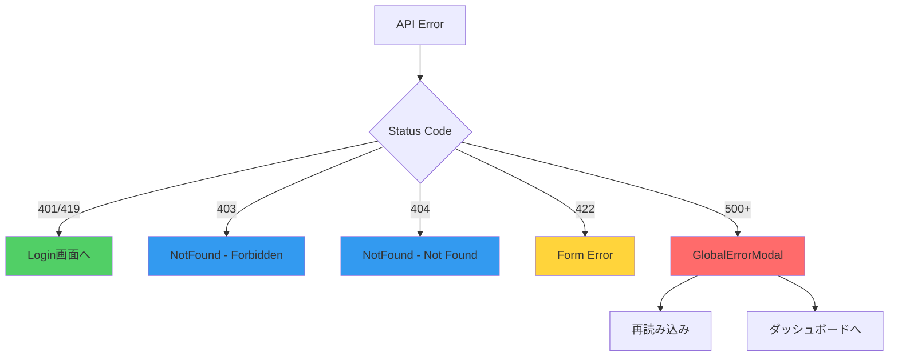

## 1. 概要

本ドキュメントは、アプリケーション全体で統一されたエラーハンドリングを実現するための実装仕様を定める。

個人開発プロジェクトの特性を考慮し、現実的に発生しうるエラーのみを対象とする。

---

## 2. 基本方針

### 2.1 対応するエラーの選定基準

- 実際に発生する可能性が高いエラーのみ対応
- ユーザーに適切なフィードバックを提供できるもの
- 個人開発の工数を考慮し、優先度の高いものに絞る

### 2.2 表示方法の統一

- モーダルまたはコンポーネント表示で統一
- トースト通知は使用しない（視認性が低く、デザインに合わないため）

### 2.3 アプリケーション構成の特性

- Laravel（バックエンド）とVue（フロントエンド）は同一サーバー上に配置
- モノリシックSPA構成
- Laravelが停止した場合、Vueも表示されない
- ネットワークエラー（クライアント側）の優先度は低い

---

## 3. 対応するHTTPステータスコード

### 3.1 401 Unauthorized / 419 CSRF Token Mismatch

**発生条件**:

- セッションタイムアウト
- 未認証状態でのAPIアクセス
- CSRFトークン不一致

**発生可能性**: 高い

**対応方法**:

- ログイン画面へ自動リダイレクト
- ユーザーへのメッセージ表示は不要（リダイレクトで状況が明確）

**実装場所**: Axios Interceptor

---

### 3.2 403 Forbidden

**発生条件**:

- 他ユーザーのリソースへのアクセス
- URL直接入力による不正アクセス

**発生可能性**: 低〜中（URL誤参照は現実的に発生）

**対応方法**:

- エラーモーダル表示
- モーダルを閉じたらダッシュボードへリダイレクト

**モーダル内容**:

- タイトル: 「アクセスできません」
- メッセージ: 「このページにアクセスする権限がありません」
- ボタン: [ダッシュボードへ戻る]

**実装場所**: Axios Interceptor

---

### 3.3 404 Not Found

**発生条件**:

- 削除済みデータへのアクセス
- 存在しないIDの指定
- ブックマークした削除済みページへのアクセス

**発生可能性**: 中〜高

**対応方法**:

- エラーモーダル表示
- モーダルを閉じたらダッシュボードへリダイレクト

**モーダル内容**:

- タイトル: 「データが見つかりません」
- メッセージ: 「お探しのデータは削除されたか、存在しない可能性があります」
- ボタン: [ダッシュボードへ戻る]

**実装場所**: Axios Interceptor

---

### 3.4 422 Unprocessable Entity

**発生条件**:

- バリデーションエラー
- フロントエンドのバリデーションをバイパスした不正なリクエスト

**発生可能性**: 低（フロントエンドで事前検証済み）

**対応方法**:

- 既存実装を維持（各フォームコンポーネントでエラー表示）
- 新規実装は不要

**実装場所**: 各フォームコンポーネント（実装済み）

---

### 3.5 429 Too Many Requests

**発生条件**:

- レート制限超過（例: ログイン試行の繰り返し）

**発生可能性**: 極めて低（個人利用アプリ）

**対応方法**:

- 実装しない

---

### 3.6 500 Internal Server Error

**発生条件**:

- データベース接続エラー
- サーバー側の未処理例外
- コードのバグ

**発生可能性**: 中〜高（開発中、デプロイ直後）

**対応方法**:

- エラーモーダル表示
- 再読み込みまたはダッシュボードへの移動を選択可能

**モーダル内容**:

- タイトル: 「エラーが発生しました」
- メッセージ: 「サーバーエラーが発生しました」
- ボタン:
    - [ページを再読み込み]
    - [ダッシュボードへ戻る]

**実装場所**: Axios Interceptor

**注意事項**:

- DELETE処理時の削除確認モーダルとの連携は別途調整が必要（実装時に検討）

---

### 3.7 その他のステータスコード

**対応方法**:

- 想定外のエラーとして500エラーと同じ扱い

---

## 4. 実装コンポーネント

### 4.1 Axios Interceptor

**ファイルパス**: `resources/js/plugins/axios.js`

**役割**:

- 全APIリクエストのレスポンスを監視
- エラー発生時に適切な処理を実行
- エラー種別に応じて適切な画面へ遷移またはモーダル表示

**処理フロー**:

```
APIレスポンス受信
  ↓
ステータスコード判定
  ↓
401/419 → ログイン画面へリダイレクト
403 → NotFound.vue へ遷移（type=forbidden）
404 → NotFound.vue へ遷移（type=notfound）
500 → GlobalErrorModal表示（再読み込み/ダッシュボード選択）
その他 → 500と同じ処理
```

---

### 4.2 NotFound.vue（既存改修）

**ファイルパス**: `resources/js/views/NotFound.vue`

**対象エラー**: 403 Forbidden / 404 Not Found

**役割**:

- クエリパラメータ（type）に応じて動的にエラー内容を表示
- ダッシュボードへの戻りボタンを提供

**表示内容**:

- 403の場合:
    - タイトル: 「アクセスできません」
    - メッセージ: 「このページにアクセスする権限がありません」
- 404の場合:
    - タイトル: 「データが見つかりません」
    - メッセージ: 「お探しのデータは削除されたか、存在しない可能性があります」
- ボタン: [ダッシュボードへ戻る]

---

### 4.3 GlobalErrorModal.vue（新規作成）

**ファイルパス**: `resources/js/components/common/GlobalErrorModal.vue`

**対象エラー**: 500 Internal Server Error

**役割**:

- 500エラー専用のモーダル表示
- ユーザーに再読み込みまたはダッシュボードへの移動を選択させる

**表示内容**:

- タイトル: 「エラーが発生しました」
- メッセージ: 「サーバーエラーが発生しました」
- ボタン:
    - [ページを再読み込み]
    - [ダッシュボードへ戻る]

---

### 4.4 エラーモーダルストア

**ファイルパス**: `resources/js/stores/errorModal.js`

**役割**:

- GlobalErrorModalの表示状態を管理
- モーダルの表示/非表示を制御

**状態**:

- `isVisible`: モーダルの表示状態

---

## 5. エラー表示パターン

### 5.1 全体エラー表示

**適用シーン**:

- ページ読み込み時に全てのデータ取得が失敗
- いずれか1つでもAPI取得に失敗した場合

**表示方法**:

- ページ全体にエラーモーダルを表示
- 部分的なデータは表示しない

**理由**:

- 学習記録管理アプリではデータの整合性が重要
- 部分的なデータ表示は誤解を招く

---

### 5.2 個別エラー表示

**適用シーン**:

- フォーム送信時のバリデーションエラー（422）

**表示方法**:

- フォーム内に個別のエラーメッセージを表示
- 既存実装を維持

---

## 6. 実装の優先順位

| 優先度 | ステータスコード | 工数 |
| --- | --- | --- |
| 高 | 401/419 | 0.5日 |
| 中 | 403 | 0.5日 |
| 中 | 404 | 0.5日 |
| 高 | 500 | 1日 |
| 低 | 422 | 実装済み |
| - | 429 | 実装しない |

**合計工数**: 約2日

---

## 7. 実装手順

### ステップ1: Axios Interceptorの実装

- エラー判定ロジックの実装
- 各エラーに応じた処理の分岐

### ステップ2: グローバルエラーモーダルの実装

- コンポーネントの作成
- 動的な表示内容の切り替え

### ステップ3: エラーモーダルストアの実装

- Piniaストアの作成
- 状態管理ロジックの実装

### ステップ4: 統合テスト

- 各エラーパターンの動作確認
- モーダル表示の検証

---

## 8. 保留事項

### DELETE処理時の削除確認モーダルとの連携

**課題**:

- 削除確認モーダル表示中に500エラーが発生した場合
- 2つのモーダルが重なる可能性

**対応方針**:

- 実装フェーズで詳細を検討
- 削除確認モーダルを閉じてから500エラーモーダルを表示する方向

---

## 9. テスト方法

### 9.1 手動テスト項目

| テストケース | 確認内容 |
| --- | --- |
| セッションタイムアウト | ログイン画面へリダイレクト |
| 他ユーザーのURL参照 | 403モーダル表示 |
| 削除済みデータアクセス | 404モーダル表示 |
| サーバーエラー発生 | 500モーダル表示、再読み込み/ダッシュボード動作 |

### 9.2 Apidogでのテスト

**可能な方法**:

- モックサーバーで任意のHTTPステータスコードを返すエンドポイントを作成
- 422、500などを意図的に返してフロントエンドの動作を確認

**今回は実施しない理由**:

- Laravel側で`abort(500)`を使った実際のAPIエンドポイントでテスト済み
- 実際のコントローラーでエラーを発生させる方が、本番環境に近い検証ができる
- モックは「実際のAPI実装前」のフロントエンド先行開発で有効だが、今回は両方実装済み
- 手動テスト（9.1）で十分な品質保証ができている

---

## 10. 実装された機能まとめ



**詳細テスト結果**:

全テスト項目の詳細は[APIエラーハンドリング手動テストリスト](https://www.notion.so/API-c4c56afcb55b45d9af6f9b96e1771e4a?pvs=21)を参照
