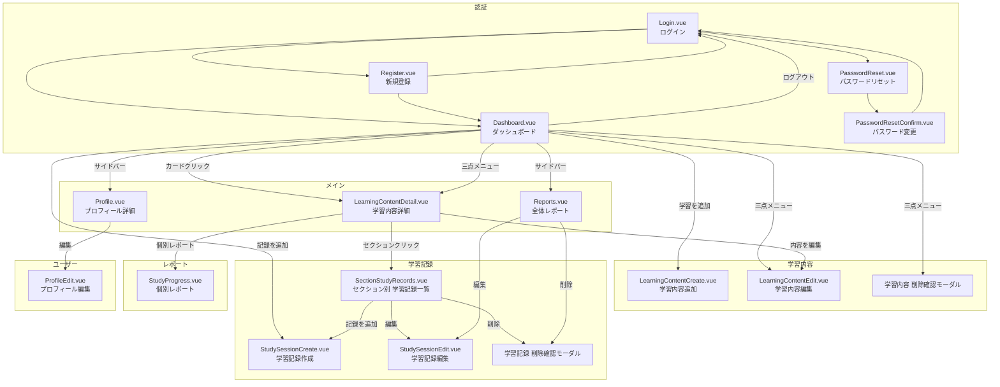

## 認証関連

### Login.vue - ログインページ

```markdown
┌──────────────────────────────────────────────────────────────┐
│                         Login.vue                            │
│                     (灰色背景・中央配置)                        │
│                                                               │
│         ┌────────────────────────────────────┐               │
│         │        白い角丸カード (max-w-md)     │                │
│         │                                    │               │
│         │           LearnTrack Pro           │               │
│         │         (グラデーション文字)          │               │
│         │         アカウントにログイン          │                │
│         │                                    │               │
│         │  ┌─────────────────────────────┐   │               │
│         │  │ ⚠️ 入力エラー                 │  │                │
│         │  │ • メールアドレスは必須です      │   │               │
│         │  └─────────────────────────────┘   │               │
│         │                                    │               │
│         │  メールアドレス                      │                │
│         │  ┌─────────────────────────────┐   │               │
│         │  │ email@example.com           │   │                │
│         │  └─────────────────────────────┘   │               │
│         │                                    │               │
│         │  パスワード                         │                │
│         │  ┌─────────────────────────────┐   │               │
│         │  │ ••••••••••           [👁]   │   │               │
│         │  └─────────────────────────────┘   │               │
│         │                                    │               │
│         │  パスワードを忘れた方 →               │               │
│         │                                    │               │
│         │  ┌─────────────────────────────┐   │               │
│         │  │      🔒 ログイン             │   │                │
│         │  └─────────────────────────────┘   │               │
│         │                                    │               │
│         │   アカウントをお持ちでないですか？      │                │
│         │      新規登録はこちら →               │               │
│         └────────────────────────────────────┘               │
└──────────────────────────────────────────────────────────────┘

```

### Register.vue - 新規登録ページ

```markdown
┌─────────────────────────────────────────────────────────┐
│                    LearnTrack Pro                       │
│                  (グラデーション文字)                      │
│                 新しいアカウントを作成                      │
│                                                         │
│ ┌─────────────────────────────────────────────────────┐ │
│ │ ⚠️ 入力エラー                                         │ │
│ │ • 名前は必須です                                      │ │
│ │ • パスワードが一致しません                              │ │
│ └─────────────────────────────────────────────────────┘ │
│                                                         │
│ 名前*                                                    │
│ ┌─────────────────────────────────────────────────────┐ │
│ │ 山田太郎                                             │ │
│ └─────────────────────────────────────────────────────┘ │
│                                                         │
│ メールアドレス*                                             │
│ ┌─────────────────────────────────────────────────────┐ │
│ │ email@example.com                                   │ │
│ └─────────────────────────────────────────────────────┘ │
│                                                         │
│ パスワード*                                               │
│ ┌─────────────────────────────────────────────────────┐ │
│ │ ••••••••••                                    [👁]  │ │
│ └─────────────────────────────────────────────────────┘ │
│                                                         │
│ パスワード確認*                                             │
│ ┌─────────────────────────────────────────────────────┐ │
│ │ ••••••••••                                    [👁]  │ │
│ └─────────────────────────────────────────────────────┘ │
│                                                         │
│ ┌─────────────────────────────────────────────────────┐ │
│ │                   👤+ 登録する                        │ │
│ └─────────────────────────────────────────────────────┘ │
│                                                         │
│               すでにアカウントをお持ちですか？                │
│                   ログインはこちら →                       │
└─────────────────────────────────────────────────────────┘

```

### PasswordReset.vue - パスワード再設定ページ

```markdown
┌─────────────────────────────────────────────────────────┐
│                    LearnTrack Pro                       │
│                  (グラデーション文字)                      │
│                  パスワードをリセット                       │
│                                                         │
│ ┌─────────────────────────────────────────────────────┐ │
│ │ ✅ 成功メッセージ                                      │ │
│ │ パスワードリセットのメールを送信しました。                 │ │
│ └─────────────────────────────────────────────────────┘ │
│                                                         │
│ メールアドレス                                             │
│ ┌─────────────────────────────────────────────────────┐ │
│ │ email@example.com                                   │ │
│ └─────────────────────────────────────────────────────┘ │
│                                                         │
│ ┌─────────────────────────────────────────────────────┐ │
│ │               ✉️ リセットリンクを送信                   │ │
│ └─────────────────────────────────────────────────────┘ │
│                                                         │
│                      ログインに戻る →                      │
└─────────────────────────────────────────────────────────┘

```

### PasswordResetConfirm.vue - パスワード変更ページ

```markdown
┌─────────────────────────────────────────────────────────┐
│                    LearnTrack Pro                       │
│                  (グラデーション文字)                      │
│                  パスワードをリセット                       │
│                                                         │
│ ┌─────────────────────────────────────────────────────┐ │
│ │ ✅ 成功メッセージ                                      │ │
│ │ パスワードをリセットしました。ログインページに移動します。    │ │
│ └─────────────────────────────────────────────────────┘ │
│                                                         │
│ メールアドレス                                             │
│ ┌─────────────────────────────────────────────────────┐ │
│ │ email@example.com                                   │ │
│ └─────────────────────────────────────────────────────┘ │
│                                                         │
│ 新しいパスワード*                                          │
│ ┌─────────────────────────────────────────────────────┐ │
│ │ ••••••••••                                    [👁]  │ │
│ └─────────────────────────────────────────────────────┘ │
│                                                         │
│ パスワード確認*                                            │
│ ┌─────────────────────────────────────────────────────┐ │
│ │ ••••••••••                                    [👁]  │ │
│ └─────────────────────────────────────────────────────┘ │
│ ┌─────────────────────────────────────────────────────┐ │
│ │               🔒 パスワードリセット                    │ │
│ └─────────────────────────────────────────────────────┘ │
│                                                         │
│                      ログインに戻る                        │
└─────────────────────────────────────────────────────────┘

```

---

## ダッシュボード関連

### AppSidebar.vue - サイドメニュー（デスクトップ）

```markdown
【通常時（マウスが離れている）】
┌────┐
│ 📚 │
│    │
│ 📊 │
│    │
│ 👤 │
│    │
│ 🚪 │
└──-─┘

【ホバー時（マウスを乗せた時）】
┌────────────────────┐
│                    │
│ 📚 学習内容          │
│                    │
│ 📊 学習レポート      │
│                    │
│ 👤 プロフィール      │
│                    │
│ 🚪 ログアウト        │
│                    │
│ 学習統計             │
│ 完了コース         1 │
│ 平均進捗         68% │
│                    │
└────────────────────┘

```

### サイドメニュー（モバイル）

```markdown
【通常時】
┌────────────────────────┐
│ ☰ LearnTrack Pro   👤  │
└────────────────────────┘

【メニュー展開時（オーバーレイ）】
┌────────────────────┐
│ LearnTrack Pro ✕   │
│                    │
│ 📚 学習内容          │
│                    │
│ 📊 学習レポート      │
│                    │
│ 👤 プロフィール      │
│                    │
│ 🚪 ログアウト        │
│                    │
│ 学習統計             │
│ 完了コース         1 │
│ 平均進捗         68% │
│                    │
└────────────────────┘

```

### Dashboard.vue - ダッシュボードページ

```markdown
┌──────────────────────────────────────────────────────────────┐
│ LearnTrack Pro                              👤 ユーザー名      │ ← ヘッダー（固定）
│                                           user@example.com   │
├───┬──────────────────────────────────────────────────────────┤
│ 📚│ 学習ダッシュボード                             [➕学習を追加] │
│   │ あなたの学習進捗を管理・追跡します                             │
│ 📊│                                                          │
│   │ ┌──────────────┐ ┌──────────────┐ ┌──────────────┐       │
│ 👤│ │ 📖           │ │ ✅           │ │ 📊           │       │
│   │ │ 学習中コース   │ │ 完了セクション │ │ 平均進捗       │       │
│ 🚪│ │     3        │ │ 21/30        │ │   67%.       │       │
│   │ └──────────────┘ └──────────────┘ └──────────────┘       │
│   │                                                          │
│   │ 進行中の学習                                               │
│   │ ┌────────────────────────────────────────────────────┐   │
│   │ │ Laravel REST API開発                           [⋯]  │   │
│   │ │ 技術:📷 Laravel                                     │   │
│   │ │ ステータス:🔵 学習中                                  │   │
│   │ │ RESTful APIの設計から実装まで                         │   │
│   │ │                                                    │   │
│   │ │ 進捗                                          80%   │   │
│   │ │ ████████████████████████████░░░░░░░░░░             │   │
│   │ │ 8/10 セクション完了    ⏰ 総学習時間: 12時間30分        │   │
│   │ │────────────────────────────────────────────────────│   │
│   │ │ 最終学習: 2024年10月28日               [➕記録を追加]  │   │
│   │ └────────────────────────────────────────────────────┘   │
│   │                                                          │
│   │ ┌────────────────────────────────────────────────────┐   │
│   │ │ Vue.js基礎                                     [⋯]  │   │
│   │ │ 技術:📷 Vue.js                                      │   │
│   │ │ ステータス:🔵 学習中                                  │   │
│   │ │ コンポーネント開発の基礎を学ぶ                          │   │
│   │ │                                                    │   │
│   │ │ 進捗                                          30%   │   │
│   │ │ ████████████░░░░░░░░░░░░░░░░░░░░░░░░░░░░░          │   │
│   │ │ 3/10 セクション完了     ⏰ 総学習時間: 5時間15分        │   │
│   │ │────────────────────────────────────────────────────│   │
│   │ │ 最終学習: 2024年10月15日               [➕記録を追加]  │   │
│   │ └────────────────────────────────────────────────────┘   │
│   │                                                          │
│   │───────────────────────────────────────────────────       │
│   │ 完了したの学習                                              │
│   │ ┌────────────────────────────────────────────────────┐   │
│   │ │ React Hooks マスター                            [⋯]  │   │
│   │ │ 技術:📷 React  ステータス:✅ 完了済                    │   │
│   │ │                                                    │   │
│   │ │ 進捗                                         100%   │   │
│   │ │ ████████████████████████████████████████████████   │   │
│   │ │ 12/12 セクション完了    ⏰ 総学習時間: 20時間           │   │
│   │ │────────────────────────────────────────────────────│   │
│   │ │ 最終学習日: 2024年9月20日               [➕記録を追加]  │   │
│   │ └────────────────────────────────────────────────────┘   │
└───┴──────────────────────────────────────────────────────────┘

```

### LearningContentCard.vue - カードデザイン

```markdown
┌────────────────────────────────────────────────────┐
│ タイトル                                       [⋯]   │ ← 三点リーダー
│ [技術バッジ] [ステータスアイコン+テキスト]               │
│                                                    │
│                                                    │
│ 進捗 ─────────────────────────────────────── XX%    │
│ ████████████████████░░░░░░░░░░░                    │ ← グラデーション
│ X/Y セクション完了    ⏰ 総学習時間: XX時間YY分         │
│─────────────────────────────────────────────────── │
│ 最終学習: YYYY年MM月DD日      [➕記録を追加]           │
└────────────────────────────────────────────────────┘

```

### 三点メニュー（ドロップダウン）

**学習中（progress < 100%）の場合：**

```markdown
┌──────────────┐
│ ✏️ 編集       │
│ ℹ️ 詳細       │
│ 📊 レポート   │
│──────────────│
│ 🗑️ 削除       │ ← 赤文字
└──────────────┘

```

**進捗100%だが未完了の場合：**

```markdown
┌──────────────┐
│ ✏️ 編集      │
│ ℹ️ 詳細      │
│ 📊 レポート   │
│ ✅ 完了にする │ ← 緑文字・太字
│──────────────│
│ 🗑️ 削除      │ ← 赤文字
└──────────────┘

```

**完了済みの場合：**

```markdown
┌──────────────┐
│ ✏️ 編集      │
│ ℹ️ 詳細      │
│ 📊 レポート   │
│ 🔄 学習を再開 │ ← 青文字・太字
│──────────────│
│ 🗑️ 削除      │ ← 赤文字
└──────────────┘

```

### 統計カードデザイン

```markdown
┌──────────────┐  ┌──────────────┐   ┌──────────────┐
│ 📖           │  │ ✅           │   │ 📊           │
│ 学習中コース   │  │ 完了セクション  │  │ 平均進捗       │
│     3        │  │    21/30     │   │  67%         │
└──────────────┘  └──────────────┘   └──────────────┘

```

### モーダル

```markdown
#### 削除確認モーダル（学習内容）
┌─────────────────────────────────────────────────────┐
│  学習内容を削除しますか？                               │
│                                                     │
│  「Laravel入門」を削除すると関連する学習                  │
│  記録も全て削除されます。この操作は取り消せません。          │
│                                                     │
│                                [キャンセル]  [削除]   │
└─────────────────────────────────────────────────────┘
```

---

## ユーザー詳細関連

### Profile.vue - プロフィール詳細ページ

```markdown
┌─────────────────────────────────────────────────────────┐
│ プロフィール                                              │
│                                                         │
│                      ┌────────┐                         │
│                      │  📷    │                         │
│                      │ avatar │                         │
│                      └────────┘                         │
│                                                         │
│                      TaroYamada                         │
│                  taro.yamada@example.com                │
│                  登録日: 2024年1月15日                    │
│                                                         │
│──────────────────────────────────────────────────────── │
│                                               [✏️編集]   │
└─────────────────────────────────────────────────────────┘

```

### ProfileEdit.vue - プロフィール編集ページ

```markdown
┌─────────────────────────────────────────────────────────┐
│ プロフィール編集                                           │
│ プロフィール情報を編集します。                               │
│                                                         │
│ ┌─────────────────────────────────────────────────────┐ │
│ │ ⚠️ 入力エラー                                         │ │
│ │ • 名前は必須です                                      │ │
│ │ • パスワードが一致しません                              │ │
│ └─────────────────────────────────────────────────────┘ │
│                                                         │
│ プロフィール画像                                           │
│ ┌────────┐                                              │
│ │  📷    │  [画像を変更]                                  │
│ │ avatar │  ※クリックでモーダルを表示                       │
│ └────────┘                                              │
│                                                         │
│ 名前*                                                    │
│ ┌─────────────────────────────────────────────────────┐ │
│ │ 山田太郎                                              │ │
│ └─────────────────────────────────────────────────────┘ │
│                                                         │
│ メールアドレス*                                             │
│ ┌─────────────────────────────────────────────────────┐ │
│ │ taro.yamada@example.com                             │ │
│ └─────────────────────────────────────────────────────┘ │
│                                                         │
│ [キャンセル]                                     [保存]    │
└─────────────────────────────────────────────────────────┘

```

### モーダル

```markdown
#### プロフィール画像更新モーダル
##### **AvatarUploadModal.vue**
┌──────────────────────────────────────────────────┐
│  プロフィール画像を変更                         [×]  │
├──────────────────────────────────────────────────┤
│                                                  │
│               ┌────────────────┐                 │
│               │   プレビュー    │                 │
│               │      📷        │                 │
│               └────────────────┘                 │
│         ⚠️ エラーメッセージ表示エリア                 │
│                                                  │
│         推奨: 400x400px 以上の正                   │
│         対応形式: JPEG, PNG, WebP（最大2MB）        │
│                                                  │
│                                                  │
├──────────────────────────────────────────────────┤
│                        [キャンセル] [適用する]      │
└──────────────────────────────────────────────────┘
```

---

## 学習内容関連

セクション情報必須なのでウィザード形式を採用

### LearningContentCreate.vue - 学習内容追加ページ

**TechnologySelector.vue - ステップ1: 基本情報**

```markdown
┌─────────────────────────────────────────────────────┐
│ 新しい学習内容の作成                                    │
│ 学習したい内容とセクションを登録します。                   │
│                                                     │
│  ●━━━━━━━━━━━  ○━━━━━━━━━━━  ○                      │
│  基本情報      セクション設定    確認                    │
│                                                     │
│ ┌─────────────────────────────────────────────────┐ │
│ │ ⚠️ 入力エラー                                     │ │
│ │ • 技術を選択してください。                          │ │
│ │ • タイトルを入力してください。                       │ │
│ └─────────────────────────────────────────────────┘ │
│                                                     │
│ 技術*                                                │
│ ┌─────────────────────────────────────────────────┐ │
│ │ 技術を選択してください                         ▼    │ │
│ └─────────────────────────────────────────────────┘ │
│   ┌───────────────────────────────────────────────┐ │
│   │ 🔍 技術名で検索...                              │ │
│   ├───────────────────────────────────────────────┤ │
│   │ ● Laravel                                  ✓  │ │
│   │ ◯ React                                       │ │
│   │ ◯ Vue.js                                      │ │
│   └───────────────────────────────────────────────┘ │
│                                                     │
│ タイトル*                                             │
│ ┌─────────────────────────────────────────────────┐ │
│ │ 例: Laravel完全マスター                            │ │
│ └─────────────────────────────────────────────────┘ │
│                                                     │
│ 概要 　　　　                                         │
│ ┌─────────────────────────────────────────────────┐ │
│ │ 学習内容の詳細を自由に入力してください。               │ │
│ │                                                 │ │
│ └─────────────────────────────────────────────────┘ │
│ 0/500文字                                           │
│   ↑                                                 │
│  デフォルトでは文字色は灰色で、上限値を超えると赤文字に変化   │
│                                                     │
│ [キャンセル]                               [次へ →]   │
└─────────────────────────────────────────────────────┘
                                               ↑
                                        必須項目未入力でバリデーションエラー

```

**SectionListEditor - ステップ2: セクション**

```markdown
┌─────────────────────────────────────────────────────┐
│ 新しい学習内容の作成                                   │
│ 学習したい内容とセクションを登録します。                   │
│                                                     │
│ ┌─────────────────────────────────────────────────┐ │
│ │ ⚠️ 入力エラー                                     │ │
│ │ • すべてのセクションにタイトルを入力してください。      │ │
│ └─────────────────────────────────────────────────┘ │
│                                                     │
│  ✓━━━━━━━━━━━  ●━━━━━━━━━━━  ○                      │
│  基本情報      セクション設定    確認                   │
│                                                     │
│      ┌────────────────────────────────────┐         │
│ ≡ 1. │ セクションのタイトル                   │ [×]     │ ← 1件しかない場合は削除不可
│      └────────────────────────────────────┘         │
│                                                     │
│      ┌────────────────────────────────────┐         │
│ ≡ 2. │ セクションのタイトル                   │ [×]     │
│      └────────────────────────────────────┘         │
│                                                     │
│      ┌────────────────────────────────────┐         │
│ ≡ 3. │ セクションのタイトル                   │ [×]     │
│      └────────────────────────────────────┘         │
│                                                     │
│ [+ セクションを追加].                                  │
│                                                     │
│ 💡 ドラッグ&ドロップで順番を変更できます                   │
│                                                     │
│ [キャンセル]                    [← 戻る] [次へ →]      │
└─────────────────────────────────────────────────────┘
                                            ↑
                                        1つ以上入力で有効

```

**ステップ3: 確認**

- 親コンポーネントに記載

```markdown
┌─────────────────────────────────────────────────────┐
│ 新しい学習内容の作成                                   │
│ 学習したい内容とセクションを登録します。                   │
│                                                     │
│  ✓━━━━━━━━━━━  ✓━━━━━━━━━━━  ●                      │
│  基本情報      セクション設定    確認                   │
│                                                     │
│ ┌─────────────────────────────────────────────────┐ │
│ │ 基本情報                                         │ │
│ ├─────────────────────────────────────────────────┤ │
│ │ 技術: Laravel                                    │ │
│ │ タイトル: Laravel REST API開発                    │ │
│ │ 概要: RESTful APIの設計から実装まで                │ │
│ └─────────────────────────────────────────────────┘ │
│                                                     │
│ ┌─────────────────────────────────────────────────┐ │
│ │ セクション (3個)                                  │ │
│ ├─────────────────────────────────────────────────┤ │
│ │ 1. 環境構築                                      │ │
│ │ 2. 認証機能実装                                   │ │
│ │ 3. CRUD API作成                                  │ │
│ └─────────────────────────────────────────────────┘ │
│                                                     │
│ ☑ すぐに学習を開始する                                 │
│ 💡 チェックすると「学習中」状態で作成します                │
│                                                     │
│ [キャンセル]                      [← 戻る] [作成する]   │
└─────────────────────────────────────────────────────┘

```

### LearningContentEdit.vue - 学習内容編集ページ

**TechnologySelector.vue - ステップ1: 基本情報**

```markdown
┌─────────────────────────────────────────────────────┐
│ 学習内容を編集                                         │
│ 登録済みの学習内容を更新します。                          │
│                                                     │
│  ●━━━━━━━━━━━  ○━━━━━━━━━━━  ○                      │
│  基本情報      セクション設定    確認                    │
│                                                     │
│ ┌─────────────────────────────────────────────────┐ │
│ │ ⚠️ 入力エラー                                     │ │
│ │ • 技術を選択してください。                          │ │
│ │ • タイトルを入力してください。                       │ │
│ └─────────────────────────────────────────────────┘ │
│                                                     │
│ 技術*                                                │
│ ┌─────────────────────────────────────────────────┐ │
│ │ Laravel                                    ▼    │ │
│ └─────────────────────────────────────────────────┘ │
│                                                     │
│ タイトル*                                             │
│ ┌─────────────────────────────────────────────────┐ │
│ │ Laravel REST API開発                             │ │
│ └─────────────────────────────────────────────────┘ │
│                                                     │
│ 概要                                                 │
│ ┌─────────────────────────────────────────────────┐ │
│ │ RESTful APIの設計から実装まで                      │ │
│ │                                                 │ │
│ └─────────────────────────────────────────────────┘ │
│ 20/500文字                                           │
│   ↑                                                 │
│  デフォルトでは文字色は灰色で、上限値を超えると赤文字に変化   │
│                                                     │
│ ステータス                                            │
│ ○ 未着手  ● 学習中  ○ 完了                             │
│                                                     │
│ [キャンセル]                              [次へ →]    │
└─────────────────────────────────────────────────────┘
                                               ↑
                                        必須項目未入力でバリデーションエラー

```

**SectionListEditor - ステップ2: セクション**

```markdown
┌─────────────────────────────────────────────────────┐
│ 学習内容を編集                                         │
│ 登録済みの学習内容を更新します。                          │
│                                                     │
│  ✓━━━━━━━━━━━  ●━━━━━━━━━━━  ○                      │
│  基本情報      セクション設定    確認                    │
│                                                     │
│ ┌─────────────────────────────────────────────────┐ │
│ │ ⚠️ 入力エラー                                     │ │
│ │ • すべてのセクションにタイトルを入力してください。      │ │
│ └─────────────────────────────────────────────────┘ │
│                                                     │
│                                                     │
│      ┌────────────────────────────────────┐         │
│ ≡ 1. │ 環境構築                            │ [×]      │ ← 1件しかない場合は削除不可
│      └────────────────────────────────────┘         │
│                                                     │
│      ┌────────────────────────────────────┐         │
│ ≡ 2. │ 認証機能実装                         │ [×]     │ ← 削除はモーダルで確認
│      └────────────────────────────────────┘         │ （学習記録が消されてしまうのを防止）
│                                                     │
│      ┌────────────────────────────────────┐         │
│ ≡ 3. │ CRUD API作成                        │ [×]     │
│      └────────────────────────────────────┘         │
│                                                     │
│ [+ セクションを追加]                                   │
│                                                     │
│                                                     │
│ [キャンセル]                    [← 戻る] [次へ →]      │
└─────────────────────────────────────────────────────┘
                                            ↑
                                        1つ以上入力で有効

```

**ステップ3: 確認**

- 親コンポーネントに記載

```markdown
┌─────────────────────────────────────────────────────┐
│ 学習内容を編集                                        │
│ 登録済みの学習内容を更新します。                         │
│                                                     │
│  ✓━━━━━━━━━━━  ✓━━━━━━━━━━━  ●                      │
│  基本情報      セクション設定    確認                   │
│                                                     │
│ ┌─────────────────────────────────────────────────┐ │
│ │ 基本情報                                         │ │
│ ├─────────────────────────────────────────────────┤ │
│ │ タイトル:                                        │ │
│ │   Laravel入門 → Laravel REST API開発             │ │
│ │                                                 │ │
│ │ ステータス:                                       │ │
│ │   未着手 → 学習中                                 │ │
│ └─────────────────────────────────────────────────┘ │
│                                                     │
│ ┌─────────────────────────────────────────────────┐ │
│ │ セクション                                        │ │
│ ├─────────────────────────────────────────────────┤ │
│ │ セクション追加:                                   │ │
│ │   + 4. テスト実装                                 │ │
│ │   + 5. デプロイ                                  │ │
│ │                                                 │ │
│ │ セクション削除:                                   │ │
│ │   - 3. 不要なセクション                            │ │
│ └─────────────────────────────────────────────────┘ │
│                                                     │
│ [キャンセル]                       [← 戻る] [更新する]  │
└─────────────────────────────────────────────────────┘
```

### モーダル

```markdown
#### 未保存警告モーダル
┌─────────────────────────────────────────────────────┐
│  編集内容が保存されていません                            │
│                                                     │
│  編集した内容を破棄してもよろしいですか？                  │
│                                                     │
│                                [キャンセル]  [破棄]    │
└─────────────────────────────────────────────────────┘

#### 削除確認モーダル（既存セクション）
┌─────────────────────────────────────────────────────┐
│  セクションを削除しますか？                              │
│                                                     │
│  「Laravel入門」を削除すると関連する学習                  │
│  記録も全て削除されます。この操作は取り消せません。          │
│                                                     │
│                                [キャンセル]  [削除]   │
└─────────────────────────────────────────────────────┘
```

---

## 学習詳細関連

### LearningContentDetail.vue - 学習内容詳細ページ

```markdown
┌─────────────────────────────────────────────────────────┐
│ ← ダッシュボード / Laravel REST API開発                    │
│                                                         │
│ Laravel REST API開発                                     │
│                                                         │
│ 技術: Laravel  ステータス: 🔵 学習中                        │
│ 作成日: 2024/08/10  最終学習日: 2024/10/28                 │
│                                                          │
│ 概要:                                                     │
│ RESTful APIの設計から実装まで、実践的なスキルを習得            │
│                                                         │
│ 進捗                                                 80% │
│ ████████████████████████████████████░░░░░░░░░░          │
│ 8/10 セクション完了                ⏰ 総学習時間: 12時間30分 │
│                                                         │
│ セクション一覧                                             │
│ 💡 チェックマークをクリックすると完了状態を切り替えられます。     │
│                                                         │
│ ┌───────────────────────────────────────────────────┐   │
│ │ ✅ 1. 環境構築 (完了)              [3件の記録]        │  │
│ └───────────────────────────────────────────────────┘   │
│ ┌───────────────────────────────────────────────────┐   │
│ │ ✅ 2. ルーティング設定 (完了)       [5件の記録]        │  │
│ └───────────────────────────────────────────────────┘   │
│ ┌───────────────────────────────────────────────────┐   │
│ │ ⭕ 3. 認証機能実装 (学習中)         [2件の記録]        │  │
│ └───────────────────────────────────────────────────┘   │
│ ┌───────────────────────────────────────────────────┐   │
│ │ ⭕ 4. CRUD API作成 (学習中)        [0件の記録]       │   │
│ └───────────────────────────────────────────────────┘   │
│                                                         │
│            [前へ] [1] [2] [3] ... [10] [次へ]            │
│                                                         │
│──────────────────────────────────────────────────────── │
│                   [← 戻る] [📊個別レポート] [✏️内容を編集]   │
└─────────────────────────────────────────────────────────┘

```

### SectionStudyRecords.vue - 学習記録詳細ページ

```markdown
┌─────────────────────────────────────────────────────────┐
│ ← Laravel REST API開発 / 環境構築の学習記録                 │
│                                                         │
│ ┌─────────────────────────────────────────────────┐     │
│ │ セクション: 環境構築                               │     │
│ │ 合計学習時間: 3時間30分    記録件数: 3件             │     │
│ └─────────────────────────────────────────────────┘     │
│                                                         │
│ 学習記録一覧                                              │
│                                                         │
│ ┌─────────────────────────────────────────────────┐     │
│ │ 2024/10/28 14:30     [✏️記録を編集] [🗑️記録を削除] │     │
│ │ 学習時間: 1時間30分                                │    │
│ │ 調子: ⭐⭐⭐⭐☆                                  │    │
│ │ メモ:                                            │    │
│ │ Docker環境構築完了、最初は戸惑ったが理解できた         │    │
│ └─────────────────────────────────────────────────┘     │
│                                                         │
│ ┌─────────────────────────────────────────────────┐     │
│ │ 2024/10/25 10:00     [✏️記録を編集] [🗑️記録を削除] │     │
│ │ 学習時間: 1時間                                    │    │
│ │ 調子: ⭐⭐⭐☆☆                                   │     │
│ │ メモ:                                            │    │
│ │ Composerインストール、依存関係の理解                 │     │
│ └─────────────────────────────────────────────────┘     │
│                                                         │
│ ┌─────────────────────────────────────────────────┐     │
│ │ 2024/10/20 15:45     [✏️記録を編集] [🗑️記録を削除] │     │
│ │ 学習時間: 1時間                                   │     │
│ │ 調子: ⭐⭐⭐⭐⭐                                 │    │
│ │ メモ:                                            │    │
│ │ Laravel初期設定完了！順調に進んでいる           │    │
│ └─────────────────────────────────────────────────┘     │
│                                                         │
│            [前へ] [1] [2] [3] ... [10] [次へ]            │
│                                                         │
│─────────────────────────────────────────────────────────│
│                     [← 戻る] [➕ このセクションに記録を追加] │
└─────────────────────────────────────────────────────────┘

```

### モーダル

```markdown
#### 削除確認モーダル（学習記録）

┌─────────────────────────────────────────────────────┐
│  学習記録を削除しますか？                               │
│                                                     │
│ ┌─────────────────────────────────────────────────┐ │
│ │ 日時：2025/08/15 14:30                           │ │
│ │ 学習時間: 1時間30分                               │  │
│ │ メモ：                                           │ │
│ │ Vueの基本構文                                     │ │
│ └─────────────────────────────────────────────────┘ │
│  この操作は元に戻せません。                              │
│                                                     │
│                                [キャンセル]  [削除]   │
└─────────────────────────────────────────────────────┘

```

---

## 学習記録関連

### StudySessionCreate.vue - 学習記録追加ページ

```markdown
┌─────────────────────────────────────────────────────┐
│ 学習記録の追加                                         │
│ 「Laravel入門」の学習記録を作成します。                   │
│                                                     │
│ ┌─────────────────────────────────────────────────┐ │
│ │ ⚠️ 入力エラー                                     │ │
│ │ • 学習セクションを選択してください。                  │ │
│ │ • 学習時間は1分以上で入力してください。               │ │
│ └─────────────────────────────────────────────────┘ │
│                                                     │
│ 学習セクション*                                        │
│ ┌─────────────────────────────────────────────────┐ │
│ │ 学習したセクションを選択                       ▼      │ │
│ └─────────────────────────────────────────────────┘ │
│   ┌───────────────────────────────────────────────┐ │
│   │ 🔍 セクション名で検索...                           │ │
│   ├───────────────────────────────────────────────┤ │
│   │ ● 1. イントロダクション                       ✓    │ │
│   │ ◯ 2. 環境構築                                   │ │
│   │ ◯ 3. ルーティング                                │ │
│   └───────────────────────────────────────────────┘ │
│                                                     │
│ 学習日                                               │
│ ┌─────────────────────────────────────────────────┐ │
│ │ 📅 2025年8月26日  🕐 14:30               [現時刻] │ │ ←クリックで時刻を更新
│ └─────────────────────────────────────────────────┘ │
│           ↑____________↑                            │
│                 丨                                  │
│          クリックでモーダル表示                          │
│                                                     │
│ 学習時間*                                            │
│ ┌─────────────────────────────────────────────────┐ │
│ │ 🕐 0時間 00分                                    │ │
│ └─────────────────────────────────────────────────┘ │
│                                                     │
│ 学習メモ                                              │
│ ┌─────────────────────────────────────────────────┐ │
│ │ 学習した内容のメモや感想を自由に                     │ │
│ │ 入力してください。                                 │ │
│ └─────────────────────────────────────────────────┘ │
│ 0/500文字                                           │
│   ↑                                                 │
│  デフォルトでは文字色は灰色で、上限値を超えると赤文字に変化   │
│                                                     │
│                                                     │
│ 学習中の調子                                          │
│ ☆ ☆ ☆ ☆ ☆ ← ダブルクリックで未選択                      │
│                                                     │
│─────────────────────────────────────────────────────│
│ [キャンセル]                              [記録を保存]  │
└─────────────────────────────────────────────────────┘
                                               ↑
                                        必須項目未入力でバリデーションエラー

```

**実装時の変更点**

- タブ切り替えUIは実装しない（ストップウォッチ機能は条件付き実装のため）
- 右上の×ボタンは廃止（右下のキャンセルボタンで十分なため）
- 戻るボタンは廃止（キャンセルボタンに統合）

### StudySessionEdit.vue - 学習記録編集ページ

```markdown
┌─────────────────────────────────────────────────────┐
│ 学習記録の編集                                         │
│ 「Laravel入門」の学習記録を更新します。                   │
│                                                     │
│                                                     │
│ ┌─────────────────────────────────────────────────┐ │
│ │ ⚠️ 入力エラー                                     │ │
│ │ • 学習セクションを選択してください。                  │ │
│ │ • 学習時間は1分以上で入力してください。               │ │
│ └─────────────────────────────────────────────────┘ │
│                                                     │
│ 学習セクション*                                       │
│ ┌─────────────────────────────────────────────────┐ │
│ │ イントロダクション                            ✓      │ │
│ └─────────────────────────────────────────────────┘ │
│                                                     │
│ 学習日                                               │
│ ┌─────────────────────────────────────────────────┐ │
│ │ 📅 2025年8月26日  🕐 14:30               [現時刻] │ │ ←クリックで時刻を更新
│ └─────────────────────────────────────────────────┘ │
│           ↑____________↑                            │
│                 丨                                  │
│          クリックでモーダル表示                           │
│                                                     │
│ 学習時間*                                            │
│ ┌─────────────────────────────────────────────────┐ │
│ │ 🕐 1時間 30分                                    │ │
│ └─────────────────────────────────────────────────┘ │
│                                                     │
│ 学習メモ                                             │
│ ┌─────────────────────────────────────────────────┐ │
│ │ Docker環境構築完了                                │ │
│ │                                                 │ │
│ └─────────────────────────────────────────────────┘ │
│ 12/500文字                                          │
│   ↑                                                 │
│  デフォルトでは文字色は灰色で、上限値を超えると赤文字に変化   │
│                                                     │
│                                                     │
│ 学習中の調子                                          │
│ ⭐⭐⭐⭐☆ ← ダブルクリックで未選択                       │
│                                                     │
├─────────────────────────────────────────────────────┤
│ [キャンセル]                              [記録を保存]  │
└─────────────────────────────────────────────────────┘
                                               ↑
                                        必須項目未入力でバリデーションエラー

```

### モーダル（共通）

```markdown
#### カレンダーモーダル
##### DatePickerModal.vue
┌─────────────────────────────────────────────────────┐
│                      日付を選択                       │
│                                                     │
│  <                   2025年◯月                    >  │
│              日  月  火  水  木  金  土                │
│              ...                                    │
│                                                     │
│                                                     │
│                                                     │
│                                [キャンセル]  [確認]   │
└─────────────────────────────────────────────────────┘

#### 時間入力モーダル
##### TimeInputModal.vue
┌─────────────────────────────────────────────────────┐
│                      時間を選択                       │
│                                                     │
│                  時間             分                 │
│               ┌────────┐      ┌────────┐            │
│               │0       │  :   │0       │            │
│               └────────┘      └────────┘            │
│                [キャンセル]       [確認]              │
└─────────────────────────────────────────────────────┘

#### 未保存警告モーダル
##### ConfirmModal.vue
┌─────────────────────────────────────────────────────┐
│  編集内容が保存されていません                            │
│                                                     │
│  編集した内容を破棄してもよろしいですか？                  │
│                                                     │
│                                [キャンセル]  [破棄]    │
└─────────────────────────────────────────────────────┘
```

---

## レポート関連

### Reports.vue - 全体レポートページ

```markdown
┌─────────────────────────────────────────────────────────────┐
│ 学習レポート                                                  │
│ あなたの学習活動の概要と統計です。                                │
│                                                             │
│ ┌─────────────┬─────────────┬─────────────┬─────────────┐   │
│ │ 🕐          │ ✅          │ 📊          │ 🔥          │   │
│ │ 総学習時間    │ 完了コース数  │ 平均/日      │ 連続日数     │   │
│ │ 248時間30分  │ 12          │ 2時間15分    │ 15日         │   │
│ └─────────────┴─────────────┴─────────────┴─────────────┘   │
│                                                             │
│ ┌───────────────────────────────┬───────────────────────┐   │
│ │ 月別学習時間（直近6ヶ月）         │ 技術別学習時間           │   │
│ │                               │                       │   │
│ │ [BarChart]                    │ [PieChart]            │   │
│ │ 棒グラフ                       │ 円グラフ                │   │
│ │ height: 320px                 │ height: 320px         │   │
│ │                               │                       │   │
│ └───────────────────────────────┴───────────────────────┘   │
│                                                             │
│ ┌─────────────────────────────────────────────────────────┐ │
│ │ 最近の学習活動（学習内容別）                                 │ │
│ ├─────────────────────────────────────────────────────────┤ │
│ │ ┌───────────────────────────────────────────────────┐   │ │
│ │ │ 2025年09月01日 (14:30)                   [✏️] [🗑️] │   │ │
│ │ │ 学習内容: Laravel実践コース                           │  │ │
│ │ │ セクション: Chapter 3                               │   │ │
│ │ │ 学習時間: 1時間30分                                  │  │ │
│ │ │ 調子: ⭐⭐⭐⭐☆                                    │  │ │
│ │ │ メモ:                                              │   │ │
│ │ │ APIの実装部分を重点的に学習                           │   │ │
│ │ └───────────────────────────────────────────────────┘   │ │
│ │                                                         │ │
│ │ ┌───────────────────────────────────────────────────┐   │ │
│ │ │ 2025年08月31日 (20:15)                   [✏️] [🗑️] │   │ │
│ │ │ 学習内容: Vue.js基礎                                │   │ │
│ │ │ セクション: Chapter 5                               │   │ │
│ │ │ 学習時間: 45分                                      │   │ │
│ │ │ 調子: ⭐⭐⭐☆☆                                     │   │ │
│ │ └───────────────────────────────────────────────────┘   │ │
│ │                                                         │ │
│ │         [前へ] [1] [2] [3] ... [10] [次へ]                │ │
│ └─────────────────────────────────────────────────────────┘ │
└─────────────────────────────────────────────────────────────┘

```

### BarChart.vue - 棒グラフ

```markdown
┌─────────────────────────────────────────────────────┐
│                                                     │
│  10時間 ┤                                            │
│         │                                           │
│   8時間 ┤                              ████          │
│         │                              ████         │
│   6時間 ┤                    ████      ████          │
│         │          ████      ████      ████         │
│   4時間 ┤  ████    ████      ████      ████          │
│         │  ████    ████      ████      ████         │
│   2時間 ┤  ████    ████      ████      ████          │
│         │  ████    ████      ████      ████         │
│   0時間 └──────────────────────────────────────      │
│          01月    02月    03月    04月    05月         │
                                                     │
└─────────────────────────────────────────────────────┘

#### 動的調整ルール
- Y軸: データ最大値の1.2倍を上限
- 刻み幅:
  - ≤5h: 1時間刻み
  - ≤10h: 2時間刻み
  - ≤30h: 5時間刻み
  - >30h: 10時間刻み
-ホバー表示: "学習時間: X時間Y分"

```

### LineChart.vue - 折れ線グラフ

```markdown
┌─────────────────────────────────────────────────────┐
│                                                     │
│  3時間 ┤                          ╱╲                 │
│        │                        ╱    ╲              │
│  2時間 ┤                      ╱        ╲             │
│        │            ╱╲      ╱            ╲          │
│  1時間 ┤          ╱    ╲  ╱                ╲         │
│        │        ╱        ╲╱                  ╲      │
│    0分 └──────────────────────────────────────────   │
│         1日  5日  10日  15日  20日  25日  30日         │
│                                                     │
└─────────────────────────────────────────────────────┘

#### 動的調整ルール
  - Y軸: データ最大値に応じて動的調整
- 刻み幅:
  - ≤1h: 15分刻み
  - ≤3h: 30分刻み
  - ≤6h: 1時間刻み
  - ≤12h: 2時間刻み
  - >12h: 3時間刻み
- ホバー表示: "ラベル: X時間Y分"
- 塗りつぶし: 線の下を薄い紫色で塗りつぶし
```

### StudyProgress.vue - 個別レポートページ

```markdown
┌─────────────────────────────────────────────────────────────┐
│ [← Laravel実践コース] / 個別レポート                            │
│                                                             │
│ ┌─────────────────────────────────────────────────────────┐ │
│ │ 個別レポート: Laravel実践コース                             │ │
│ │ 直近30日間の個別レポートを確認できます。                       │ │
│ │                                                         │ │
│ │ 日別学習時間                                              │ │
│ │ ┌─────────────────────────────────────────────────┐     │ │
│ │ │                                                 │     │ │
│ │ │ [LineChart]                                     │     │ │
│ │ │ 折れ線グラフ（塗りつぶし付き）                       │     │ │
│ │ │ height: 320px                                   │     │ │
│ │ │                                                 │     │ │
│ │ └─────────────────────────────────────────────────┘     │ │
│ └─────────────────────────────────────────────────────────┘ │
│                                                             │
│ ┌─────────────────────────────────────────────────────────┐ │
│ │ 学習記録一覧                                              │ │
│ ├─────────────────────────────────────────────────────────┤ │
│ │ ┌───────────────────────────────────────────────────┐   │ │
│ │ │ 2025年09月01日 (14:30)                   [✏️] [🗑️] │   │ │
│ │ │ セクション: Chapter 3 - APIの基礎                    │   │ │
│ │ │ 学習時間: 1時間30分                                  │   │ │
│ │ │ 調子: ⭐⭐⭐⭐☆                                    │   │ │
│ │ │ メモ:                                              │   │ │
│ │ │ RESTful APIの設計原則を理解                          │   │ │
│ │ └───────────────────────────────────────────────────┘   │ │
│ │                                                         │ │
│ │ ┌───────────────────────────────────────────────────┐   │ │
│ │ │ 2025年08月30日 (19:45)                   [✏️] [🗑️] │   │ │
│ │ │ セクション: Chapter 2 - モデルとマイグレーション        │   │ │
│ │ │ 学習時間: 2時間                                     │   │ │
│ │ │ 調子: ⭐⭐⭐⭐⭐                                   │   │ │
│ │ └───────────────────────────────────────────────────┘   │ │
│ │                                                         │ │
│ │         [前へ] [1] [2] [3] [4] [5] [次へ]                 │ │
│ │                                                         │ │
│ │                                            [戻る]        │ │
│ └─────────────────────────────────────────────────────────┘ │
└─────────────────────────────────────────────────────────────┘

```

### PieChart - 円グラフ

```markdown
┌─────────────────────────────────────────────────────┐
│                                                     │
│            ╭────────╮        【凡例】                │
│           ╱          ╲                              │
│         ╱    Laravel   ╲     ■ Laravel (45.2%)      │
│        │      45%       │                           │
│       │                  │    ■ Vue.js (28.3%)      │
│       │  React    Vue.js │                          │
│       │   20%      28%   │    ■ React (20.1%)       │
│        │                │                           │
│         ╲    Docker    ╱      ■ Docker (6.4%)       │
│           ╲   6%     ╱                              │
│            ╰────────╯                               │
│                                                     │
└─────────────────────────────────────────────────────┘

#### 表示ルール
- 凡例: 右側に配置、パーセンテージ付
- ホバー表示:
  - 60分以上: "技術名: X時間Y分 (Z.Z%)"
  - 60分未満: "技術名: X分 (Z.Z%)"
- 色: 技術ごとに固定色を割り当て

```

### 学習記録カード（共通）

```markdown
┌─────────────────────────────────────┐
│ 日付 (時刻)            [編集] [削除]   │
│ 学習内容/セクション: リンク付き          │
│ 学習時間: X時間Y分                    │
│ 調子: ⭐⭐⭐⭐☆                     │
│ メモ: テキスト（あれば）                │
└─────────────────────────────────────┘

#### 仕様:
- 背景: white
- ボーダー: 1px solid
- hover: shadow-md
- パディング: 20px (p-5)
- アクションボタン: アイコンのみ

```

---

## 共通コンポーネント

### Pagination.vue - ページネーション

```markdown
[前へ] [1] [2] [3] ... [10] [次へ]

仕様:
- 最大表示: 5ページ
- 現在ページ: violet-600背景
- 他ページ: gray-200背景
- disabled時: opacity-50

```

### SuccessToast.vue- 完了通知

```markdown
┌─────────────────────────────────────────────────────┐
│                        ✅                           │
│                                                     │
│                      更新完了                        │
│               〇〇を（作成/更新）しました。              │
│                                                     │
│                                                     │
│                                                     │
└─────────────────────────────────────────────────────┘

```

---

## 画面フロー



### Figma

<https://www.figma.com/design/3QfeLGfKLIqW8MUgVM8P40/%E7%94%BB%E9%9D%A2%E3%83%95%E3%83%AD%E3%83%BC?node-id=0-1&p=f&t=5xCCks9RSP20PNbD-0>

---
