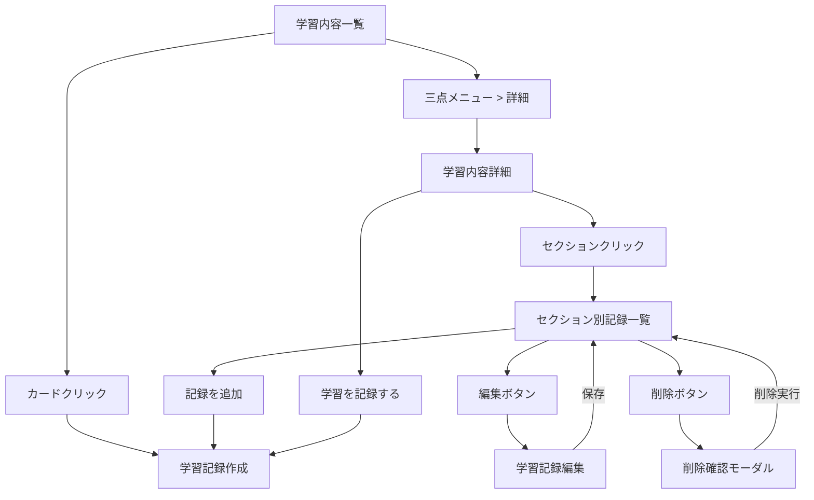
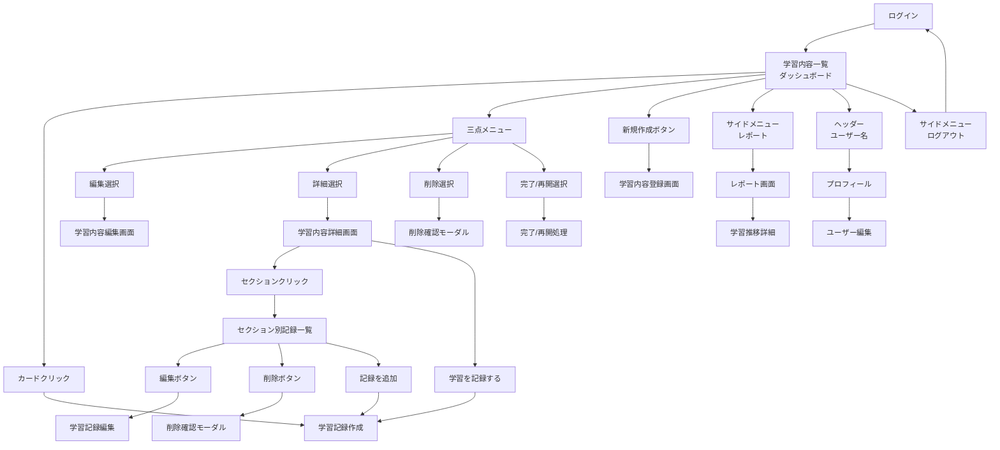

## 相互リンク

[簡易設計&画面フロー](https://www.notion.so/24e9d86c12e880898572d710eb2f34a4?pvs=21) 

.gemini/docs/designs/簡易設計&画面フロー.md

---

## ダッシュボード

### レイアウト全体像

```
┌───────────────────────────────────────────────────────┐
│ 🎯 LearnTrack Pro                           👤 ユーザ名 │ <- ヘッダー（固定）
├───┬───────────────────────────────────────────────────┤
│📚 │  学習内容一覧                           [➕新規作成]  │
│   │  ┌──────────┐ ┌──────────┐                        │
│📊 │  │ Laravel  │ │ Vue.js   │                        │
│   │  │ 進捗:80%  │ │ 進捗:60% │                        │
│── │  └──────────┘ └──────────┘                        │
│   │                                                   │
│🚪 │                                                   │
└───┴───────────────────────────────────────────────────┘
 ↑                        ↑
64px                 メインコンテンツ
(アイコンのみ)
```

### ヘッダー（シンプル版）

⚠️ソート機能実装時に追加

```
┌───────────────────────────────────────────────────────┐
│ 🎯 LearnTrack Pro                 [🔍] [並び替え▼] 👤   │
└───────────────────────────────────────────────────────┘
```

### サイドメニュー（デスクトップ）

```
【通常時（マウスが離れている）】
┌───┐
│ 📚 │  ← アイコンのみ
│    │     幅: 64px
│ 📊 │
│    │
│────│
│    │
│ 🚪 │
└───┘

【ホバー時（マウスを乗せた時）】
┌──────────────────┐
│ 📚 学習内容       │  ← アイコン + テキスト
│                  │     幅: 200px
│ 📊 レポート       │
│                  │
│ ───────────      │
│                  │
│ 🚪 ログアウト      │
└──────────────────┘

```

### サイドメニュー（モバイル）

```
【通常時】
┌────────────────────────┐
│ ☰ LearnTrack Pro   👤  │
└────────────────────────┘

【メニュー展開時（オーバーレイ）】
┌────────────────────┐
│ ✕                  │
│ ──────────         │
│ 📚 学習内容         │
│ 📊 レポート         │
│ ──────────         │
│ 👤 プロフィール      │
│ 🚪 ログアウト       │
└────────────────────┘

```

---

## 学習内容一覧

### 学習内容一覧

```
┌─────────────────────────────────────┐
│ 📚 学習内容一覧      [➕新規作成]       │
├─────────────────────────────────────┤
│ ┌─────────────────────────────┐     │
│ │ Laravel入門          [⋮]    │      │  <- 三点メニュー
│ │ 技術: Laravel               │      │
│ │ 進捗: ▓▓▓▓▓▓░░░░ 60%        │      │
│ │ 6/10セクション完了            │     │
│ └─────────────────────────────      │
│         ↑                    ↑      │
│   カード全体クリック      三点メニュー   │
│   → 学習記録画面へ        クリック     │
│ ┌─────────────────────────────┐     │
│ │ Vue.js基礎           [⋮]    │     │
│ │ 技術: Vue.js                │     │
│ │ 進捗: ▓▓▓░░░░░░░ 30%        │     │
│ │ 3/10セクション完了            │     │
│ └─────────────────────────────┘     │
│ ┌─────────────────────────────┐     │
│ │ React入門            [⋮]     │     │
│ │ 技術: React     ✅完了済み    │     │
│ │ 完了日: 2025/08/15           │     │
│ │ 12/12セクション               │     │
│ └─────────────────────────────┘     │
└─────────────────────────────────────┘
```

### 三点メニューの内容

```
【学習中の場合】
┌──────────────┐
│ ✏️ 編集      │
│ ℹ️ 詳細      │
│ 🗑️ 削除      │
└──────────────┘

【100%完了・未確定の場合】
┌──────────────┐
│ ✅ 完了にする │ <- 追加
│ ✏️ 編集      │
│ ℹ️ 詳細      │
│ 🗑️ 削除      │
└──────────────┘

【完了済みの場合】
┌──────────────┐
│ 🔄 学習を再開 │ <- 追加
│ ✏️ 編集      │
│ ℹ️ 詳細      │
│ 🗑️ 削除      │
└──────────────┘

```

### 削除確認モーダル

```
┌───────────────────────────────┐
│  学習内容を削除しますか？         │
├───────────────────────────────┤
│  「Laravel入門」を削除すると、    │
│  関連する学習記録も全て削除       │
│  されます。                     │
│                               │
│  この操作は取り消せません。       │
├───────────────────────────────┤
│  [キャンセル]  [削除する]        │
└───────────────────────────────┘

```

---

## 学習内容詳細

### 学習内容詳細

```
┌─────────────────────────────────────────────┐
│ 📖 Laravel入門                    [編集] [×] │
├─────────────────────────────────────────────┤
│ 技術: Laravel                                │
│ 進捗: ████████░░ 80% (4/5セクション完了)       │
│ ステータス: 学習中                             │
│ 作成日: 2025/09/10                           │
│ 更新日: 2025/09/15                           │
│                                             │
│ 【説明】                                     │
│ Laravelの基礎から実践まで学習                  │
│                                             │
│ 【セクション一覧】                             │
│ ☑ 1. 環境構築 (完了) [3件の記録]  ←クリック可.  │
│ ☑ 2. ルーティング基礎 (完了) [2件の記録]       │
│ ☑ 3. コントローラー作成 (完了) [4件の記録]      │
│ ☑ 4. ビュー作成 (完了) [1件の記録]            │
│ ☐ 5. データベース連携 (未着手) [0件の記録]       │
│                                             │
│ [学習を記録する] [レポートを見る]                │
└─────────────────────────────────────────────┘

```

### セクション別学習記録一覧

```
┌─────────────────────────────────────────────┐
│ ← Laravel入門 > 環境構築の学習記録              │
├─────────────────────────────────────────────┤
│ セクション: 環境構築                           │
│ 合計学習時間: 3時間30分                        │
│ 記録件数: 3件                                 │
│                                             │
│ 【学習記録一覧】                               │
│ ┌─────────────────────────────────────┐     │
│ │ 2025/08/15 14:30                    │     │
│ │ 学習時間: 1時間30分                   │     │
│ │ 調子: ⭐⭐⭐⭐☆                     │     │
│ │ メモ: Docker環境構築完了               │    │
│ │                [編集] [削除]         │     │
│ └─────────────────────────────────────┘     │
│                                             │
│ ┌─────────────────────────────────────┐     │
│ │ 2025/08/16 10:00                    │     │
│ │ 学習時間: 1時間00分                   │      │
│ │ 調子: ⭐⭐⭐☆☆                      │      │
│ │ メモ: Composerインストール             │     │
│ │                [編集] [削除]         │      │
│ └─────────────────────────────────────┘     │
│                                             │
│ ┌─────────────────────────────────────┐     │
│ │ 2025/08/17 15:45                    │     │
│ │ 学習時間: 1時間00分                   │     │
│ │ 調子: ⭐⭐⭐⭐⭐                    │     │
│ │ メモ: 初期設定完了！                   │     │
│ │                [編集] [削除]         │     │
│ └─────────────────────────────────────┘     │
│                                             │
│ [+ このセクションに記録を追加]                  │
└─────────────────────────────────────────────┘

```

### 学習記録の削除確認モーダル

```
┌───────────────────────────────┐
│  学習記録を削除しますか？         │
├───────────────────────────────┤
│  2025/08/15 14:30の記録        │
│  学習時間: 1時間30分             │
│                               │
│  この操作は取り消せません。        │
├───────────────────────────────┤
│  [キャンセル]  [削除する]        │
└───────────────────────────────┘

```

---

## 学習内容の登録、編集

### 新規作成画面（基本情報タブ）

```
┌─────────────────────────────────────────────┐
│ 📚 学習内容を登録            [登録] [キャンセル] │
├─────────────────────────────────────────────┤
│ 基本情報 | セクション管理                       │
├─────────────────────────────────────────────┤
│【基本情報タブ】                                │
│                                             │
│ 技術: [選択してください ▼] *必須                 │
│       Laravel / Vue.js / Python...          │
│                                             │
│ タイトル: [________________] *必須            │
│          例：Laravel入門                      │
│                                              │
│ 説明（任意）:                                  │
│ [テキストエリア_______________]                │
│ [_____________________________]              │
│                                              │
│ ☐ すぐに学習を開始する                          │
│   （チェックすると「学習中」として登録）           │
│                                              │
└──────────────────────────────────────────────┘

```

### 編集画面（基本情報タブ）

```
┌─────────────────────────────────────────────┐
│ 📚 学習内容を編集          [保存] [キャンセル]   │
├─────────────────────────────────────────────┤
│ 基本情報 | セクション管理                       │
├─────────────────────────────────────────────┤
│【基本情報タブ】                                │
│                                              │
│ 技術: [Laravel ▼] *必須                       │
│                                              │
│ タイトル: [Laravel入門_______] *必須           │
│                                              │
│ 説明（任意）:                                  │
│ [基礎から実践まで学習_________]                 │
│ [_____________________________]              │
│                                              │
│ ステータス:                                    │
│ ○ 未着手                                      │
│ ● 学習中                                      │
│ ○ 完了 *                                      │
│                                              │
│ * 全セクション完了時のみ選択可能                  │
│                                              │
└──────────────────────────────────────────────┘

```

### セクション管理タブ（共通）

```
┌─────────────────────────────────────────────┐
│ 基本情報 | セクション管理                       │
├─────────────────────────────────────────────┤
│ セクション一覧 (2/5完了)      [➕セクション追加] │
│                                             │
│ ┌────────────────────────────────────┐      │
│ │ ☑ 1. 環境構築                       │      │
│ │    [↑][↓] [編集] [×]                │      │
│ └────────────────────────────────────┘      │
│                                             │
│ ┌────────────────────────────────────┐      │
│ │ ☑ 2. ルーティング基礎                │      │
│ │    [↑][↓] [編集] [×]                │      │
│ └────────────────────────────────────┘      │
│                                             │
│ ┌────────────────────────────────────┐      │
│ │ ☐ 3. コントローラー作成               │      │
│ │    [↑][↓] [編集] [×]                │      │
│ └────────────────────────────────────┘      │
│                                             │
│ [➕ セクション追加]                            │
│                                             │
│ 💡 セクションは後からでも追加・編集できます        │
└─────────────────────────────────────────────┘

```

### 画面遷移フロー



---

## 学習記録の登録、編集

### 新規作成画面（手動入力タブ）

```
┌────────────────────────────────────────────────────┐
│ 学習記録を保存                                 [保存] │
│                                                    │
│ 手動入力 | ストップウォッチ                            │ <- タブ
├────────────────────────────────────────────────────┤
│ 学習内容: Laravel入門（変更不可）                      │
│                                                    │
│ セクション: 環境構築 [▼] （クリックで他セクション選択画面） │
│                                                    │
│ 学習日:現在日時と時刻[📅]（クリックでモーダル表示）        │
│                                                    │
│ 学習時間: 0時間 00分 [⏱] （クリックでモーダル表示）      │
│                                                    │
│ 調子: ☆☆☆☆☆                                         │
│                                                    │
│ メモ: [テキストエリア]                                │
│                                                    │
└────────────────────────────────────────────────────┘

```

### ストップウォッチタブ

```
┌───────────────────────────────────────┐
│                           [記録を保存] │
│                                      │
│ 手動入力 | ストップウォッチ              │ <- タブ
├──────────────────────────────────────┤
│        00:25:30                      │ <- 時:分:秒表示
│     ┌────────┐       ┌───┐           │
│     │開始/停止│        リセット         │ <- ボタン
│     └────────┘       └───┘            │
│                                       │
└───────────────────────────────────────┘

```

### 編集画面

```
┌────────────────────────────────────────────────────┐
│ 学習記録を編集                     [保存] [キャンセル]  │
│                                                    │
├────────────────────────────────────────────────────┤
│ 学習内容: Laravel入門（変更不可）                      │
│                                                    │
│ セクション: 環境構築 [▼] （クリックで他セクション選択画面） │
│                                                    │
│ 学習日: 2025/08/15 14:30 [📅]                       │
│                                                    │
│ 学習時間: 1時間 30分 [⏱] （クリックでモーダル表示）      │
│                                                    │
│ 調子: ⭐⭐⭐⭐☆                                     │
│ メモ:                                               │
│ [Docker環境構築完了___________]                      │
│ [_____________________________]                    │
│                                                    │
└────────────────────────────────────────────────────┘

```

### モーダル設計（共通）

```markdown
## モーダル設計の統一

### 日付選択モーダル
┌─────────────────────────────┐
│  学習日を選択               X │
├─────────────────────────────┤
│                             │
│  カレンダーUI       　        │
│  [2025年8月]        　       │
│  日 月 火 水 木 金 土         │
│  ...                        │
├─────────────────────────────┤
│  [キャンセル]  [OK]           │
└─────────────────────────────┘

### 時間入力モーダル
┌─────────────────────────────┐
│  学習時間を入力              X │
├─────────────────────────────┤
│                             │
│  詳細入力：                  │
│  [0] 時間 [30] 分            │  <- セレクトボックス
├─────────────────────────────┤
│  [キャンセル]  [OK]           │
└─────────────────────────────┘

```

## レポート画面

### 全体の学習推移

```
┌─────────────────────────────────┐
│ 📊 レポート                      │
├─────────────────────────────────┤
│ ▼ 全体の学習推移                  │
│   [週間棒グラフ] → クリックで詳細へ  │
├─────────────────────────────────┤
│ ▼ 時間配分（Phase 1で実装）        │
│   [ドーナツチャート]               │
├─────────────────────────────────┤
│ ▼ 学習履歴                       │
│   最近の学習記録一覧               │
└─────────────────────────────────┘

```

### 学習推移詳細画面

```
┌─────────────────────────────────┐
│ 📈 学習推移                      │
├─────────────────────────────────┤
│ 期間: [日][1週間][1ヶ月]          │
│   [< 月切り替え >]               │
│ 🔍 記録の絞り込み → カテゴリ検索へ  │
│   [詳細チャート表示]              │
├─────────────────────────────────┤
│ ▼ 学習コンテンツ別（Phase 1）      │
│   Laravel入門: 120分             │
│   Vue.js基礎: 80分               │
└─────────────────────────────────┘

```

---

## 画面フロー


