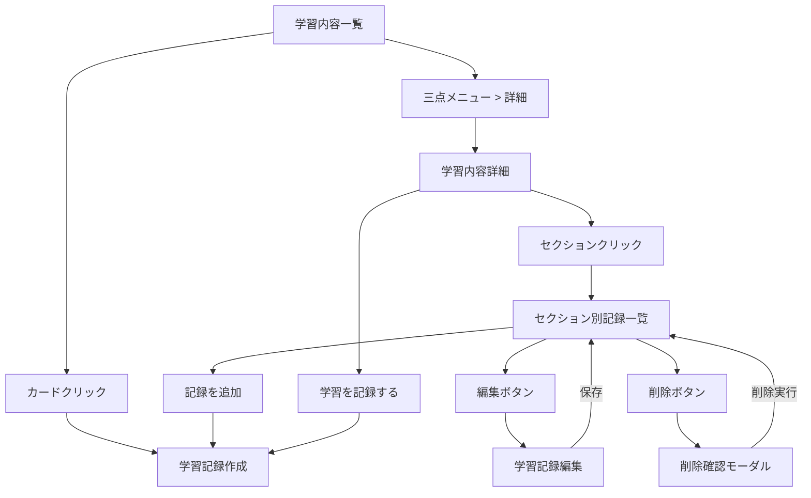
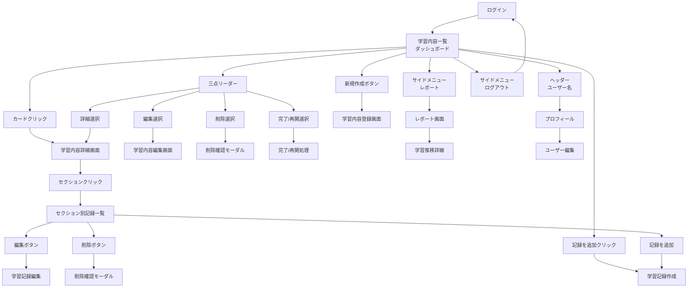

## 相互リンク

[簡易設計&画面フロー](https://www.notion.so/24e9d86c12e880898572d710eb2f34a4?pvs=21) 

.gemini/docs/designs/簡易設計&画面フロー.md

---

## ダッシュボード

### レイアウト全体像

```
┌──────────────────────────────────────────────────────────────┐
│ LearnTrack Pro                                    👤 ユーザ名  │ <- ヘッダー（固定）
│                                             User@example.com │
├───┬──────────────────────────────────────────────────────────┤
│📚 │  学習内容一覧                              [新しい学習を追加] │
│   │  ┌──────────────┐ ┌──────────────┐ ┌──────────────┐      │
│📊 │  │📖学習中のコース │ │📊平均進捗     │  │✅️完了セクション │     │
│   │  │ 進捗:80%     │  │60%          │  │ 進捗:100%     │     │
│🚪 │  └──────────────┘ └──────────────┘  └──────────────┘     │
│   │                                                          │
│   │ [進行中の学習]                                             │
│   │  ┌──────────────┐ ┌──────────────┐ ┌──────────────┐      │
│   │  │ Laravel.     │ │ Vue.js       │ │ React        │      │
│   │  │ 進捗:80%     │  │ 進捗:60%     │ │ 進捗:100%    │       │
│   │  └──────────────┘ └──────────────┘ └──────────────┘      │
│   │                                                          │
│   │                                                          │
└───┴──────────────────────────────────────────────────────────┘
                          ↑
                     メインコンテンツ

```

### ヘッダー（シンプル版）

⚠️ソート機能実装時に追加

```
┌───────────────────────────────────────────────────────┐
│ 🎯 LearnTrack Pro                 [🔍] [並び替え▼] 👤   │
└───────────────────────────────────────────────────────┘
```

### サイドメニュー（デスクトップ）

```
【通常時（マウスが離れている）】
┌────┐
│ 📚 │
│    │
│ 📊 │
│    │
│ 🚪 │
└──-─┘

【ホバー時（マウスを乗せた時）】
┌──────────────────┐
│ 📚 学習内容       │
│                  │
│ 📊 レポート       │
│                  │
│ 🚪 ログアウト      │
└──────────────────┘

```

### サイドメニュー（モバイル）

```
【通常時】
┌────────────────────────┐
│ ☰ LearnTrack Pro   👤  │
└────────────────────────┘

【メニュー展開時（オーバーレイ）】
┌────────────────────┐
│ ✕                  │
│ ──────────         │
│ 📚 学習内容         │
│ 📊 レポート         │
│                    │
│ 👤 プロフィール      │
│ 🚪 ログアウト       │
└────────────────────┘

```

---

## 学習内容一覧

### 学習内容一覧

```
┌────────────────────────────────────────────┐
│ 📚 学習内容一覧                   [➕新規作成] │
├────────────────────────────────────────────┤
│ ┌──────────────────────────────────────┐    │
│ │ Laravel入門 ▶️学習中               [⋯] │    │  ← 三点リーダ ー
│ │ 技術: Laravel                         │    │
│ │ 進捗                              60% │    │
│ │ ▓▓▓▓▓▓▓▓▓▓▓▓▓▓▓▓▓▓▓▓▓▓▓▓▓░░░░░░░░░░░ │    │
│ │ 6/10セクション完了 ⏰️総学習時間152時間15分 │    │
│ │───────────────────────────────────────│   │
│ │ 最終学習: 2024年8月25日       記録を追加 │    │
│ └──────────────────────────────────────┘    │
│         ↑                        ↑          │
│   カード全体クリック     「記録を追加」クリック    │
│   → 学習詳細画面へ         → 学習記録画面へ      │
│ ┌─────────────────────────────┐              │
│ │ Vue.js基礎           [⋯]    │              │
│ │ 技術: Vue.js                │              │
│ │ 進捗: ▓▓▓░░░░░░░ 30%        │              │
│ │ 3/10セクション完了            │              │
│ │─────────────────────────────│              │
│ │ 最終学習: 2024年1月15日       │              │
│ └─────────────────────────────┘              │
│ ┌─────────────────────────────┐              │
│ │ React入門            [⋯]     │              │
│ │ 技術: React     ✅完了済み    │              │
│ │ 進捗: ▓▓▓▓▓▓▓▓▓▓▓ 100%       │              │
│ │ 12/12セクション               │              │
│ │─────────────────────────────│              │
│ │ 最終学習: 2024年1月10日       │              │
│ └─────────────────────────────┘              │
└──────────────────────────────────────────────┘
```

### 三点リーダーの内容

```
【学習中の場合】
┌──────────────┐
│ ✏️ 編集      │
│ ℹ️ 詳細      │
│ 🗑️ 削除      │
└──────────────┘

【100%完了かつ未確定の場合】
┌──────────────┐
│ ✅ 完了にする │ <- 追加
│ ✏️ 編集      │
│ ℹ️ 詳細      │
│ 🗑️ 削除      │
└──────────────┘

【完了済みの場合】
┌──────────────┐
│ 🔄 学習を再開 │ <- 追加
│ ✏️ 編集      │
│ ℹ️ 詳細      │
│ 🗑️ 削除      │
└──────────────┘

```

### 削除確認モーダル

```
┌───────────────────────────────────┐
│  学習内容を削除しますか？             │
│                                   │
│  「Laravel入門」を削除すると、        │
│  関連する学習記録も全て削除           │
│  されます。この操作は取り消せません。   │
│                                   │
├───────────────────────────────────┤
│  [キャンセル]  [削除する]            │
└───────────────────────────────────┘

```

---

## 学習内容詳細

### 学習内容詳細

```
┌─────────────────────────────────────────────┐
│ 📖 Laravel入門                           [↵] │
│                                             │
│ 技術: Laravel ステータス: ▶️学習中              │
│ 作成日: 2025/09/10 更新日: 2025/09/15         │
│                                             │
│ 【説明】                                     │
│ Laravelの基礎から実践まで学習                   │
│                                             │
│ 進捗                                     80% │
│ █████████████████████████████████████████░░ │
│ 4/5セクション完了           ⏰️ 総学習時間:２時間 │
│                                             │
│                                             │
│ 【セクション一覧】                        [🖊️] │
│ ✅️ 1. 環境構築 (完了) [3件の記録]  ←クリック可.  │
│ ✅️ 2. ルーティング基礎 (完了) [2件の記録]        │
│ ✅️ 3. コントローラー作成 (完了) [4件の記録]      │
│ ▶️ 4. ビュー作成 (学習中) [1件の記録]           │
│ 📄 5. データベース連携 (未着手) [0件の記録]      │
│                                             │
├─────────────────────────────────────────────┤
│                [学習を記録する] [レポートを見る] │
└─────────────────────────────────────────────┘

```

### セクション別学習記録一覧

```
┌─────────────────────────────────────────────┐
│ ← Laravel入門 / 環境構築の学習記録              │
│                                             │
│ セクション: 環境構築                           │
│ 合計学習時間: 3時間30分 記録件数: 3件            │
│ 記録件数: 3件                                 │
│                                             │
│ 【学習記録一覧】                               │
│ ┌─────────────────────────────────────┐     │
│ │ 2025/08/15 14:30              🖊️ 🗑️ │     │
│ │ 学習時間: 1時間30分                   │     │
│ │ 調子: ⭐⭐⭐⭐☆                      │     │
│ │ メモ: Docker環境構築完了              │     │
│ └─────────────────────────────────────┘     │
│                                             │
│ ┌─────────────────────────────────────┐     │
│ │ 2025/08/16 10:00              🖊️ 🗑️ │     │
│ │ 学習時間: 1時間00分                   │      │
│ │ 調子: ⭐⭐⭐☆☆                       │      │
│ │ メモ: Composerインストール            │      │
│ └─────────────────────────────────────┘     │
│                                             │
│ ┌─────────────────────────────────────┐     │
│ │ 2025/08/17 15:45              🖊️ 🗑️ │     │
│ │ 学習時間: 1時間00分                   │     │
│ │ 調子: ⭐⭐⭐⭐⭐                      │     │
│ │ メモ: 初期設定完了！                   │     │
│ └─────────────────────────────────────┘     │
│                                             │
│                  [+ このセクションに記録を追加] │
└─────────────────────────────────────────────┘

```

### 学習記録の削除確認モーダル

```
┌───────────────────────────────────┐
│  学習記録を削除しますか？             │
│                                   │
│ ┌───────────────────────────────┐ │
│ │ 日時：2025/08/15 14:30         │ │
│ │ 学習時間: 1時間30分             │  │
│ │ メモ：Vueの基本構文              │ │
│ └───────────────────────────────┘ │
│  この操作は元に戻せません。           │
│                                   │
│             [キャンセル]  [削除する] │
└───────────────────────────────────┘

```

---

## 学習内容の登録、編集

セクション情報必須なのでウィザード形式を採用

### 新規作成画面

**ステップ1: 基本情報入力**

```
┌─────────────────────────────────────────────┐
│ 📚 新しい学習内容を作成                         │
├─────────────────────────────────────────────┤
│                                             │
│  ●━━━━━━━━━━━  ○━━━━━━━━━━━  ○             │
│  基本情報      セクション設定    確認           │
│                                             │
├─────────────────────────────────────────────┤
│                                             │
│ 何を学習しますか？                             │
│                                             │
│ 技術 *                                        │
│ ┌─────────────────────────────┐              │
│ │ 選択してください ▼           │              │
│ └─────────────────────────────┘              │
│                                             │
│ タイトル *                                    │
│ ┌─────────────────────────────┐              │
│ │                             │              │
│ └─────────────────────────────┘              │
│                                             │
│ 説明（任意）                                   │
│ ┌─────────────────────────────┐              │
│ │                             │              │
│ │                             │              │
│ │                             │              │
│ └─────────────────────────────┘              │
│                                             │
│                    [次へ →] ← 入力まで無効     │
└─────────────────────────────────────────────┘

```

**ステップ2: セクション設定**

```
┌─────────────────────────────────────────────┐
│ 📚 新しい学習内容を作成                         │
├─────────────────────────────────────────────┤
│                                             │
│  ✓━━━━━━━━━━━  ●━━━━━━━━━━━  ○             │
│  基本情報      セクション設定    確認           │
│                                             │
├─────────────────────────────────────────────┤
│                                             │
│ 学習セクションを設定してください                 │
│ 最低1つのセクション入力が必要です *              │
│ ドラッグ（≡）で並び替えできます                 │
│                                             │
│ セクション 1                                   │
│ ┌─────────────────────────────┐              │
│ │                             │ [削除不可]   │
│ └─────────────────────────────┘              │
│                                             │
│ セクション 2                                   │
│ ┌─────────────────────────────┐              │
│ │                             │ [× 削除]    │
│ └─────────────────────────────┘              │
│                                             │
│ セクション 3                                   │
│ ┌─────────────────────────────┐              │
│ │                             │ [× 削除]    │
│ └─────────────────────────────┘              │
│                                             │
│ [➕ セクション追加]                            │
│                                             │
│ 💡 セクションは後から編集・追加できます           │
│                                             │
│ [← 戻る]          [次へ →] ← 1つ以上入力で有効 │
└─────────────────────────────────────────────┘

```

**ステップ3: 確認画面**

```
┌─────────────────────────────────────────────┐
│ 📚 新しい学習内容を作成                         │
├─────────────────────────────────────────────┤
│                                             │
│  ✓━━━━━━━━━━━  ✓━━━━━━━━━━━  ●             │
│  基本情報      セクション設定    確認           │
│                                             │
├─────────────────────────────────────────────┤
│                                             │
│ 入力内容を確認してください                       │
│                                             │
│ ┌─────────────────────────────────────┐     │
│ │ 📋 基本情報                          │     │
│ │                                     │     │
│ │ 技術: Laravel                        │     │
│ │ タイトル: Laravel REST API開発        │     │
│ │ 説明: RESTful APIの設計から実装まで    │     │
│ └─────────────────────────────────────┘     │
│                                             │
│ ┌─────────────────────────────────────┐     │
│ │ 📑 セクション (3個)                   │     │
│ │                                     │     │
│ │ 1. 環境構築                          │     │
│ │ 2. 認証機能実装                       │     │
│ │ 3. CRUD API作成                      │     │
│ └─────────────────────────────────────┘     │
│                                             │
│ ☐ すぐに学習を開始する                          │
│   （チェックすると「学習中」状態で作成）          │
│                                             │
│ [← 戻る]                    [✓ 作成する]      │
└─────────────────────────────────────────────┘

```

### 編集画面

**ステップ1: 基本情報入力**

```
┌─────────────────────────────────────────────┐
│ 📚 学習内容を編集                              │
├─────────────────────────────────────────────┤
│                                             │
│  ●━━━━━━━━━━━  ○━━━━━━━━━━━  ○             │
│  基本情報      セクション設定    確認           │
│                                             │
├─────────────────────────────────────────────┤
│                                             │
│ 基本情報を編集                                │
│                                             │
│ 技術 *                                        │
│ ┌─────────────────────────────┐              │
│ │ Laravel ▼                  │              │
│ └─────────────────────────────┘              │
│                                             │
│ タイトル *                                    │
│ ┌─────────────────────────────┐              │
│ │ Laravel REST API開発        │              │
│ └─────────────────────────────┘              │
│                                             │
│ 説明（任意）                                   │
│ ┌─────────────────────────────┐              │
│ │ RESTful APIの設計から実装まで │              │
│ └─────────────────────────────┘              │
│                                             │
│ ステータス                                    │
│ ○ 未着手  ● 学習中  ○ 完了                   │
│                                             │
│ [キャンセル]                    [次へ →]       │
└─────────────────────────────────────────────┘

```

**ステップ2: セクション設定**

```
┌─────────────────────────────────────────────┐
│ 📚 新しい学習内容を作成                         │
├─────────────────────────────────────────────┤
│                                             │
│  ✓━━━━━━━━━━━  ●━━━━━━━━━━━  ○             │
│  基本情報      セクション設定    確認           │
│                                             │
├─────────────────────────────────────────────┤
│                                             │
│ 学習セクションを設定してください                 │
│ 最低1つのセクション入力が必要です *              │
│ ドラッグ（≡）で並び替えできます                 │
│                                             │
│ セクション 1                                  │
│ ┌─────────────────────────────┐             │
│ │ セクション 1                 │ [× 削除]     │ ← 1件しかない場合は削除不可
│ └─────────────────────────────┘              │
│                                             │
│ セクション 2                                  │
│ ┌─────────────────────────────┐             │
│ │ セクション 2                 │ [× 削除]     │
│ └─────────────────────────────┘              │
│                                             │
│ セクション 3                                   │
│ ┌─────────────────────────────┐              │
│ │ セクション 3                 │ [× 削除]     │
│ └─────────────────────────────┘              │
│                                             │
│ [➕ セクション追加]                            │
│                                             │
│ 💡 セクションは後から編集・追加できます           │
│                                             │
│ [← 戻る]          [次へ →] ← 1つ以上入力で有効 │
└─────────────────────────────────────────────┘

```

**ステップ3: 確認画面**

```
┌─────────────────────────────────────────────┐
│ 📚 学習内容を編集                              │
├─────────────────────────────────────────────┤
│                                             │
│  ✓━━━━━━━━━━━  ✓━━━━━━━━━━━  ●              │
│  基本情報      セクション設定    確認           │
│                                             │
├─────────────────────────────────────────────┤
│                                             │
│ 変更内容を確認してください                      │
│                                             │
│ ┌─────────────────────────────────────┐     │
│ │ 📝 変更箇所                           │     │
│ │                                     │     │
│ │ タイトル:                            │     │
│ │   Laravel入門 → Laravel REST API開発 │     │
│ │                                     │     │
│ │ セクション追加:                       │     │
│ │   + テスト実装                       │     │
│ │   + デプロイ                         │     │
│ └─────────────────────────────────────┘     │
│                                             │
│ [← 戻る]                    [✓ 保存する]      │
└─────────────────────────────────────────────┘

```

### 画面遷移フロー



---

## 学習記録の登録、編集

### 新規作成画面（手動入力タブ）

```
┌────────────────────────────────────────────────────┐
│                   学習記録の追加                     │
├────────────────────────────────────────────────────┤
│ 「Laravel入門」の学習を記録します。                     │
│                                                    │
│ 学習セクション *                                     │
│ ┌──────────────────────────────────────┐           │
│ │ 学習したセクションを選択          ▼      │           │
│ └──────────────────────────────────────┘           │
│                                                    │
│ 学習日 *                                            │
│ 📅 2025年8月26日  🕐 14:30  [現時刻]                 │
│                                                    │
│ 学習時間 *                                          │
│ 🕐 0時間 30分                                       │
│                                                    │
│ 学習メモ                                            │
│ ┌──────────────────────────────────────┐          │
│ │ 学習した内容のメモや感想を自由に          │           │
│ │ 入力してください。                      │           │
│ └──────────────────────────────────────┘           │
│                                                    │
│ 学習中の調子                                         │
│ ☆ ☆ ☆ ☆ ☆                                          │
│                                                    │
│                      [キャンセル] [記録を保存]        │
└────────────────────────────────────────────────────┘

```

**実装時の変更点**

- タブ切り替えUIは実装しない（ストップウォッチ機能は条件付き実装のため）
- 右上の×ボタンは廃止（右下のキャンセルボタンで十分なため）
- 戻るボタンは廃止（キャンセルボタンに統合）

### ストップウォッチタブ

```
┌───────────────────────────────────────┐
│                           [記録を保存] │
│                                      │
│ 手動入力 | ストップウォッチ              │ <- タブ
├──────────────────────────────────────┤
│        00:25:30                      │ <- 時:分:秒表示
│     ┌────────┐       ┌───┐           │
│     │開始/停止│        リセット         │ <- ボタン
│     └────────┘       └───┘            │
│                                       │
└───────────────────────────────────────┘

```

### 編集画面

```
┌────────────────────────────────────────────────────┐
│ 学習記録を編集                     [保存] [キャンセル]  │
│                                                    │
├────────────────────────────────────────────────────┤
│ 学習内容: Laravel入門（変更不可）                      │
│                                                    │
│ セクション: 環境構築 [▼] （クリックで他セクション選択画面） │
│                                                    │
│ 学習日: 2025/08/15 14:30 [📅]                       │
│                                                    │
│ 学習時間: 1時間 30分 [⏱] （クリックでモーダル表示）      │
│                                                    │
│ 調子: ⭐⭐⭐⭐☆                                     │
│ メモ:                                               │
│ [Docker環境構築完了___________]                      │
│ [_____________________________]                    │
│                                                    │
└────────────────────────────────────────────────────┘

```

### モーダル設計（共通）

```markdown
## モーダル設計の統一

### 日付選択モーダル
┌─────────────────────────────┐
│  学習日を選択               X │
├─────────────────────────────┤
│                             │
│  カレンダーUI       　        │
│  [2025年8月]        　       │
│  日 月 火 水 木 金 土         │
│  ...                        │
├─────────────────────────────┤
│  [キャンセル]  [OK]           │
└─────────────────────────────┘

### 時間入力モーダル
┌─────────────────────────────┐
│  学習時間を入力              X │
├─────────────────────────────┤
│                             │
│  詳細入力：                  │
│  [0] 時間 [30] 分            │  <- セレクトボックス
├─────────────────────────────┤
│  [キャンセル]  [OK]           │
└─────────────────────────────┘

### 未保存警告モーダル（新規追加）
┌─────────────────────────────┐
│ 編集内容が保存されていません     │
├─────────────────────────────┤
│ 編集した内容を破棄しても        │
│ よろしいですか？               │
├─────────────────────────────┤
│  [キャンセル]  [破棄]         │
└─────────────────────────────┘

```

## レポート画面

### 全体の学習推移

```
┌─────────────────────────────────┐
│ 📊 レポート                      │
├─────────────────────────────────┤
│ ▼ 全体の学習推移                  │
│   [週間棒グラフ] → クリックで詳細へ  │
├─────────────────────────────────┤
│ ▼ 時間配分（Phase 1で実装）        │
│   [ドーナツチャート]               │
├─────────────────────────────────┤
│ ▼ 学習履歴                       │
│   最近の学習記録一覧               │
└─────────────────────────────────┘

```

### 学習推移詳細画面

```
┌─────────────────────────────────┐
│ 📈 学習推移                      │
├─────────────────────────────────┤
│ 期間: [日][1週間][1ヶ月]          │
│   [< 月切り替え >]               │
│ 🔍 記録の絞り込み → カテゴリ検索へ  │
│   [詳細チャート表示]              │
├─────────────────────────────────┤
│ ▼ 学習コンテンツ別（Phase 1）      │
│   Laravel入門: 120分             │
│   Vue.js基礎: 80分               │
└─────────────────────────────────┘

```

---

## 画面フロー


