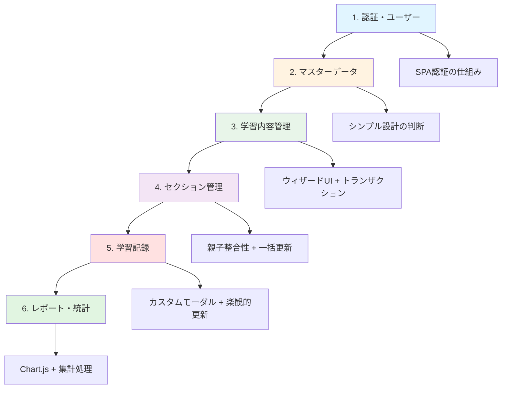
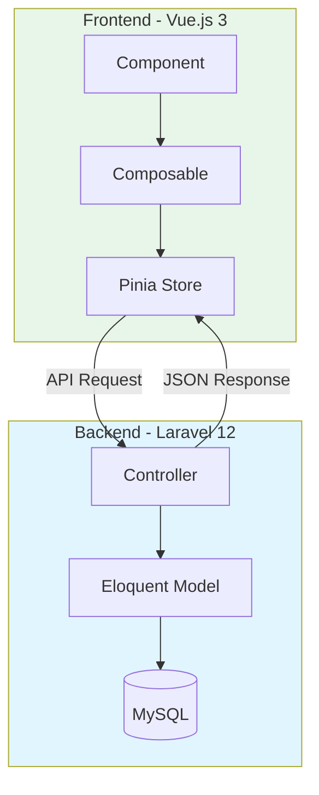

このディレクトリは、LearnTrack Proの主要機能に関する技術的な実装詳細と、その設計判断（Why）をまとめたドキュメント群です。
単なる仕様書ではなく、「なぜそのような実装にしたのか」「どのようなトレードオフがあったのか」というエンジニアリングの視点を重視しています。

## 目的

1. **深い仕様理解**: コードを読むだけでは分からない背景や意図を理解する。
2. **面接対策**: 技術的な質問に対して、論理的かつ自信を持って回答できるようにする。
3. **リファクタリングの指針**: 将来的な改善点や技術的負債を明確にする。

---

## ドキュメント一覧

推奨される読み順は以下の通りです。システムの基盤となる認証から始まり、主要機能、そして集計・分析へと進みます。

### 1. 基盤・認証

- [**01-auth-user-logic.md**](https://www.notion.so/01-auth-user-logic.md)
    - [認証・ユーザー関連ロジック理解](https://www.notion.so/2b19d86c12e880f885d5f2c47147a693?pvs=21)
    - **概要**: Laravel Fortify + SanctumによるSPA認証、ユーザー管理の実装。
    - **ポイント**: セッション認証の仕組み、フロントエンドでの認証状態管理（Pinia + localStorage）、セキュリティ対策（CSRF, XSS）。

### 2. マスターデータ

- [**02-master-data-logic.md**](https://www.notion.so/02-master-data-logic.md)
    - [マスターデータロジック理解](https://www.notion.so/2b19d86c12e880e185bdca040c9f566e?pvs=21)
    - **概要**: カテゴリー・技術スタックなどの静的データ管理。
    - **ポイント**: Service層を省略したシンプルな設計、Piniaでのキャッシュ戦略、Eager Loadingによるパフォーマンス最適化。

### 3. 学習コンテンツ管理（Core）

- [**03-learning-content-logic.md**](https://www.notion.so/03-learning-content-logic.md)
    - [学習内容管理ロジック理解](https://www.notion.so/2b19d86c12e880f4b96bfbc7c99cecdd?pvs=21)
    - **概要**: 学習教材（LearningContent）のCRUD処理。
    - **ポイント**: ウィザード形式のUI実装、Controllerへのロジック集約の理由、トランザクション管理。

### 4. セクション管理

- [**04-section-logic.md**](https://www.notion.so/04-section-logic.md)
    - [セクション管理ロジック理解](https://www.notion.so/2b19d86c12e88045b7fad1ef9c3bbcc7?pvs=21)
    - **概要**: 学習コンテンツ内のセクション（章・節）管理。
    - **ポイント**: 親リソースとの整合性担保、一括更新（Bulk Update）の複雑なロジック、順序管理。

### 5. 学習記録（Core）

- [**05-learning-session-logic.md**](https://www.notion.so/05-learning-session-logic.md)
    - [学習記録ロジック理解](https://www.notion.so/2b19d86c12e880e1b068d54af9a1c786?pvs=21)
    - **概要**: 日々の学習時間の記録と管理。
    - **ポイント**: カスタムモーダル（DatePicker/TimeInput）のUI/UX設計、楽観的更新によるUX向上、データ整合性。

### 6. レポート・統計

- [**06-report-statistics-logic.md**](https://www.notion.so/06-report-statistics-logic.md)
    - [レポート・統計ロジック理解](https://www.notion.so/2b19d86c12e880f1a127faa817bff0d4?pvs=21)
    - **概要**: 学習データの集計と可視化（Chart.js）。
    - **ポイント**: 動的なグラフ生成ロジック、パフォーマンスを考慮した集計処理、フロントエンドでのデータ加工。

---

## 学習のポイント

各ドキュメントには以下のセクションが含まれています。とくに「私の理解」と「統合理解と説明練習」に重点を置いて読み進めてください。

- **Backend理解**: Controller, Model, DB設計の実装詳細。
- **Frontend理解**: Store, Composable, Componentの責務分担。
- **Why（判断理由）**: 技術選定や設計判断の背景。
- **私の理解**: 学んだ内容の要約と解釈。
- **統合理解と説明練習**: 面接を想定したQ&A。

---

## 全体像

### 学習フロー

### アーキテクチャ概念図

---

## 学習完了チェックリスト

### 1. 認証・ユーザー関連

- [ ]  Laravel Fortify + SanctumのSPA認証の仕組みを説明できる
- [ ]  フロントエンドでの認証状態管理（Pinia + localStorage）を説明できる
- [ ]  CSRF対策、XSS対策を説明できる

### 2. マスターデータ

- [ ]  Service層を省略した理由を説明できる
- [ ]  Piniaでのキャッシュ戦略を説明できる
- [ ]  Eager Loadingの必要性を説明できる

### 3. 学習内容管理

- [ ]  ウィザード形式を採用した理由を説明できる
- [ ]  トランザクション管理の重要性を説明できる
- [ ]  Controllerにロジックを集約した判断理由を説明できる

### 4. セクション管理

- [ ]  親リソースとの整合性担保の方法を説明できる
- [ ]  一括更新（Bulk Update）の複雑なロジックを説明できる
- [ ]  order + 10000 の退避ロジックとリスクを説明できる

### 5. 学習記録

- [ ]  カスタムモーダル（DatePicker/TimeInput）の設計意図を説明できる
- [ ]  楽観的更新を採用しなかった理由を説明できる
- [ ]  N+1問題への対策を説明できる

### 6. レポート・統計

- [ ]  SQL集計 vs PHP集計の使い分けを説明できる
- [ ]  Chart.jsのカスタマイズポイントを説明できる
- [ ]  並列API取得（Promise.all）の理由を説明できる

---

## トラブルシューティング

各詳細ドキュメントに「私の理解」セクションがあります。理解が曖昧な場合は以下を参照してください：

- 認証フローが分からない → [認証・ユーザー関連ロジック理解](https://www.notion.so/2b19d86c12e880f885d5f2c47147a693?pvs=21) の Backend理解
- Store/Composable の責務分離が分からない → [学習内容管理ロジック理解](https://www.notion.so/2b19d86c12e880f4b96bfbc7c99cecdd?pvs=21) の Frontend理解
- トランザクション管理が分からない → [学習内容管理ロジック理解](https://www.notion.so/2b19d86c12e880f4b96bfbc7c99cecdd?pvs=21) の 質問2
- 一括更新ロジックが分からない → [セクション管理ロジック理解](https://www.notion.so/2b19d86c12e88045b7fad1ef9c3bbcc7?pvs=21) の 質問1
- 楽観的更新の判断が分からない → [セクション管理ロジック理解](https://www.notion.so/2b19d86c12e88045b7fad1ef9c3bbcc7?pvs=21) の 質問5

---

## 参考資料

### 関連ドキュメント

- [要件定義書](https://www.notion.so/2479d86c12e881878bb9c8dc6f9c8b3c?pvs=21) - プロジェクト概要と機能要件
- [テーブル定義書](https://www.notion.so/2479d86c12e881b7b449dd88e5e6b809?pvs=21) - データベース設計
- [**Vue.js コーディング規約**](https://www.notion.so/Vue-js-26b9d86c12e880719990cf73d40cc720?pvs=21) - フロントエンド実装規約

### 関連タスク

- [**アプリケーションロジック理解**](https://www.notion.so/2a89d86c12e880049210d34677f48446?pvs=21) - 学習進捗管理

---

## 貢献ガイド

- 新機能を追加した場合は、対応するドキュメントを更新してください。
- 実装とドキュメントに乖離がある場合は、ドキュメントを正としてコードを修正するか、ドキュメントを現状に合わせて更新してください（意図的な乖離の場合はその理由を明記）。
- 用語は「学習内容」で統一してください（「学習コンテンツ」は使用しない）。

---
