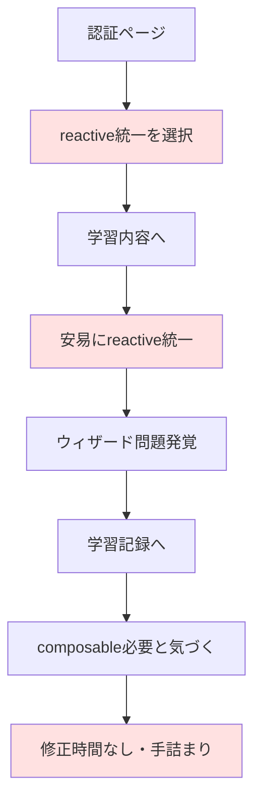

## 相互リンク

[振り返り](https://www.notion.so/25f9d86c12e880b49fb1f09974586abe?pvs=21) 

.gemini/docs/other/portfolio-reflection.md

---

# 反省点

## 1. 要件定義の進め方

- 簡易画面設計の途中で学習内容の状態管理の漏れや編集ページ、機能の実装漏れに気づき、その都度テーブル構造の修正が発生した
- 早い段階から画面フローや簡易画面設計を入念に用意しておけば、より効率的に進められたと思われる

### **1.1 具体的につまずいた箇所：**

- 学習コンテンツの進捗率計算にセクションごとのステータスが必要なことに後から気づいた
- 削除機能を実装時、関連する学習記録も削除する必要があることを見落としていた
- 編集ページの存在を忘れており、作成ページのコンポーネントを流用できることに後から気づいた

---

## 2. UI/UXの統合のタイミング

- 当初はbolt.newをフル活用して画面作成を全て実装するつもりだったが、無料プランだと1日あたりの使用トークンの上限に限界があるため、使いづらく、GitHub連携しているので、途中からローカル環境でGeminiCLIで実装に切り替えた
- 経験不足故に途中でbolt.newとの併用する可能性を考慮してそのまま完成まで作成を進めてしまい、本番移行時に実装過程のコミットが残らないので、作成レポジトリのコミット履歴を確認しなければいけないという課題が発生することに気づいた
- 変更過程はドキュメント化しているので多少わかるとはいえ次回以降の作成の課題だと認識した

### **2.1 この判断による影響：**

- コミット履歴が2つのリポジトリに分散してしまった
- 「なぜこの実装にしたか」という過程が追いづらくなった

---

## 3. 共通コンポーネント化の判断基準

- 学習内容のロジックが肥大化し、コンポーネントを細分化した実装をきっかけに、類似性のあるボタンが独立して記載されていることや、ページごとに微妙に異なるレイアウトやCSSが設定されていることに気づいた

### 3.1 具体的に発見した重複：

- メニューボタン、削除ボタン、DatePicker矢印がすべてp-2サイズなのに個別実装
- 削除確認モーダルが3箇所で微妙に異なるスタイル
- バリデーションエラーの表示方法が統一されていない
- **詳細画面のレイアウトが各ページで個別実装され、パンくずリスト・ヘッダー・アクションボタンの配置が微妙に異なる**

### 3.2 この経験から学んだ共通化の判断基準：

- 以下の内容はあらかじめ規定しておくと効率よく開発ができることを学んだ

### 3.3 共通コンポーネント化の判断基準

要件定義に含めるmarkdown

```markdown
## 1. デザインシステムの事前定義

### ボタンサイズ：
- xs: 極小（px-2 py-1 text-xs）
- sm: 小（px-3 py-1.5 text-sm）
- md: 中（px-6 py-3 text-base）
- lg: 大（px-8 py-4 text-lg）

### バリアント（派生）例：
- primary: 主要アクション（紫）
- secondary: 補助アクション（白）
- danger: 削除系（赤）
- info: 情報系（青）

## 2. 機能的な共通性 ✅

### 作成・編集で共通：
- 共通レイアウト(DefaultLayout.vue等)
- モーダル関連（DeleteConfirmModal等）
- ドラッグ&ドロップ（SectionListEditor）
- フォーカストラップ
- バリデーション表示
- ウィザードステップ

### 詳細・一覧で共通： 🆕
- DetailLayout（詳細画面の共通レイアウト）
  - パンくずリスト配置
  - ヘッダーセクション（タイトル、説明、メタ情報）
  - アクションボタン配置
  - カードスタイル統一
- ListLayout（一覧画面の共通レイアウト）
  - ページタイトル
  - フィルター配置
  - ページネーション

## 3. 共通化の追加判断基準 🆕

### すべき：
- 3箇所以上で使用
- 独立して配置可能（親要素に依存しない）
- ビジネスロジックが同じ
- メンテナンスで一括変更したい
- **レイアウトパターンが確立している（詳細画面、一覧画面、フォーム画面）**

### しない方がいい：
- 親要素に依存（absolute配置等）
- 見た目は似てるが役割が違う
- 1-2箇所でしか使わない
- 無理な抽象化が必要
- **特殊なレイアウト要件がある（複数カード構成など）**

```

プロジェクト開始時のテンプレートmarkdown

```markdown
## UIコンポーネント定義
- [ ] カラーパレット定義
- [ ] タイポグラフィ定義
- [ ] スペーシング定義
- [ ] ボタンバリアント定義
- [ ] フォーム要素定義

## 共通レイアウトコンポーネント 🆕
- [ ] DefaultLayout（アプリ全体のレイアウト）
- [ ] DetailLayout（詳細画面用）
- [ ] ListLayout（一覧画面用）
- [ ] FormLayout（フォーム画面用）
- [ ] WizardLayout（ウィザード画面用）

## 共通コンポーネント候補
- [ ] BaseButton
- [ ] BaseModal
- [ ] BaseCard
- [ ] FormInput
- [ ] FormSelect
- [ ] ConfirmDialog

## ページ間共通機能
- [ ] バリデーション
- [ ] エラー表示
- [ ] ローディング
- [ ] 通知（Toast/Alert）
- [ ] パンくずリスト 🆕
- [ ] ページヘッダー 🆕

```

プロジェクトの最初に作る

```jsx
// /src/config/design-system.js
export const designSystem = {
  buttons: {
    sizes: { xs, sm, md, lg },
    variants: { primary, secondary, danger, info }
  },
  colors: {
    primary: 'violet',
    danger: 'red',
    // ...
  },
  // レイアウトパターンの定義 🆕
  layouts: {
    detail: {
      maxWidth: 'max-w-4xl',
      padding: 'p-8',
      card: 'p-8 border shadow-lg bg-white/70 backdrop-blur-md rounded-2xl border-white/20'
    },
    list: {
      maxWidth: 'max-w-6xl',
      padding: 'p-6'
    }
  }
};

```

### 3.4 DetailLayoutの適用パターン 🆕

実際の開発で判明した3つの適用パターン：

1. **シンプルパターン（新規作成・編集）**
    - title/descriptionプロパティのみ使用
    - 静的な情報表示
2. **標準詳細パターン**
    - パンくずリスト + 動的タイトル + メタ情報
    - section-headerスロットを活用
3. **カスタムパターン（プロフィール等）**
    - 基本構造は活用しつつ、独自コンテンツを配置
    - 必要最小限のスロットのみ使用

---

## 4. バリデーションエラー表示のコンポーネント間連携

- 学習記録フォームのバリデーションエラー表示で「エラーが表示されたらフォームを赤枠で強調し、ユーザーが入力を始めたら赤枠を消す」という要件を後から追加実装することになった
- コンポーネント化されたフォーム（StudySessionForm → StudySessionFormFields → SectionSelector）において、エラー状態と修正状態を各階層で伝播させる必要が生じ、Props/Emitの連鎖が複雑化した

### 4.1 具体的につまずいた箇所：

- SectionSelectorコンポーネント内でmodified状態を管理していたが、親コンポーネントでのバリデーションエラーリセット時に連動できなかった
- 各フォーム要素（セクション選択、学習時間、メモ）で個別にエラー表示制御が必要となり、それぞれに`showXxxBorder props`と`xxx-modified emit`を追加する必要があった
- **StudySessionForm**と**StudySessionEdit**で同じ修正を重複実装する必要があった

### 4.2 この経験から学んだ教訓：

### コンポーネント設計時に考慮すべきこと：

```jsx
// ❌ 後から追加すると複雑になる例
// 各コンポーネントで個別に状態管理
const sectionModified = ref(false);
const durationModified = ref(false);
const memoModified = ref(false);

// ✅ 最初から構造化しておくべき例
const fieldStates = reactive({
  section: { touched: false, modified: false, error: null },
  duration: { touched: false, modified: false, error: null },
  memo: { touched: false, modified: false, error: null }
});

```

### バリデーション要件の事前定義：

```markdown
## フォームバリデーション仕様
- [ ] エラー表示タイミング（submit時/リアルタイム/フォーカスアウト時）
- [ ] エラー表示方法（赤枠/エラーメッセージ/両方）
- [ ] エラー解除条件（入力開始時/有効な値入力時/再submit時）
- [ ] エラー状態の管理場所（各コンポーネント/親で一元管理/状態管理ライブラリ）

```

### 4.3 改善案：

1. **Provide/Injectパターンの活用**
    - 深い階層のコンポーネント間でのProps/Emit地獄を回避
    - バリデーション状態を一元管理
2. **カスタムコンポーザブルの作成**
    
    ```jsx
    // useFieldValidation.js
    export const useFieldValidation = (fieldName, validationErrors) => {
      const isModified = ref(false);
      const hasError = computed(() =>
        validationErrors.value.some(e => e.includes(fieldName)) && !isModified.value
      );
      const markAsModified = () => { isModified.value = true; };
      const reset = () => { isModified.value = false; };
    
      return { hasError, markAsModified, reset };
    };
    
    ```
    
3. **フォームライブラリの検討**
    - VeeValidate、Vuelidateなどの採用で複雑なバリデーション管理を簡素化
    - ただし、学習目的では自前実装の経験も重要

### 4.4 得られた知見：

- **要件は最初から明確に** - 特にUXに関わる挙動は後付けすると実装が複雑化する
- **状態管理の設計は慎重に** - どのレベルでどの状態を持つか、最初に設計する
- **コンポーネント化と複雑性のバランス** - 再利用性と実装の複雑さはトレードオフ
- **段階的な実装** - 基本機能を実装してから、エラー表示などの付加機能を追加する方が見通しが良い

---

## 5. データ管理層の設計統一を怠ったこと

- Mock実装時にコンポーザブル（useUser）でデータ管理を行い、API実装時に別途Piniaストア（useAuthStore）を作成したため、データソースの切り替えで全コンポーネントの修正が必要になった
- 最初からPiniaストアで統一していれば、Mock/APIの切り替えはストア内部の実装変更だけで済み、コンポーネント側の修正は不要だった

### 5.1 具体的につまずいた箇所：

- useUserからuseAuthStoreへの移行で、computedの扱い（user vs user.value）に混乱した
- どのコンポーネントがどのデータソースを使っているか把握できず、影響範囲の特定に時間がかかった
- DefaultLayout、Profile、ProfileEditなど複数箇所で同じ修正を繰り返す必要があった
- propsで渡されたユーザー情報と、直接取得したユーザー情報が混在し、データフローが不明瞭になった

### 5.2 この経験から学んだ教訓：

**データ管理層の設計原則：**

```jsx
// ✅ 最初からすべきだった設計
// 1. Piniaストアで一元管理
// 2. Mock/APIの切り替えはストア内部で隠蔽
// 3. コンポーネントはデータソースを意識しない

// stores/auth.js
const dataSource = import.meta.env.DEV ? mockData : apiData;

```

### 5.3 得られた知見：

- **設計の一貫性が重要** - Mock実装でも本番と同じアーキテクチャを採用すべき
- **データフローの明確化** - どこでデータを取得し、どう伝播するか最初に決める
- **抽象化の価値** - データソースの詳細をコンポーネントから隠蔽することで、変更に強い設計になる
- **「動けばいい」の落とし穴** - バイブコーディングで進めると、後から全体像が把握できなくなる

---

## 6. SPAにおけるAPI設計の難しさ

- Vue学習経験が浅く、初めてのSPAアプリケーション開発で、RESTful API設計の概念理解が不十分なまま実装を進め、実装とドキュメントに大きな乖離が発生した
- AI駆動開発で「動くものを作る」ことを優先した結果、「dataラップ」「JsonResource」「ページネーション」などの概念を理解せずに進め、後から「なぜこうなった？」と振り返る必要が生じた

### 6.1 具体的につまずいた箇所：

- **仕様書と実装の乖離**：Apidocで作成したAPI仕様書が実装と全く異なり、特に認証エンドポイントのプレフィックス設定、学習記録・統計APIの構造が想定と大きく異なった
- **dataラップの理解不足**：`response.data.data`という二重構造の意味が分からず、なぜResourceを使うとdataでラップされるのか理解できないまま実装
- **AIへの丸投げ**：「JsonResource？ページネーション？よくわからないからそれで実装して」という指示で進めた結果、動くが理解できないコードが量産された
- **概念の爆発的増加**：RESTful設計、JSONシリアライゼーション、Resource層、HTTPステータスコードなど、一度に多くの新概念に直面し消化不良に

### 6.2 この経験から学んだ教訓：

**API設計で押さえるべき基本概念：**

```jsx
// ❌ 理解せずに実装した例
return UserResource::collection($users); // なぜこう書く？？

// ✅ 理解した後の整理
// 1. 生データ返却（統計API向け）
return response()->json($users);

// 2. 手動dataラップ（必要に応じて）
return response()->json(['data' => $users]);

// 3. Resource使用（CRUD向け、自動dataラップ）
return UserResource::collection($users);

```

APIレスポンス統一ルールの策定：

```markdown
1. Fortify認証系: dataラップなし
2. CRUD系: Resource使用で自動dataラップ
3. 統計・集計: dataラップなし（生配列）
4. 削除: メッセージのみ

```

### 6.3 改善案：

1. **段階的理解アプローチ**
    - まず最小限のJSONレスポンスから始める
    - 動作確認後、Resource層を導入
    - 最後にページネーション等の付加機能
2. **AI活用の改善**
    
    ```markdown
    // ❌ 丸投げ
    「API作って」
    
    // ✅ 理解を深める質問
    「このResourceクラスは何をしているか、簡単な例で説明して」
    
    ```
    
3. **実装とドキュメントの同期**
    - 実装を正（Source of Truth）とする
    - Apidogで実際のレスポンスを確認してから仕様書更新

### 6.4 得られた知見：

- **締切と理解のバランス**: 10/7締切を守るため理解60%で進めたのは正しい判断だったが、事後学習が必須
- **AI駆動開発の落とし穴**: AIに丸投げすると「動くが理解できないコード」になる
- **概念の段階的学習**: 一度にすべて理解しようとせず、優先順位をつけて学習
- **「なぜ」を問う重要性**: 実装後でも「なぜdataラップ？」と疑問を持ち、理解を深める姿勢が成長につながる

---

## 7. 個人開発の教訓

- 初めてのSPA開発において、締切（10/7）を絶対厳守するため、完璧な理解より動作を優先する判断を下したが、これが結果的に正しい選択となった
- ポートフォリオ作成において「動くもの」が最重要であり、企業は「未完成の完璧」より「動く60点」を評価することを学んだ

### 7.1 具体的につまずいた箇所：

- **完璧主義の罠**: API概念を完全に理解してから実装しようとすると締切に間に合わない
- **AI依存の不安**: 「AI任せで大丈夫か」という不安を抱えながら、でも締切のために進む葛藤

### 7.2 この経験から学んだ教訓：

### 個人開発の優先順位：

```markdown
1. 最優先: 動作する実装（締切厳守）
2. 重要: 見た目の完成度（ポートフォリオは第一印象が9割）
3. 可能なら: テスト・ドキュメント
4. 後回し: 完璧な理解・リファクタリング

```

### 戦略的なAI活用：

```markdown
## 開発フロー
1. AIに実装依頼（理解60%）
2. 動作確認
3. 問題があれば修正
4. 事後学習で理解を深める

✅ これは「AI任せ」ではなく「AI協働」

```

### 7.3 改善案：

1. **MVPファーストの徹底**
    - 完璧な設計より動くもの
    - 理解できる範囲で実装
    - 後から改善する前提で進める
2. **学習記録の習慣化**
    
    ```markdown
    ## 日次振り返りテンプレート
    - 実装: 何を作ったか
    - 理解: 何が分からなかったか
    - 学習: 何を学んだか
    - 次回: 何を深掘りするか
    
    ```
    

---

## 8. フォームデータ管理の不統一と判断基準の欠如

- プロジェクト全体でレイアウトの不均一、`ref`、`reactive`、`composable`の使い分けが不統一なまま実装を進めた結果、「どこで何を使うべきか」の判断基準が不明確になってしまった
- 具体例として、**ProfileEdit.vue**では`reactive`を使用し、**StudySessionEdit.vue**/**LearningContentEdit.vue**では`composable`を採用するなど実装パターンが混在していたため、新規フォーム実装時に毎回判断に迷う状況を招いた

### 8.1 具体的につまずいた箇所：

- バリデーションロジックの統一に取り組んだ際、認証ページで`ref`と`reactive`が混在していることに気づき、同時並行で修正作業を行った。
- `ref`、`reactive`、`composable`の適切な使い分け基準を十分検討せずに、安易に`reactive`での統一を選択してしまった。その結果、特定の実装パターンが選ばれた理由が理解できず、変更による影響範囲も正確に判断できなかった。
- このため、認証→学習内容→学習記録と段階的に実装を進めたものの、各段階で修正作業が必要となり、結果的に多大な工数を要することになった。
- 振り返ると、UI/UX作成・統合時およびAI実装依頼時に明確な基準を示せなかったことが原因で、AIが一貫性のない異なるパターンで実装してしまう結果となった。

つまずきループ



### 8.2 この経験から学んだ教訓：

**フォームデータ管理の統一ルール策定：**

```markdown
## コンポーザブル化すべき条件（いずれか1つでも該当）
1. Create/Edit両方で使う
2. バリデーションロジックが複雑
3. モーダル管理などUI状態が複雑
4. フォーマット処理が必要

## reactive（コンポーネント内）でOKな条件
1. Editのみで使う（Createがない）
2. シンプルな入力フィールドのみ（3〜5個程度）
3. バリデーションが単純（必須チェック程度）

## ref使用ケース
- 単一の値のみ（boolean, number, stringなど）

```

| ファイル | 現在のパターン | 判定結果 | 対応 |
| --- | --- | --- | --- |
| ProfileEdit.vue | reactive | ✅ 正解 | 変更不要（Editのみ、シンプル） |
| StudySession系 | コンポーザブル | ✅ 正解 | 変更不要（Create/Edit両方、複雑） |
| LearningContent系 | 一部コンポーザブル | ⚠️ 要改善 | 完全コンポーザブル化が必要 |

### 8.3 改善案：

1. **Vue.js コーディング規約に詳細なルールを記載する:**
    - フォーム実装ガイドラインを明文化
    - 新規実装時の判断フローチャートを記載
    - AI指示時のリファレンスとして活用
2. **新規フォーム作成時の判断フロー:**
    
    ```
    新しいフォームを作る
        ↓
    Create/Edit両方ある？
        ↓ はい
    コンポーザブル化
        ↓ いいえ
    複雑（モーダル、ウィザード、フォーマット処理）？
        ↓ はい
    コンポーザブル化
        ↓ いいえ
    reactive（コンポーネント内）
    
    ```
    

### 8.4 得られた知見：

- **「不均一」自体は問題ではない** - 適切な理由があれば異なるパターンの混在は許容される
- **判断基準の明文化が重要** - ルールがないことが最大の問題であり、ドキュメント化で解決できる
- **事後の整理でも価値がある** - 実装後に振り返って基準を策定することで、次回以降の開発効率が向上する
- **AI協働には明確な基準が必須** - AIに「よしなに実装して」では一貫性のないコードが生まれる

---
