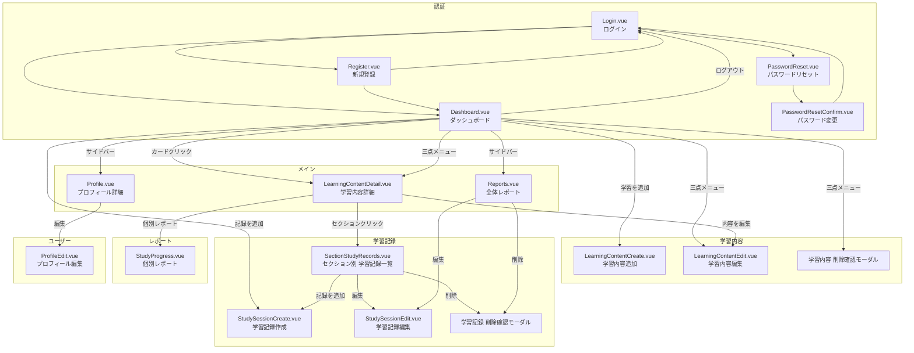
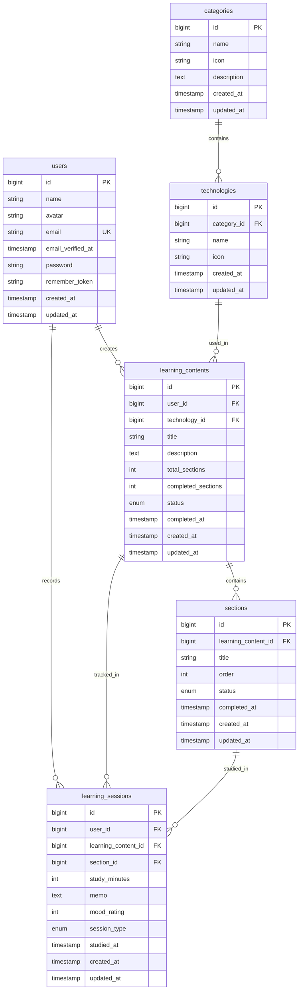
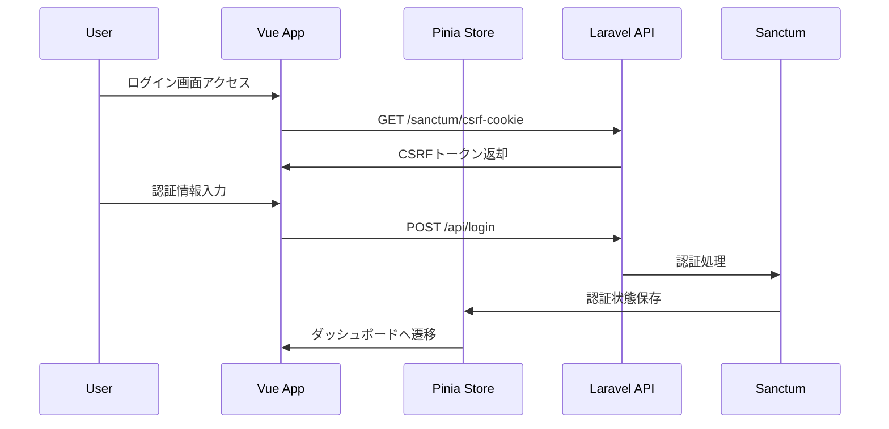

## 1. プロジェクト概要

### 1.1 プロジェクト基本情報

- プロジェクト名: LearnTrack Pro - プログラミング学習管理プラットフォーム
- 開発目的: 転職活動用ポートフォリオとして、Laravel 12とVue.js 3を用いたモダンなSPAアプリケーションの開発
- ターゲット: 企業の採用担当者および技術者
- 開発期間: 2025年9月3日〜10月11日（6週間）
- 最終完成期限: 2025年10月11日（金）
  - 当初予定: 2025年10月7日（火）
  - **実績: 4日間遅延**
  - MVP完成日: 2025年10月7日（火）
- 事前準備期間: 23日間（2025年8月11日〜9月2日）
- 開発手法: APIファーストアプローチ with AI駆動開発（GeminiCLI + Claude）
- 現在の状態: MVP完成、改善フェーズ

### 1.2 StudyPlusとの差別化ポイント

- **StudyPlus**: 書籍・教材ベースの汎用学習記録アプリ
- **LearnTrack Pro**: プログラミング学習特化、教材に依存しない柔軟な学習内容管理
- **核心的差別化**: 「ポートフォリオ作成実践」「Laravel環境構築」など、書籍が存在しない学習内容に対応

### 1.3 技術スタック

- **Backend**: Laravel 12.x (PHP 8.3+)
- **Frontend**: Vue.js 3 (Composition API) + Tailwind CSS
- **状態管理**: Pinia
- **ビルドツール**: Vite
- **Database**: MySQL 8.0
- **認証**: Laravel Sanctum, Laravel Fortify (SPA認証)
- **チャート**: Chart.js
- **アイコン**: Heroicons
- **UIライブラリ**: Headless UI
- **ドラッグ&ドロップ**: VueDraggable
- **開発環境**: Docker

### 1.4 開発支援ツール

- **API設計・テスト**: Apidog
- **UI生成**: Bolt.new（初期構成のみ使用）→GeminiCLI
- **バージョン管理**: Git
- **エディタ**: VS Code
- **AI支援**: Gemini CLI, Claude

---

## 2. 解決すべき課題

### 2.1 核心的な問題

1. **プログラミング学習の特殊性**
    - 書籍に依存しない学習内容（ポートフォリオ作成、環境構築実践等）
    - 技術分野別の学習管理の必要性
2. **学習進捗の可視化不足**
    - セクション単位での詳細な進捗管理
    - 学習時間と進捗率の相関分析
3. **学習履歴の分析機能不足**
    - 技術分野別の学習時間分析
    - 学習パターンの把握

### 2.2 成功指標

- セクション単位での進捗可視化
- 技術分野別学習時間の分析
- 週間学習パターンのチャート表示

---

## 3. 機能要件

### 3.1 MVP機能（必須実装）

### 3.1.1 認証機能

- ユーザー登録
- ログイン・ログアウト
- パスワードリセット
- パスワード変更
- ユーザープロフィール表示・編集

### 3.1.2 学習内容管理

- 学習内容登録（技術選択、タイトル、説明）
- セクション管理（作成、編集、削除、並び替え）
  - **学習内容作成時に最低1つのセクション登録が必須**
  - 削除は2つ以上ある場合のみ可能
- 進捗率計算・表示（完了セクション数 / 総セクション数）
- 学習内容一覧表示
  - カード形式での表示
  - 更新日時順の並び替え（デフォルト）
  - 三点メニューからの操作（編集・詳細・削除・完了/再開）
- 学習内容詳細表示
- 学習内容編集（基本情報タブ/セクション管理タブ）
- 学習内容削除（確認モーダル付き、カスケード削除）
- 学習内容の完了/再開機能
  - 全セクション完了時に完了可能
  - 三点メニューから操作
  - 完了後も再開可能

### 3.1.3 学習記録機能

- 手動記録入力
  - 学習日選択（日付ピッカー）
  - 学習時間入力（時間・分の選択）
  - 学習メモ（任意）
  - 調子評価（1-5段階、任意）

### 3.1.4 基本レポート機能

- 週間学習時間推移チャート（棒グラフ）
- 技術分野別学習時間表示
- 学習履歴一覧（日付、時間、メモ表示）

---

## 4. 画面設計

### 4.1 画面一覧

1. 認証関連
    - ログイン画面
    - ユーザー登録画面
    - パスワードリセット画面
2. メイン機能
    - 学習内容一覧画面（メインページ）
    - 学習内容詳細画面（セクション一覧表示）
    - 学習内容登録画面（セクション入力必須）
    - 学習内容編集画面
    - 学習記録入力画面（手動入力）
    - 学習記録編集画面
    - レポート画面
    - 学習推移詳細画面（チャート表示）
3. ユーザー管理
    - ユーザープロフィール表示
    - ユーザー情報編集画面
4. モーダル・ダイアログ
    - 削除確認モーダル
    - 日付選択モーダル
    - 時間入力モーダル

### 4.2 画面フロー



---

## 5. API設計

### 5.1 RESTful エンドポイント

1. 認証関連

    ```bash
    # CSRF保護
    GET    /sanctum/csrf-cookie
    
    # 基本認証（Fortify）
    POST   /fortify/register
    POST   /fortify/login
    POST   /fortify/logout
    POST   /fortify/forgot-password
    POST   /fortify/reset-password
    
    # ユーザー情報管理（自前API）
    GET    /api/user
    PUT    /api/user/profile
    POST   /api/user/avatar
    ```

2. マスターデータ

```bash
# カテゴリー・技術マスターデータ
GET    /api/categories                        # カテゴリー一覧
GET    /api/technologies                      # 技術一覧
GET    /api/technologies?category_id={id}     # カテゴリー別技術一覧

```

1. 学習内容管理

```bash
GET    /api/learning-contents                 # 学習内容一覧
POST   /api/learning-contents                 # 学習内容作成
GET    /api/learning-contents/{id}            # 学習内容詳細
PUT    /api/learning-contents/{id}            # 学習内容編集
DELETE /api/learning-contents/{id}            # 学習内容削除
PUT    /api/learning-contents/{id}/complete   # 完了にする
PUT    /api/learning-contents/{id}/reopen     # 学習を再開

```

1. セクション管理

    ```bash
    GET    /api/learning-contents/{id}/sections                      # セクション一覧
    POST   /api/sections                                             # セクション追加
    PUT    /api/sections/{id}                                        # セクション編集
    PUT    /api/sections/{id}/status                                 # ステータス変更
    PUT    /api/learning-contents/{learningContentId}/sections/bulk  # セクション一括更新
    DELETE /api/sections/{id}                                        # セクション削除
    ```

2. 学習記録

    ```bash
    GET    /api/learning-sessions                                       # 学習記録一覧
    POST   /api/learning-sessions                                       # 学習記録作成
    GET    /api/learning-sessions/{id}                                  # 学習記録詳細
    PUT    /api/learning-sessions/{id}                                  # 学習記録更新
    DELETE /api/learning-sessions/{id}                                  # 学習記録削除
    GET    /api/sections/{sectionId}/sessions                           # セクション別学習記録
    GET    /api/learning-contents/{learningContentId}/sessions          # 学習内容別学習記録
    ```

3. レポート・統計

    ```bash
    GET    /api/learning-sessions/statistics/summary                    # 統計サマリー
    GET    /api/learning-sessions/statistics/monthly                    # 月別統計
    GET    /api/learning-sessions/statistics/by-technology              # 技術別統計
    GET    /api/learning-sessions/statistics/daily                      # 日別統計
    GET    /api/learning-sessions/statistics/latest-by-content          # 学習内容別最新記録取得
    GET    /api/learning-contents/{learningContentId}/statistics/daily  # 学習内容別日別統計取得
    ```

---

## 6. データベース設計

### 6.1 ER図



### 6.2 主要テーブル詳細

### categories テーブル（マスターデータ）

```sql
INSERT INTO categories (name, description) VALUES
('Programming', 'プログラミング言語、フレームワーク、ライブラリ'),
('Infrastructure', 'サーバー、ネットワーク、クラウド、コンテナ技術'),
('Service', 'Webサービス、開発ツール、生産性向上ツール'),
('Development', '設計、開発手法、プロジェクト管理、実践的な開発'),
('AI', 'AI、機械学習、LLM、プロンプトエンジニアリング'),
('Other', 'ビジネススキル、マインドセット、その他の学習');
```

### technologies テーブル（Seederデータ）

```sql
-- プログラミング言語
{ id: 1, category_id: 1, name: 'Laravel', icon: '/src/assets/icons/technologies/laravel-icon.png', created_at: '2023-01-01T00:00', updated_at: '2023-01-01T00:00' },
{ id: 2, category_id: 1, name: 'Vue.js', icon: '/src/assets/icons/technologies/vue-icon.png', created_at: '2023-01-01T00:00', updated_at: '2023-01-01T00:00' },
{ id: 3, category_id: 1, name: 'React', icon: '/src/assets/icons/technologies/react-icon.png', created_at: '2023-01-01T00:00', updated_at: '2023-01-01T00:00' },
-- ..etc

-- インフラ
{ id: 14, category_id: 2, name: 'Linux', icon: '/src/assets/icons/technologies/linux-icon.png', created_at: '2023-01-01T00:00', updated_at: '2023-01-01T00:00' },
{ id: 15, category_id: 2, name: 'Nginx', icon: '/src/assets/icons/technologies/nginx-icon.png', created_at: '2023-01-01T00:00', updated_at: '2023-01-01T00:00' },
{ id: 16, category_id: 2, name: 'Apache', icon: '/src/assets/icons/technologies/apache-icon.png', created_at: '2023-01-01T00:00', updated_at: '2023-01-01T00:00' },
-- ..etc

-- サービス
{ id: 21, category_id: 3, name: 'Git', icon: '/src/assets/icons/technologies/git-icon.png', created_at: '2023-01-01T00:00', updated_at: '2023-01-01T00:00' },
{ id: 22, category_id: 3, name: 'GitHub', icon: '/src/assets/icons/technologies/github-icon.png', created_at: '2023-01-01T00:00', updated_at: '2023-01-01T00:00' },
{ id: 23, category_id: 3, name: 'VSCode', icon: '/src/assets/icons/technologies/vscode-icon.png', created_at: '2023-01-01T00:00', updated_at: '2023-01-01T00:00' },
-- ..etc

-- 開発関連
{ id: 27, category_id: 4, name: '開発', icon: '/src/assets/icons/technologies/agile-icon.png', created_at: '2023-01-01T00:00', updated_at: '2023-01-01T00:00' },
{ id: 28, category_id: 4, name: 'システム設計', icon: '/src/assets/icons/technologies/development-icon.png', created_at: '2023-01-01T00:00', updated_at: 
{ id: 29, category_id: 4, name: 'UI/UX設計', icon: '/src/assets/icons/technologies/system-design-icon.png', created_at: '2023-01-01T00:00', updated_at: 
-- ..etc

-- AI
{ id: 32, category_id: 5, name: 'ChatGPT', icon: '/src/assets/icons/technologies/chatgpt-icon.png', created_at: '2023-01-01T00:00', updated_at: 
{ id: 33, category_id: 5, name: 'Claude', icon: '/src/assets/icons/technologies/claude-icon.png', created_at: '2023-01-01T00:00', updated_at: '2023-01-01T00:00' },
{ id: 34, category_id: 5, name: 'Gemini', icon: '/src/assets/icons/technologies/gemini-icon.png', created_at: '2023-01-01T00:00', updated_at: '2023-01-01T00:00' },
-- ..etc

-- その他
{ id: 37, category_id: 6, name: 'ビジネススキル', icon: '/src/assets/icons/technologies/business-icon.png', created_at: '2023-01-01T00:00', updated_at: 
{ id: 38, category_id: 6, name: 'マインドセット', icon: '/src/assets/icons/technologies/mind-icon.png', created_at: '2023-01-01T00:00', updated_at: 
{ id: 39, category_id: 6, name: 'その他', icon: '/src/assets/icons/technologies/other-icon.png', created_at: '2023-01-01T00:00', updated_at: '2023-01-01T00:00' },
-- ..etc

```

### sections.status（列挙型）

各セクションの学習進捗状態を管理

```sql
ENUM('not_started', 'in_progress', 'completed')
-- not_started: 未着手（初期状態）
-- in_progress: 学習中（学習記録が1回以上ある状態）
-- completed: 完了（ユーザーが明示的に完了マークした状態）

```

### learning_sessions.session_type（列挙型）

学習記録の入力方法を区別し、ストップウォッチ機能の実装状況を管理

```sql
ENUM('manual', 'stopwatch')
-- manual: 手動入力（時間を手入力で記録）
-- stopwatch: ストップウォッチ（自動計測で記録）

```

### **learning_sessions テーブル**

```sql
bigint section_id FK NOT NULL  # NULL不可を明記
```

---

## 7. 技術的考慮事項

### 7.1 SPA認証フロー



---

## 8. 成果物の評価基準

### 8.1 機能面での評価ポイント

- ✅ プログラミング学習特化の学習内容管理
- ✅ セクション単位での詳細進捗管理
- ✅ 手動入力による学習記録機能
- ✅ 週間学習時間チャート表示
- ✅ レスポンシブ対応（PC + スマートフォン）

### 8.2 技術面での評価ポイント

- ✅ Laravel 12新機能の実践的活用
- ✅ Vue.js 3 Composition API + Pinia実装
- ✅ Tailwind CSSによるモダンUI構築
- ✅ SPA認証（Sanctum + Fortify）の実装
- ✅ APIファースト設計思想の実践

### 8.3 ポートフォリオとしての価値

- ✅ StudyPlusとの明確な差別化
- ✅ 実用的な学習管理アプリとして完成
- ✅ モダンな技術スタックの習得証明

---

## 9. 開発後の展望

### 9.1 今後の実装タスク

**優先度: 高（2日以内）**

1. **APIエラーハンドリングの実装**
    - Axios Interceptor実装
    - グローバルエラーモーダル実装
    - エラーモーダルストア実装

**優先度: 中（1週間以内）**

1. APIドキュメントの境界値テスト追加と検証
2. 文字数カウンター実装
3. レイアウトの最終確認

**優先度: 低（余裕があれば）**

1. 時間入力のループ機能
2. 高速連続削除の完全対策

### 9.2 長期的改善（1ヶ月目以降）

デプロイ

- CI/CDパイプライン構築
- AWSへのデプロイ
  - 本番環境構築・デプロイ
  - SSL証明書設定・独自ドメイン対応
  - 監視・ログ設定

---

## 10. まとめ

### 10.1 本プロジェクトは、プログラミング学習に特化した管理プラットフォームとして、以下を実現します

1. 技術的成長: Laravel 12 + Vue.js 3 + Tailwind CSSの実践習得
2. 差別化価値: StudyPlusにない「教材非依存」の学習管理
3. 実用性: 手動入力による詳細な学習記録管理
4. 転職活動: モダン技術習得とSPA認証実装の実績

### 10.2 APIファーストアプローチとAI駆動開発により

- 効率的な開発プロセス
- 高品質なコード生成
- 段階的な機能拡張

### 10.3 MVP完成により

- コア機能の完成
- 改善フェーズへの移行
- 継続的な価値創造

---

## 更新履歴

- **修正完了日**: 2025年10月11日
- **MVP完成日**: 2025年10月7日
- **開発開始日**: 2025年9月3日

---
