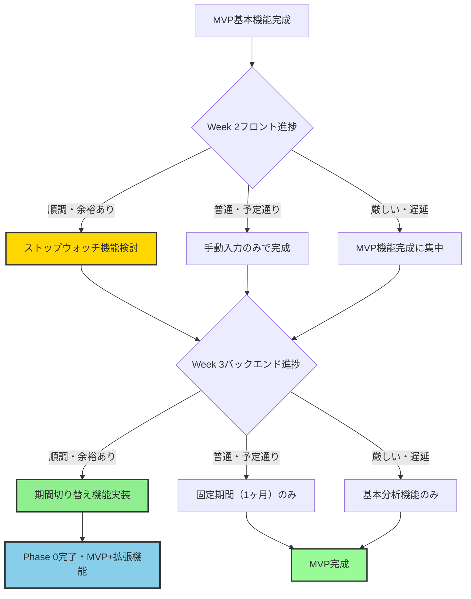

## 相互リンク

[機能拡張ロードマップ](https://www.notion.so/2499d86c12e880b9ba25d1cc7e8d71f3?pvs=21) 

.gemini/docs/project-infos/機能拡張ロードマップ.md

---

## 概要

APIファーストアプローチによるMVP完成後の追加機能拡張計画。
Week 2でのフロント完成度とWeek 3でのバックエンド実装余裕に応じて段階的に拡張。

---

## Phase 0: MVP拡張機能（開発期間中の条件付き実装）

### 0-1. ストップウォッチ機能

実装タイミング: Week 2フロント実装で余裕がある場合
必須度: ★★★★☆
理由:

- 学習管理アプリとしての完成度大幅向上
- Page Visibility APIでの技術力アピール
- 手動入力でも基本機能は成立するため条件付き

仕様概要:

- 開始・停止・リセット機能
- Page Visibility API対応（バックグラウンド動作）
- 計測完了時の学習記録自動保存
- タブ切り替え（手動入力 ↔ ストップウォッチ）

工数見積: フロント2日 + バック1日

### 0-2. 期間切り替え機能

実装タイミング: Week 3バックエンド実装で余裕がある場合
必須度: ★★★☆☆
理由:

- データ蓄積後の実用性向上
- 固定期間（直近1ヶ月）でも分析は可能
- 実装の技術的複雑度は低い

仕様概要:

- 1週間・1ヶ月・全期間の切り替え
- URLパラメータでの期間状態保持
- チャート描画の動的更新

工数見積: フロント1日 + バック1日

---

## 実装優先順位（現実的な判断基準）

### 🎯 Week 2-3での追加機能実装順序

### 📊 実装判断マトリックス

| 機能 | 実装コスト | ユーザー価値 | 技術的複雑度 | 必須度 | Phase 0優先度 |
| --- | --- | --- | --- | --- | --- |
| ストップウォッチ | 中（3日） | 高 | 中 | ★★★★☆ | 1位 |
| 期間切り替え | 低（2日） | 中 | 低 | ★★★☆☆ | 2位 |
| 技術別ドーナツ | 低（2日） | 中 | 低 | ★★★☆☆ | Phase 1 |
| 詳細フィルタ | 中（3日） | 高 | 中 | ★★★★☆ | Phase 1 |
| 休憩時間記録 | 低（2日） | 中 | 低 | ★★★☆☆ | Phase 1 |

---

## Phase 1: 基本機能強化（MVP完成後 1-2週間）

### 1-1. 技術別学習時間ドーナツチャート

必須度: ★★★☆☆
理由: 学習バランスの可視化で付加価値向上

仕様概要:

- Chart.js ドーナツチャート
- 技術別の学習時間割合表示
- ホバーで詳細時間表示
- カテゴリ別の色分け

工数見積: 2日

### 1-2. 学習履歴の詳細フィルタリング

必須度: ★★★★☆
理由: データ蓄積後の検索・絞り込みは必須

仕様概要:

- 技術別、期間、調子評価でのフィルタ
- 検索機能（メモ内容での検索）
- ソート機能（時間、日付、評価）
- フィルタ条件の保存

工数見積: 3日

### 1-3. 休憩時間記録機能

必須度: ★★★☆☆
理由: 実質学習時間の正確な把握

仕様概要:

- learning_sessionsテーブルに以下を追加
    - break_count: 休憩回数
    - break_minutes: 休憩時間合計
    - total_minutes: 総学習時間（休憩込み）
- 実質学習時間の自動計算機能
- レポートでの表示切り替え（総時間/実質時間）

工数見積: 2日

---

## Phase 2: 分析・レポート機能強化（1-2ヶ月後）

### 2-1. 週間目標設定・達成率機能

必須度: ★★★☆☆
仕様概要:

- 週間学習時間目標の設定
- 進捗率の円形プログレスバー表示
- 達成・未達成の履歴管理
- 目標達成時の通知機能

工数見積: 4日

### 2-2. 学習時間推移線グラフ

必須度: ★★★☆☆
仕様概要:

- 日別・週別・月別の学習時間推移
- 複数技術の重ね合わせ表示
- 目標ラインの表示
- ズーム・パン機能

工数見積: 3日

### 2-3. カレンダービュー

必須度: ★★☆☆☆
仕様概要:

- 月別カレンダー表示
- 各日の学習時間をヒートマップで表示
- 日付クリックで詳細記録表示
- 学習していない日の可視化

工数見積: 5日

---

## Phase 3: UX・管理機能改善（2-3ヶ月後）

### 3-1. 学習記録の一括操作

必須度: ★★★☆☆
仕様概要:

- 複数記録の選択・削除
- 一括での技術カテゴリ変更
- CSVでのインポート・エクスポート
- 記録の複製機能

工数見積: 4日

### 3-2. 学習内容テンプレート機能

必須度: ★★☆☆☆
仕様概要:

- よく使う学習内容のテンプレート化
- プリセットテンプレート提供
- テンプレートからの学習内容作成
- 個人テンプレートの登録

工数見積: 4日

---

## Phase 4: 高度な機能・外部連携（3-6ヶ月後）

### 4-1. PWA対応

必須度: ★★☆☆☆
工数見積: 8日

### 4-2. 外部ツール連携

必須度: ★☆☆☆☆
工数見積: 10日以上

---

## 実装判断の指標

### MVP拡張機能の判断基準

ストップウォッチ機能:

- Week 2-3日目時点でのUI実装進捗70%以上
- 基本画面（認証、管理、記録、履歴）動作確認完了

期間切り替え機能:

- Week 3-3日目時点でのAPI実装進捗70%以上
- 基本的なデータ取得・保存機能動作確認完了

### Phase移行判断

Phase 1: MVPでの1週間継続利用 + 20件以上の学習記録蓄積

Phase 2: Phase 1機能での学習改善効果実感 + 100件以上の記録蓄積

Phase 3: 日常的利用の定着 + 大量データでの操作性課題顕在化

---

作成日: 2025年8月11日

編集日: 2025年8月13日（休憩時間記録機能の追記）
