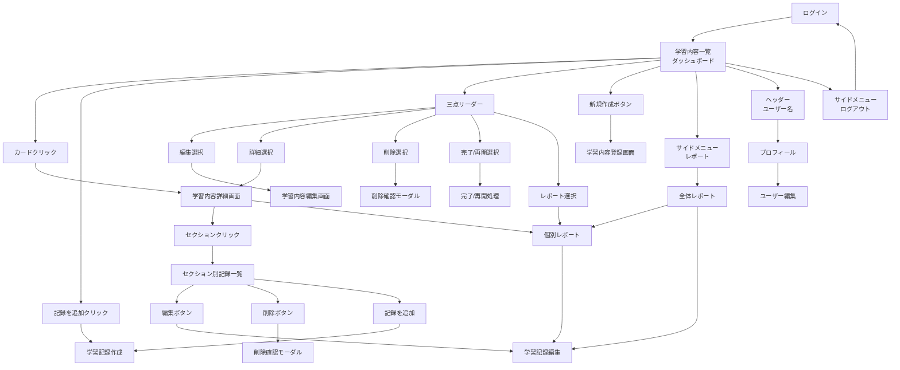
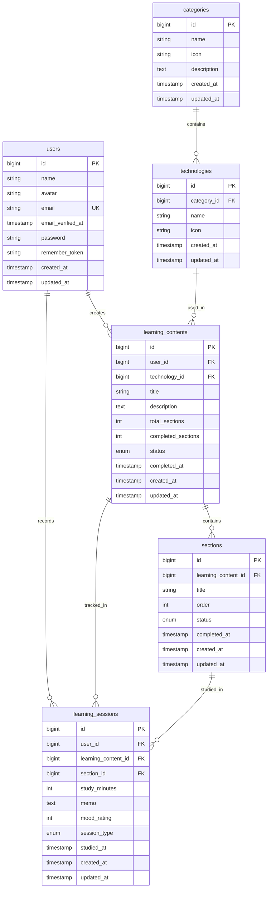
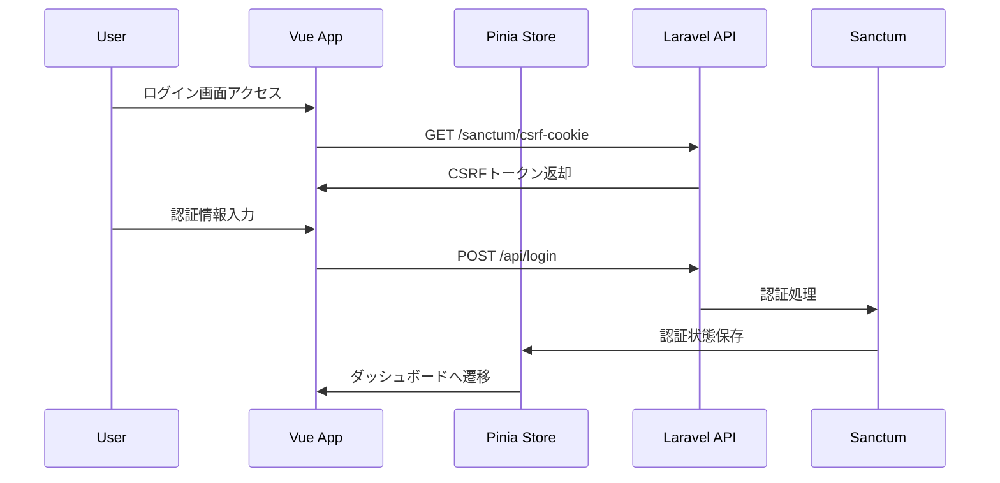
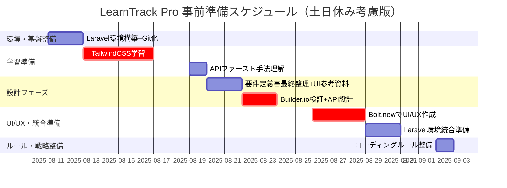
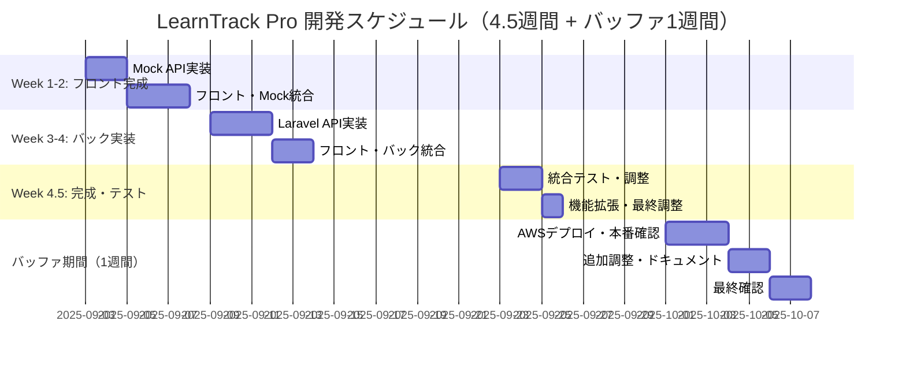

## 相互リンク

[要件定義書](https://www.notion.so/2479d86c12e881878bb9c8dc6f9c8b3c?pvs=21)

.gemini/docs/project-infos/要件定義書.md

---

## 1. プロジェクト概要

### 1.1 プロジェクト基本情報

- **プロジェクト名**: LearnTrack Pro - プログラミング学習管理プラットフォーム
- **開発目的**: 転職活動用ポートフォリオとして、Laravel 12とVue.js 3を用いたモダンなSPAアプリケーションの開発
- **ターゲット**: 企業の採用担当者および技術者
- **開発期間**: 4.5週間（22営業日、合計110時間）
    - **開始日**: 2025年9月3日（水）
    - **終了日**: 2025年9月30日（火）
- **バッファ期間**: 1週間（2025年10月1日〜10月7日）
- **バッファを含めた全体期間**: 5.5週間
    - **最終完成期限**: 2025年10月7日（火）
- **事前準備期間**: 23日間（2025年8月11日〜9月2日）
- **開発手法**: APIファーストアプローチ with AI駆動開発

### 1.2 StudyPlusとの差別化ポイント

- **StudyPlus**: 書籍・教材ベースの汎用学習記録アプリ
- **LearnTrack Pro**: プログラミング学習特化、教材に依存しない柔軟な学習内容管理
- **核心的差別化**: 「ポートフォリオ作成実践」「Laravel環境構築」など、書籍が存在しない学習内容に対応

### 1.3 技術スタック

- **Backend**: Laravel 12.x (PHP 8.3+)
- **Frontend**: Vue.js 3 (Composition API) + Tailwind CSS
- **状態管理**: Pinia
- **ビルドツール**: Vite
- **Database**: MySQL 8.0
- **認証**: Laravel Sanctum, Laravel Fortify (SPA認証)
- **チャート**: Chart.js
- **アイコン**: Heroicons
- **UIライブラリ**: Headless UI
- **ドラッグ&ドロップ**: VueDraggable
- **開発環境**: Docker

### 1.4 開発支援ツール

- **API設計・テスト**: Apidog
- **UI生成**: Bolt.new（初期構成のみ使用）→GeminiCLI
- **バージョン管理**: Git
- **エディタ**: VS Code
- **AI支援**: Gemini CLI, Claude

---

## 2. 解決すべき課題

### 2.1 核心的な問題

1. **プログラミング学習の特殊性**
    - 書籍に依存しない学習内容（ポートフォリオ作成、環境構築実践等）
    - 技術分野別の学習管理の必要性
2. **学習進捗の可視化不足**
    - セクション単位での詳細な進捗管理
    - 学習時間と進捗率の相関分析
3. **学習履歴の分析機能不足**
    - 技術分野別の学習時間分析
    - 学習パターンの把握

### 2.2 成功指標

- セクション単位での進捗可視化
- 技術分野別学習時間の分析
- 週間学習パターンのチャート表示

---

## 3. 機能要件

### 3.1 MVP機能（必須実装）

### 3.1.1 認証機能

- ユーザー登録
- ログイン・ログアウト
- パスワードリセット
- パスワード変更
- ユーザープロフィール表示・編集

### 3.1.2 学習内容管理

- 学習内容登録（技術選択、タイトル、説明）
- セクション管理（作成、編集、削除、並び替え）
    - **学習内容作成時に最低1つのセクション登録が必須**
    - 削除は2つ以上ある場合のみ可能
- 進捗率計算・表示（完了セクション数 / 総セクション数）
- 学習内容一覧表示
    - カード形式での表示
    - 更新日時順の並び替え（デフォルト）
    - 三点メニューからの操作（編集・詳細・削除・完了/再開）
- 学習内容詳細表示
- 学習内容編集（基本情報タブ/セクション管理タブ）
- 学習内容削除（確認モーダル付き、カスケード削除）
- 学習内容の完了/再開機能
    - 全セクション完了時に完了可能
    - 三点メニューから操作
    - 完了後も再開可能

### 3.1.3 学習記録機能

- 手動記録入力
    - 学習日選択（日付ピッカー）
    - 学習時間入力（時間・分の選択）
    - 学習メモ（任意）
    - 調子評価（1-5段階、任意）
- ストップウォッチ機能（条件付き実装 ★★★★☆）
    - 計測開始・停止・リセット
    - Page Visibility API対応（バックグラウンド動作）
    - 計測完了時の学習記録自動保存
- タブ切り替え（手動入力 ↔ ストップウォッチ）

### 3.1.4 基本レポート機能

- **週間学習時間推移チャート**（棒グラフ）
- **期間別データ表示切り替え**（条件付き実装 ★★★☆☆）
    - 1週間・1ヶ月・全期間の切り替え
    - URLパラメータでの期間状態保持
- 技術分野別学習時間表示
- 学習履歴一覧（日付、時間、メモ表示）

### 3.2 条件付き拡張機能（開発期間内での実装判断）

### Phase 0拡張機能

- **ストップウォッチ機能**: Week 2フロント実装の余裕に応じて実装
- **期間切り替え機能**: Week 3バックエンド実装の余裕に応じて実装

### 将来拡張機能（MVP後）

- 複数チャート種類（ドーナツ、線グラフ）
- 週間目標設定・達成状況
- 学習内容のカテゴリ詳細分類
- ストップウォッチ高度化（一時停止、複数セッション管理）

---

## 4. 画面設計

### 4.1 画面一覧

1. 認証関連
    - ログイン画面
    - ユーザー登録画面
    - パスワードリセット画面
2. メイン機能
    - 学習内容一覧画面（メインページ）
    - 学習内容詳細画面（セクション一覧表示）
    - 学習内容登録画面（セクション入力必須）
    - 学習内容編集画面
    - 学習記録入力画面（手動入力 + ストップウォッチタブ）
    - 学習記録編集画面
    - レポート画面
    - 学習推移詳細画面（チャート表示・期間切り替え）
3. ユーザー管理
    - ユーザープロフィール表示
    - ユーザー情報編集画面
4. モーダル・ダイアログ
    - 削除確認モーダル
    - 日付選択モーダル
    - 時間入力モーダル

### 4.2 画面フロー



---

## 5. API設計

### 5.1 RESTful エンドポイント

### 認証関連

```bash
# CSRF保護
GET    /sanctum/csrf-cookie

# 基本認証
POST   /api/register
POST   /api/login
POST   /api/logout
GET    /api/user

# ユーザー情報管理
PUT    /api/user/profile
PUT    /api/user/password

# パスワードリセット
POST   /api/forgot-password
POST   /api/reset-password

```

### 学習内容管理

```bash
GET    /api/learning-contents                 # 学習内容一覧
POST   /api/learning-contents                 # 学習内容作成
GET    /api/learning-contents/{id}            # 学習内容詳細
PUT    /api/learning-contents/{id}            # 学習内容編集
DELETE /api/learning-contents/{id}            # 学習内容削除
PUT    /api/learning-contents/{id}/complete   # 完了にする
PUT    /api/learning-contents/{id}/reopen     # 学習を再開
```

### セクション管理

```bash
GET    /api/learning-contents/{id}/sections   # セクション一覧
POST   /api/sections                          # セクション追加
PUT    /api/sections/{id}                     # セクション編集
DELETE /api/sections/{id}                     # セクション削除
PUT    /api/sections/{id}/status              # セクションのステータスの変更
```

### 学習記録

```bash
POST   /api/learning-sessions                 # 学習記録追加
GET    /api/learning-sessions                 # セクション内の学習記録一覧
GET    /api/learning-sessions/{id}            # 学習記録詳細
PUT    /api/learning-sessions/{id}            # 学習記録編集
DELETE /api/learning-sessions/{id}            # 学習記録削除

```

### レポート・統計

```
GET    /api/reports/weekly-chart?period=week&date=2025-02-01
GET    /api/reports/technology-summary?period=month
GET    /api/reports/learning-history?period=week&page=1

```

### マスターデータ

```
GET    /api/categories
GET    /api/technologies

```

---

## 6. データベース設計

### 6.1 ER図



### 6.2 主要テーブル詳細

### categories テーブル（マスターデータ）

```sql
INSERT INTO categories (name, description) VALUES
('Programming', 'プログラミング言語、フレームワーク、ライブラリ'),
('Infrastructure', 'サーバー、ネットワーク、クラウド、コンテナ技術'),
('Service', 'Webサービス、開発ツール、生産性向上ツール'),
('Development', '設計、開発手法、プロジェクト管理、実践的な開発'),
('AI', 'AI、機械学習、LLM、プロンプトエンジニアリング'),
('Other', 'ビジネススキル、マインドセット、その他の学習');
```

### technologies テーブル（Seederデータ）

```sql
-- プログラミング言語
{ id: 1, category_id: 1, name: 'Laravel', icon: '/src/assets/icons/technologies/laravel-icon.png', created_at: '2023-01-01T00:00', updated_at: '2023-01-01T00:00' },
{ id: 2, category_id: 1, name: 'Vue.js', icon: '/src/assets/icons/technologies/vue-icon.png', created_at: '2023-01-01T00:00', updated_at: '2023-01-01T00:00' },
{ id: 3, category_id: 1, name: 'React', icon: '/src/assets/icons/technologies/react-icon.png', created_at: '2023-01-01T00:00', updated_at: '2023-01-01T00:00' },
-- ..etc

-- インフラ
{ id: 14, category_id: 2, name: 'Linux', icon: '/src/assets/icons/technologies/linux-icon.png', created_at: '2023-01-01T00:00', updated_at: '2023-01-01T00:00' },
{ id: 15, category_id: 2, name: 'Nginx', icon: '/src/assets/icons/technologies/nginx-icon.png', created_at: '2023-01-01T00:00', updated_at: '2023-01-01T00:00' },
{ id: 16, category_id: 2, name: 'Apache', icon: '/src/assets/icons/technologies/apache-icon.png', created_at: '2023-01-01T00:00', updated_at: '2023-01-01T00:00' },
-- ..etc

-- サービス
{ id: 21, category_id: 3, name: 'Git', icon: '/src/assets/icons/technologies/git-icon.png', created_at: '2023-01-01T00:00', updated_at: '2023-01-01T00:00' },
{ id: 22, category_id: 3, name: 'GitHub', icon: '/src/assets/icons/technologies/github-icon.png', created_at: '2023-01-01T00:00', updated_at: '2023-01-01T00:00' },
{ id: 23, category_id: 3, name: 'VSCode', icon: '/src/assets/icons/technologies/vscode-icon.png', created_at: '2023-01-01T00:00', updated_at: '2023-01-01T00:00' },
-- ..etc

-- 開発関連
{ id: 27, category_id: 4, name: '開発', icon: '/src/assets/icons/technologies/agile-icon.png', created_at: '2023-01-01T00:00', updated_at: '2023-01-01T00:00' },
{ id: 28, category_id: 4, name: 'システム設計', icon: '/src/assets/icons/technologies/development-icon.png', created_at: '2023-01-01T00:00', updated_at: 
{ id: 29, category_id: 4, name: 'UI/UX設計', icon: '/src/assets/icons/technologies/system-design-icon.png', created_at: '2023-01-01T00:00', updated_at: 
-- ..etc

-- AI
{ id: 32, category_id: 5, name: 'ChatGPT', icon: '/src/assets/icons/technologies/chatgpt-icon.png', created_at: '2023-01-01T00:00', updated_at: 
{ id: 33, category_id: 5, name: 'Claude', icon: '/src/assets/icons/technologies/claude-icon.png', created_at: '2023-01-01T00:00', updated_at: '2023-01-01T00:00' },
{ id: 34, category_id: 5, name: 'Gemini', icon: '/src/assets/icons/technologies/gemini-icon.png', created_at: '2023-01-01T00:00', updated_at: '2023-01-01T00:00' },
-- ..etc

-- その他
{ id: 37, category_id: 6, name: 'ビジネススキル', icon: '/src/assets/icons/technologies/business-icon.png', created_at: '2023-01-01T00:00', updated_at: 
{ id: 38, category_id: 6, name: 'マインドセット', icon: '/src/assets/icons/technologies/mind-icon.png', created_at: '2023-01-01T00:00', updated_at: 
{ id: 39, category_id: 6, name: 'その他', icon: '/src/assets/icons/technologies/other-icon.png', created_at: '2023-01-01T00:00', updated_at: '2023-01-01T00:00' },
-- ..etc

```

### sections.status（列挙型）

各セクションの学習進捗状態を管理

```sql
ENUM('not_started', 'in_progress', 'completed')
-- not_started: 未着手（初期状態）
-- in_progress: 学習中（学習記録が1回以上ある状態）
-- completed: 完了（ユーザーが明示的に完了マークした状態）

```

### learning_sessions.session_type（列挙型）

学習記録の入力方法を区別し、ストップウォッチ機能の実装状況を管理

```sql
ENUM('manual', 'stopwatch')
-- manual: 手動入力（時間を手入力で記録）
-- stopwatch: ストップウォッチ（自動計測で記録）

```

### **learning_sessions テーブル**

```sql
bigint section_id FK NOT NULL  # NULL不可を明記
```

---

## 7. 技術的考慮事項

### 7.1 SPA認証フロー



### 7.2 ストップウォッチ技術仕様

```jsx
// Page Visibility APIでバックグラウンド対応
document.addEventListener('visibilitychange', () => {
  if (document.hidden) {
    // タブ非表示時: 現在時刻を保存
    store.pauseTimer(Date.now());
  } else {
    // タブ表示時: 経過時間を加算して再開
    store.resumeTimer(Date.now());
  }
});

// 正確な時間計測
const useStopwatch = () => {
  const startTime = ref(null);
  const elapsedTime = ref(0);
  const isRunning = ref(false);

  const start = () => {
    startTime.value = Date.now() - elapsedTime.value;
    isRunning.value = true;
    updateTimer();
  };

  const updateTimer = () => {
    if (isRunning.value) {
      elapsedTime.value = Date.now() - startTime.value;
      requestAnimationFrame(updateTimer);
    }
  };

  return { start, stop, reset, elapsedTime, isRunning };
};

```

### 7.3 期間切り替え技術仕様

```php
// レポートAPI: 期間別データ取得
class ReportController extends Controller
{
    public function weeklyChart(Request $request)
    {
        $period = $request->get('period', 'week'); // week, month, all
        $date = $request->get('date', now());

        $query = LearningSession::where('user_id', auth()->id());

        switch ($period) {
            case 'week':
                $startDate = Carbon::parse($date)->startOfWeek();
                $endDate = Carbon::parse($date)->endOfWeek();
                break;
            case 'month':
                $startDate = Carbon::parse($date)->startOfMonth();
                $endDate = Carbon::parse($date)->endOfMonth();
                break;
            default: // 'all'
                // 全期間
                break;
        }

        if (isset($startDate)) {
            $query->whereBetween('studied_at', [$startDate, $endDate]);
        }

        return $query->selectRaw('DATE(studied_at) as date, SUM(study_minutes) as total_minutes')
                     ->groupBy('date')
                     ->orderBy('date')
                     ->get();
    }
}

```

### 7.4 進捗率計算ロジック

```php
// Learning Content Model
public function getProgressPercentageAttribute()
{
    if ($this->total_sections === 0) return 0;

    return round(
        ($this->completed_sections / $this->total_sections) * 100,
        1
    );
}

```

---

## 8. 開発スケジュール

### 8.1 事前準備期間（2025年8月11日〜9月2日）



### 8.2 開発期間（2025年9月3日〜10月7日）



### 8.3 条件付き拡張機能の実装判断

**ストップウォッチ機能実装条件**

- Week 2-3日目時点（2025年9月5日）でのUI実装進捗70%以上
- 基本画面（認証、管理、記録、履歴）動作確認完了

**期間切り替え機能実装条件**

- Week 3-3日目時点（2025年9月11日）でのAPI実装進捗70%以上
- 基本的なデータ取得・保存機能動作確認完了

---

## 9. 成果物の評価基準

### 9.1 機能面での評価ポイント

- ✅ プログラミング学習特化の学習内容管理
- ✅ セクション単位での詳細進捗管理
- ✅ 手動 + ストップウォッチ両対応の記録機能（条件付き）
- ✅ 期間別切り替え対応の学習時間チャート（条件付き）
- ✅ バックグラウンド対応ストップウォッチ（条件付き）
- ✅ レスポンシブ対応（PC + スマートフォン）

### 9.2 技術面での評価ポイント

- ✅ Laravel 12新機能の実践的活用
- ✅ Vue.js 3 Composition API + Pinia実装
- ✅ Tailwind CSSによるモダンUI構築
- ✅ SPA認証（Sanctum + Fortify）の実装
- ✅ APIファースト設計思想の実践
- ✅ Page Visibility API等のモダンWeb API活用（条件付き）

### 9.3 ポートフォリオとしての価値

- ✅ StudyPlusとの明確な差別化
- ✅ 実用的な学習管理アプリとして完成
- ✅ モダンな技術スタックの習得証明
- ✅ AWS本番デプロイまでの完遂
- ✅ リアルタイム機能の実装経験（条件付き）

---

## 10. リスク管理

### 10.1 主要リスク要因

### Bolt.new統合の複雑性

- **リスク**: 期待通りのUI生成ができない可能性
- **対策**: 段階的手動実装（TailwindCSSクラス活用）への切り替え

### 学習期間の制約

- **リスク**: TailwindCSS（4日間）、APIファースト手法（1日間）の学習不足
- **対策**: 限定スコープでの学習、必要に応じて基本機能に集中

### 開発期間の制約

- **リスク**: 4.5週間での完成度とスコープのバランス
- **対策**: 条件付き拡張機能の実装判断、MVP優先の開発、1.5週間のバッファ活用

### 10.2 判断タイムライン

- Week 1終了時（2025年9月6日）: UI生成50%以上完了 → 継続
- Week 2終了時（2025年9月13日）: フロント70%完了 → バック実装開始
- Week 3終了時（2025年9月20日）: フロント・バック接続確認 → 拡張機能判断
- Week 4終了時（2025年9月27日）: コア機能完成確認 → デプロイ準備

---

## 11. 開発後の展望

### 11.1 AWSへのデプロイ（1ヶ月以内）

- 本番環境構築・デプロイ
- SSL証明書設定・独自ドメイン対応
- 監視・ログ設定

### 11.2 短期的改善（1ヶ月目以降）

**転職活動との並行**

- CI/CDパイプライン構築
- ストップウォッチ高度化（一時停止、複数セッション）
- 週間目標設定機能

---

## 12. まとめ

本プロジェクトは、プログラミング学習に特化した管理プラットフォームとして、以下を実現します：

1. **技術的成長**: Laravel 12 + Vue.js 3 + Tailwind CSSの実践習得
2. **差別化価値**: StudyPlusにない「教材非依存」の学習管理
3. **実用性**: ストップウォッチ機能により日常的に活用可能な完成度
4. **転職活動**: モダン技術習得とリアルタイム機能実装の実績

**APIファーストアプローチとAI駆動開発により**:

- 効率的な開発プロセス
- 高品質なコード生成
- 段階的な機能拡張

**条件付き拡張機能により**:

- リスク管理と確実な完成
- 開発期間内での最適化
- 継続的な価値創造

---

**修正完了日**: 2025年8月9日

**開発開始予定**: 2025年8月26日（月）

**完成予定**: 2025年9月23日（火）

**最終完成期限**: 2025年10月7日（火）

テーブル定義書の作成
基本設計

- 画面フローと詳細仕様の設計
