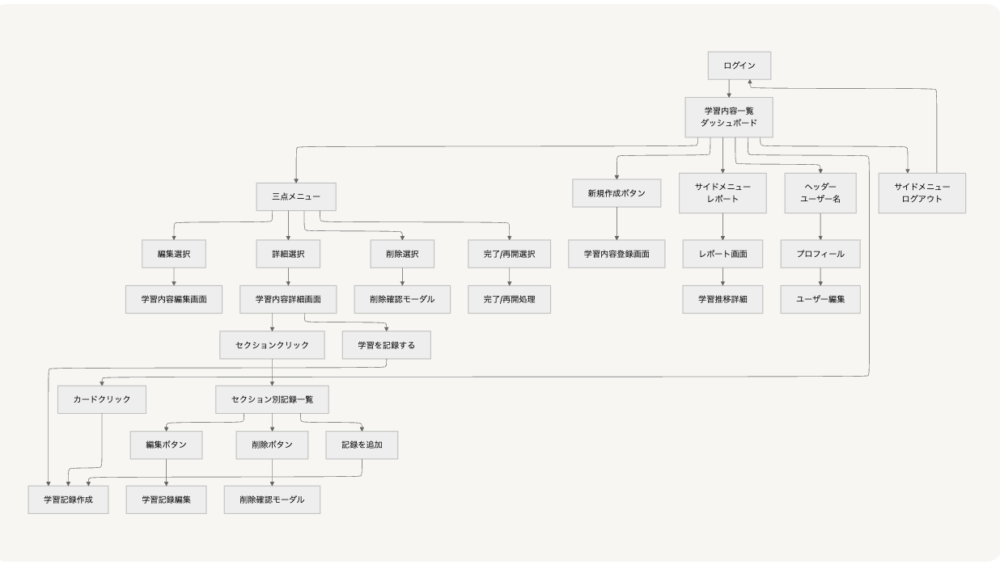

<!-- _class: lead -->

# LearnTrack Pro

## プログラミング学習特化型進捗管理アプリ

Laravel 12 + Vue.js 3 による SPA 開発

---

# プロジェクト概要

## サービス概要
プログラミング学習に特化した進捗管理Webアプリケーション
転職活動用ポートフォリオとして、Laravel 12とVue.js 3を用いたモダンなSPAアプリケーションを開発

## 開発期間
- 開発開始：2025年9月3日（水）
- 完成予定：2025年9月30日（火）
- 最終期限：2025年10月7日（火）
- 総開発時間：110時間（22営業日）

---

# 解決する課題

## 📚 書籍が存在しない学習内容の管理困難
- ポートフォリオ作成実践、環境構築作業などの記録ができない

## 📊 学習進捗の可視化不足
- どこまで学習したか、あとどれくらいで完了するかが不明確

## ⏱️ 学習時間の把握困難
- 技術分野ごとの学習時間が分からない

---

# 提供価値

## ✅ セクション単位での細かい進捗管理

## ✅ 技術分野別の学習時間分析

## ✅ 視覚的なチャートによる学習状況の把握

## ✅ モチベーション維持のための達成感の可視化

---

# 技術スタック

## Frontend
- Vue.js 3 (Composition API)
- Vite, TailwindCSS
- Pinia（状態管理）
- Chart.js（チャート）

## Backend
- Laravel 12.x (PHP 8.3+)
- Laravel Sanctum + Laravel Fortify（認証）

## Database & Environment
- MySQL 8.0
- Docker（開発環境）

---

# 主要機能一覧

## 認証機能
- ユーザー登録・ログイン・ログアウト
- パスワード変更・リセット
- プロフィール管理
- SPA認証（Sanctum + Fortify）

## 学習内容管理機能
- 技術分野の選択（PHP、JavaScript、Docker等）
- タイトルと説明の入力
- セクション（章・単元）の設定と並び替え
- 進捗率の自動計算（完了セクション数 ÷ 総セクション数）
- カード形式での見やすい一覧表示
- 学習中/完了/未着手の状態管理

---

# 学習記録機能

## ⏰ 2つの記録方法
1. **手動入力**: 学習後にまとめて時間を入力
2. **ストップウォッチ機能** ※条件付き実装（★★★★☆）
   - リアルタイムで学習時間を計測
   - Page Visibility APIでバックグラウンド対応

## 📝 記録内容
- 学習日・学習時間（分単位）
- 学習メモ（振り返り、気づき）
- 調子の5段階評価（任意）
- セクション単位での記録管理

---

# レポート・分析機能

## 📈 学習時間の推移
- 週間の学習時間を棒グラフで表示
- 期間切り替え（1週間/1ヶ月/全期間）※条件付き実装（★★★☆☆）

## 🎯 技術分野別の分析
- 技術カテゴリごとの学習時間集計
- 学習バランスの把握

## 📋 学習履歴
- 過去の学習記録を一覧表示
- 日付、時間、メモの確認
- セクション別の記録表示

---

# 画面フロー

---

# 主要テーブル（1/6）

## users テーブル
ユーザー情報を管理するテーブル

| データ型 | カラム名 | 属性 | 説明 |
|---------|----------|------|------|
| bigint | id | PRIMARY KEY | ユーザーID |
| string | name | NOT NULL | ユーザー名 |
| string | email | NOT NULL, UNIQUE | メールアドレス |
| timestamp | email_verified_at | NULLABLE | メール認証日時 |
| string | password | NOT NULL | パスワード（ハッシュ化済み） |
| string | remember_token | NULLABLE | ログイン状態維持トークン |
| timestamp | created_at | NOT NULL | レコード作成日時 |
| timestamp | updated_at | NOT NULL | レコード最終更新日時 |

---

# 主要テーブル（2/6）

## categories テーブル
技術カテゴリーを管理するテーブル（マスターデータ）

| データ型 | カラム名 | 属性 | 説明 |
|---------|----------|------|------|
| bigint | id | PRIMARY KEY | カテゴリーID |
| string | name | NOT NULL | カテゴリー名 |
| string | icon | NOT NULL | カテゴリーのアイコン |
| timestamp | created_at | NOT NULL | レコード作成日時 |
| timestamp | updated_at | NOT NULL | レコード最終更新日時 |

---

# 主要テーブル（3/6）

## technologies テーブル
学習コンテンツで利用される技術情報を管理

| データ型 | カラム名 | 属性 | 説明 |
|---------|----------|------|------|
| bigint | id | PRIMARY KEY | 技術ID |
| bigint | category_id | FOREIGN KEY | カテゴリーID (categories.id参照) |
| string | name | NOT NULL | 技術名 |
| string | icon | NOT NULL | 技術のアイコン |
| timestamp | created_at | NOT NULL | レコード作成日時 |
| timestamp | updated_at | NOT NULL | レコード最終更新日時 |

---

# 主要テーブル（4/6）

## learning_contents テーブル
学習コンテンツそのものの情報を管理

| データ型 | カラム名 | 属性 | 説明 |
|---------|----------|------|------|
| bigint | id | PRIMARY KEY | 学習コンテンツID |
| bigint | user_id | FOREIGN KEY | ユーザーID (users.id参照) |
| bigint | technology_id | FOREIGN KEY | 技術ID (technologies.id参照) |
| string | title | NOT NULL | コンテンツのタイトル |
| text | description | NULLABLE | コンテンツの詳細な説明 |
| int | total_sections | DEFAULT 0 | 総セクション数 |
| int | completed_sections | DEFAULT 0 | 完了セクション数 |
| enum | status | DEFAULT 'not_started' | 学習状態 |
| timestamp | completed_at | NULLABLE | 完了日時 |
| timestamp | created_at | NOT NULL | レコード作成日時 |
| timestamp | updated_at | NOT NULL | レコード最終更新日時 |

---

# 主要テーブル（5/6）

## sections テーブル
学習コンテンツ内のセクション情報を管理

| データ型 | カラム名 | 属性 | 説明 |
|---------|----------|------|------|
| bigint | id | PRIMARY KEY | セクションID |
| bigint | learning_content_id | FOREIGN KEY | 学習コンテンツID (learning_contents.id参照) |
| string | title | NOT NULL | セクションのタイトル |
| int | order | NOT NULL | セクションの並び順 |
| enum | status | DEFAULT 'not_started' | ステータス (not_started/in_progress/completed) |
| timestamp | completed_at | NULLABLE | 完了日時 |
| timestamp | created_at | NOT NULL | レコード作成日時 |
| timestamp | updated_at | NOT NULL | レコード最終更新日時 |

---

# 主要テーブル（6/6）

## learning_sessions テーブル
ユーザーの学習セッション（学習記録）を管理

| データ型 | カラム名 | 属性 | 説明 |
|---------|----------|------|------|
| bigint | id | PRIMARY KEY | 学習セッションID |
| bigint | user_id | FOREIGN KEY | ユーザーID (users.id参照) |
| bigint | learning_content_id | FOREIGN KEY | 学習コンテンツID (learning_contents.id参照) |
| bigint | section_id | FOREIGN KEY | セクションID (sections.id参照) |
| int | study_minutes | NOT NULL | 学習時間（分） |
| text | memo | NULLABLE | セッションのメモ |
| int | mood_rating | NULLABLE | 調子評価（1-5段階） |
| enum | session_type | DEFAULT 'manual' | タイプ (manual/stopwatch) |
| timestamp | studied_at | NOT NULL | 学習日時 |
| timestamp | created_at | NOT NULL | レコード作成日時 |
| timestamp | updated_at | NOT NULL | レコード最終更新日時 |

---

# 利用シナリオ

## 新規学習開始時
1. 「Laravel入門」という学習内容を登録
2. セクションを設定（第1章、第2章...）
3. 学習を開始し、セクションごとに記録
4. 進捗率を確認しながら学習継続

## 日々の学習記録
1. ダッシュボードから学習中の内容を選択
2. 今日学習したセクションを選んで記録作成
3. 学習時間とメモを入力して保存
4. レポート画面で週間の学習状況を確認

---

# 他サービスとの差別化

## StudyPlusとの比較

| 項目 | StudyPlus | LearnTrack Pro |
|------|-----------|----------------|
| 対象 | 汎用学習全般 | プログラミング学習特化 |
| 記録単位 | 書籍・教材ベース | 自由な学習内容設定 |
| 進捗管理 | ページ数 | セクション単位 |
| 技術スタック | ネイティブアプリ中心 | モダンSPA（Laravel + Vue.js） |

## LearnTrack Proの強み
- 📖 書籍に依存しない：ポートフォリオ作成、環境構築なども記録可能
- 🎯 プログラミング特化：技術分野別の管理に最適化
- 📊 詳細な進捗管理：セクション単位での細かい管理
- 🚀 最新技術の活用：Laravel 12 + Vue.js 3での実装

---

# 技術的チャレンジ

## SPA認証の実装
- Laravel Sanctum + Fortifyの統合
- CSRFトークン管理
- 認証状態のPinia管理

## リアルタイム進捗計算
- 完了セクション数の自動集計
- 進捗率のリアクティブな更新
- パフォーマンスを考慮した実装

## 3階層構造の採用
- 学習内容 → セクション → 学習記録
- 柔軟な学習内容への対応
- 直感的な情報構造

---

# 設計上の工夫

## 条件付き実装戦略
MVP優先での現実的なスコープ管理
開発進捗に応じた機能追加判断
リスク管理とバッファの確保

| 機能 | 優先度 | 実装条件 | 技術的難易度 |
|------|--------|----------|-------------|
| ストップウォッチ機能 | ★★★★☆ | Week 2でUI実装70%完了時 | 中 |
| 期間切り替え機能 | ★★★☆☆ | Week 3でAPI実装70%完了時 | 低 |

## コンポーネント設計
- 再利用可能なコンポーネント分割
- 単一責任の原則の遵守
- Props/Emitによる明確なデータフロー

---

# セキュリティ・品質

## テスト方針
- 単体テスト：重要なビジネスロジック
- 統合テスト：API エンドポイント
- E2Eテスト：主要な画面遷移（時間があれば）

## セキュリティ対策
- CSRF保護（Laravel標準機能）
- XSS対策（Vue.jsの自動エスケープ）
- SQLインジェクション対策（Eloquent ORM）

---

# 今後のロードマップ

## Phase 0: 条件付きMVP拡張（開発期間中）
- ストップウォッチ機能（Week 2でUI実装70%完了時）
- 期間切り替え機能（Week 3でAPI実装70%完了時）

## Phase 1: 基本機能強化（MVP後1-2週間）
- 技術別学習時間のドーナツチャート（Chart.js活用）
- 詳細な検索・フィルタリング機能
- 休憩時間の記録機能

## Phase 2: 分析機能強化（1-2ヶ月後）
- 週間目標設定と達成率表示
- 学習時間推移の線グラフ
- カレンダービューでの学習履歴表示

---

<!-- _class: lead -->

# まとめ

## LearnTrack Pro の価値

✅ セクション単位での細かい進捗管理
✅ 技術分野別の学習時間分析
✅ 視覚的なチャートによる学習状況の把握
✅ モチベーション維持のための達成感の可視化

プログラミング学習に特化した進捗管理
書籍に依存しない柔軟な記録
最新技術スタックでのポートフォリオ
実用的で拡張可能な設計

転職活動において技術力をアピールできる作品
