## 1. プロジェクト概要

### 1.1 サービス概要

**LearnTrack Pro**は、プログラミング学習に特化した進捗管理Webアプリケーションです。
転職活動用ポートフォリオとして、Laravel 12とVue.js 3を用いたモダンなSPAアプリケーションを開発します。

### 1.2 解決する課題

- 📚 **書籍が存在しない学習内容の管理困難**
    - ポートフォリオ作成実践、環境構築作業などの記録ができない
- 📊 **学習進捗の可視化不足**
    - どこまで学習したか、あとどれくらいで完了するかが不明確
- ⏱️ **学習時間の把握困難**
    - 技術分野ごとの学習時間が分からない

### 1.3 提供価値

- ✅ セクション単位での細かい進捗管理
- ✅ 技術分野別の学習時間分析
- ✅ 視覚的なチャートによる学習状況の把握
- ✅ モチベーション維持のための達成感の可視化

### 1.4 技術スタック

- **Frontend**: Vue.js 3 (Composition API) + TypeScript, Vite, TailwindCSS
- **Backend**: Laravel 12.x (PHP 8.3+)
- **Database**: MySQL 8.0
- **認証**: Laravel Sanctum + Laravel Fortify
- **状態管理**: Pinia
- **チャート**: Chart.js
- **開発環境**: Docker

### 1.5 開発期間

- **開発開始**: 2025年9月3日（水）
- **完成予定**: 2025年9月30日（火）
- **最終期限**: 2025年10月7日（火）
- **総開発時間**: 110時間（22営業日）

---

## 2. 主要機能

### 2.1 認証機能

- ユーザー登録・ログイン・ログアウト
- パスワード変更・リセット
- プロフィール管理
- SPA認証（Sanctum + Fortify）

### 2.2 学習内容管理機能

### 📝 学習内容の登録

- 技術分野の選択（PHP、JavaScript、Docker等）
- タイトルと説明の入力
- セクション（章・単元）の設定と並び替え

### 📊 進捗の可視化

- 進捗率の自動計算（完了セクション数 ÷ 総セクション数）
- カード形式での見やすい一覧表示
- 学習中/完了/未着手の状態管理

### ✏️ 柔軟な編集・管理

- セクションの追加・削除・並び替え
- 学習内容の編集・削除
- 完了後の再開も可能

### 2.3 学習記録機能

### ⏰ 2つの記録方法

1. **手動入力**: 学習後にまとめて時間を入力
2. **ストップウォッチ機能** ※条件付き実装（★★★★☆）
    - リアルタイムで学習時間を計測
    - Page Visibility APIでバックグラウンド対応

### 📝 記録内容

- 学習日・学習時間（分単位）
- 学習メモ（振り返り、気づき）
- 調子の5段階評価（任意）
- セクション単位での記録管理

### 2.4 レポート・分析機能

### 📈 学習時間の推移

- 週間の学習時間を棒グラフで表示
- 期間切り替え（1週間/1ヶ月/全期間）※条件付き実装（★★★☆☆）

### 🎯 技術分野別の分析

- 技術カテゴリごとの学習時間集計
- 学習バランスの把握

### 📋 学習履歴

- 過去の学習記録を一覧表示
- 日付、時間、メモの確認
- セクション別の記録表示

---

## 3. 利用シナリオ

### 3.1 新規学習開始時

```
1. 「Laravel入門」という学習内容を登録
2. セクションを設定（第1章、第2章...）
3. 学習を開始し、セクションごとに記録
4. 進捗率を確認しながら学習継続

```

### 3.2 日々の学習記録

```
1. ダッシュボードから学習中の内容を選択
2. 今日学習したセクションを選んで記録作成
3. 学習時間とメモを入力して保存
4. レポート画面で週間の学習状況を確認

```

### 3.3 学習の振り返り

```
1. レポート画面で学習時間の推移を確認
2. 技術分野別の学習バランスをチェック
3. 学習履歴から過去の記録を参照
4. 次の学習計画を立てる

```

---

## 4. システム設計

### 4.1 画面設計

### 4.1.1 画面一覧

| 画面カテゴリ | 画面名 | 説明 |
| --- | --- | --- |
| **認証** | ログイン画面 | メールアドレスとパスワードでログイン |
|  | ユーザー登録画面 | 新規アカウント作成 |
|  | パスワードリセット画面 | パスワードを忘れた場合の再設定 |
| **メイン** | ダッシュボード | 学習内容の一覧表示、メインページ |
|  | 学習内容詳細画面 | セクション一覧と進捗確認 |
|  | 学習内容登録画面 | 新しい学習内容の追加 |
|  | 学習内容編集画面 | 既存の学習内容の修正（基本情報/セクション管理タブ） |
| **記録** | 学習記録入力画面 | 手動入力/ストップウォッチで記録 |
|  | 学習記録編集画面 | 過去の記録を修正 |
| **分析** | レポート画面 | 統計情報の概要表示 |
|  | 学習推移詳細画面 | チャートによる詳細分析 |
| **設定** | プロフィール画面 | ユーザー情報の表示・編集 |

### 4.1.2 画面フロー図

```mermaid
flowchart TD
    A[ログイン] --> B[学習内容一覧<br/>ダッシュボード]

    %% 学習内容管理
    B --> C[カードクリック]
    C --> REC[学習記録作成]

    B --> T[三点メニュー]
    T --> ED[編集選択]
    T --> DE[詳細選択]
    T --> DL[削除選択]
    T --> CO[完了/再開選択]

    ED --> G[学習内容編集画面]
    DE --> D[学習内容詳細画面]
    DL --> DC[削除確認モーダル]
    CO --> CS[完了/再開処理]

    B --> O[新規作成ボタン]
    O --> F[学習内容登録画面]

    %% 詳細画面からの遷移
    D --> SEC[セクションクリック]
    SEC --> RLIST[セクション別記録一覧]

    RLIST --> REDIT[編集ボタン]
    REDIT --> REDITED[学習記録編集]

    RLIST --> RDEL[削除ボタン]
    RDEL --> RDELCONF[削除確認モーダル]

    RLIST --> RADD[記録を追加]
    RADD --> REC

    D --> DREC[学習を記録する]
    DREC --> REC

    %% レポート関連
    B --> NAV_REPORT[サイドメニュー<br/>レポート]
    NAV_REPORT --> I[レポート画面]
    I --> J[学習推移詳細]

    %% ユーザー管理
    B --> USER[ヘッダー<br/>ユーザー名]
    USER --> M[プロフィール]
    M --> N[ユーザー編集]

    %% ログアウト
    B --> LOGOUT[サイドメニュー<br/>ログアウト]
    LOGOUT --> A

```



### 4.2 データベース設計

### 4.2.1 ER図


### 4.2.2 テーブル定義書

**1. users テーブル**

ユーザー情報を管理するテーブルです。

| データ型 | カラム名 | 属性 | 説明 |
| --- | --- | --- | --- |
| bigint | `id` | PRIMARY KEY | ユーザーID (主キー) |
| string | `name` | NOT NULL | ユーザー名 |
| string | `email` | NOT NULL, UNIQUE | メールアドレス (ユニーク) |
| timestamp | `email_verified_at` | NULLABLE | メール認証日時 |
| string | `password` | NOT NULL | パスワード (ハッシュ化済み) |
| string | `remember_token` | NULLABLE | ログイン状態維持のためのトークン |
| timestamp | `created_at` | NOT NULL | レコード作成日時 |
| timestamp | `updated_at` | NOT NULL | レコード最終更新日時 |

**2. categories テーブル**

技術カテゴリーを管理するテーブルです。マスターデータとして事前にSeederで投入されます（プログラミング言語、開発環境・ツール、その他）。

| データ型 | カラム名 | 属性 | 説明 |
| --- | --- | --- | --- |
| bigint | `id` | PRIMARY KEY | カテゴリーID (主キー) |
| string | `name` | NOT NULL | カテゴリー名 |
| string | `icon` | NOT NULL | カテゴリーのアイコン |
| timestamp | `created_at` | NOT NULL | レコード作成日時 |
| timestamp | `updated_at` | NOT NULL | レコード最終更新日時 |

**3. technologies テーブル**

学習コンテンツで利用される技術情報を管理するテーブルです。Seederで初期データを投入し、ユーザーは選択のみ可能です。

| データ型 | カラム名 | 属性 | 説明 |
| --- | --- | --- | --- |
| bigint | `id` | PRIMARY KEY | 技術ID (主キー) |
| bigint | `category_id` | FOREIGN KEY | カテゴリーID (categories.idを参照) |
| string | `name` | NOT NULL | 技術名 |
| string | `icon` | NOT NULL | 技術のアイコン |
| timestamp | `created_at` | NOT NULL | レコード作成日時 |
| timestamp | `updated_at` | NOT NULL | レコード最終更新日時 |

**外部キー制約:**

- `technologies.category_id` は `categories.id` を参照します。

**4. learning_contents テーブル**

学習コンテンツそのものの情報を管理するテーブルです。

| データ型 | カラム名 | 属性 | 説明 |
| --- | --- | --- | --- |
| bigint | `id` | PRIMARY KEY | 学習コンテンツID (主キー) |
| bigint | `user_id` | FOREIGN KEY | 学習コンテンツを作成したユーザーのID (users.idを参照) |
| bigint | `technology_id` | FOREIGN KEY | 使用されている技術のID (technologies.idを参照) |
| string | `title` | NOT NULL | コンテンツのタイトル |
| text | `description` | NULLABLE | コンテンツの詳細な説明 |
| int | `total_sections` | DEFAULT 0 | コンテンツの総セクション数 |
| int | `completed_sections` | DEFAULT 0 | 完了したセクション数 |
| enum | `status` | DEFAULT 'not_started' | 学習状態 |
| timestamp | `completed_at` | NULLABLE | 完了日時 |
| timestamp | `created_at` | NOT NULL | レコード作成日時 |
| timestamp | `updated_at` | NOT NULL | レコード最終更新日時 |

**ステータス値の説明:**

- **not_started**: 未着手（初期状態）
- **in_progress**: 学習中（学習記録が1回以上ある状態）
- **completed**: 完了（ユーザーが明示的に完了マークした状態）

**外部キー制約:**

- `learning_contents.user_id` は `users.id` を参照します。
- `learning_contents.technology_id` は `technologies.id` を参照します。

**5. sections テーブル**

学習コンテンツ内のセクション情報を管理するテーブルです。

| データ型 | カラム名 | 属性 | 説明 |
| --- | --- | --- | --- |
| bigint | `id` | PRIMARY KEY | セクションID (主キー) |
| bigint | `learning_content_id` | FOREIGN KEY | 所属する学習コンテンツのID (learning_contents.idを参照) |
| string | `title` | NOT NULL | セクションのタイトル |
| int | `order` | NOT NULL | セクションの並び順 |
| enum | `status` | DEFAULT 'not_started' | セクションのステータス ('not_started', 'in_progress', 'completed') |
| timestamp | `completed_at` | NULLABLE | 完了日時 |
| timestamp | `created_at` | NOT NULL | レコード作成日時 |
| timestamp | `updated_at` | NOT NULL | レコード最終更新日時 |

**ステータス値の説明:**

- **not_started**: 未着手（初期状態）
- **in_progress**: 学習中（学習記録が1回以上ある状態）
- **completed**: 完了（ユーザーが明示的に完了マークした状態）

**外部キー制約:**

- `sections.learning_content_id` は `learning_contents.id` を参照します。

**6. learning_sessions テーブル**

ユーザーの学習セッション（学習記録）を管理するテーブルです。

| データ型 | カラム名 | 属性 | 説明 |
| --- | --- | --- | --- |
| bigint | `id` | PRIMARY KEY | 学習セッションID (主キー) |
| bigint | `user_id` | FOREIGN KEY | セッションを作成したユーザーのID (users.idを参照) |
| bigint | `learning_content_id` | FOREIGN KEY | 関連する学習コンテンツのID (learning_contents.idを参照) |
| bigint | `section_id` | FOREIGN KEY | 学習したセクションのID (sections.idを参照) |
| int | `study_minutes` | NOT NULL | 学習時間（分） |
| text | `memo` | NULLABLE | セッションのメモ |
| int | `mood_rating` | NULLABLE | 調子評価（1-5段階） |
| enum | `session_type` | DEFAULT 'manual' | セッションのタイプ ('manual', 'stopwatch') |
| timestamp | `studied_at` | NOT NULL | 学習日時 |
| timestamp | `created_at` | NOT NULL | レコード作成日時 |
| timestamp | `updated_at` | NOT NULL | レコード最終更新日時 |

**セッションタイプの説明:**

- **manual**: 手動入力（時間を手入力で記録）
- **stopwatch**: ストップウォッチ（自動計測で記録）※条件付き実装

**外部キー制約:**

- `learning_sessions.user_id` は `users.id` を参照します。
- `learning_sessions.learning_content_id` は `learning_contents.id` を参照します。
- `learning_sessions.section_id` は `sections.id` を参照します。

---

## 5. 他サービスとの差別化

### StudyPlusとの比較

| 項目 | StudyPlus | LearnTrack Pro |
| --- | --- | --- |
| **対象** | 汎用学習全般 | プログラミング学習特化 |
| **記録単位** | 書籍・教材ベース | 自由な学習内容設定 |
| **進捗管理** | ページ数 | セクション単位 |
| **技術スタック** | ネイティブアプリ中心 | モダンSPA（Laravel + Vue.js） |

### LearnTrack Proの強み

- 📖 **書籍に依存しない**: ポートフォリオ作成、環境構築なども記録可能
- 🎯 **プログラミング特化**: 技術分野別の管理に最適化
- 📊 **詳細な進捗管理**: セクション単位での細かい管理
- 🚀 **最新技術の活用**: Laravel 12 + Vue.js 3での実装

---

## 6. 拡張機能ロードマップ

### Phase 0: 条件付きMVP拡張（開発期間中）

| 機能 | 優先度 | 実装条件 | 技術的難易度 |
| --- | --- | --- | --- |
| ストップウォッチ機能 | ★★★★☆ | Week 2でUI実装70%完了時 | 中 |
| 期間切り替え機能 | ★★★☆☆ | Week 3でAPI実装70%完了時 | 低 |

### Phase 1: 基本機能強化（MVP後1-2週間）

- 技術別学習時間のドーナツチャート（Chart.js活用）
- 詳細な検索・フィルタリング機能
- 休憩時間の記録機能

### Phase 2: 分析機能強化（1-2ヶ月後）

- 週間目標設定と達成率表示
- 学習時間推移の線グラフ
- カレンダービューでの学習履歴表示

---

## 7. 開発上の工夫点

### 技術的チャレンジ

### SPA認証の実装

- Laravel Sanctum + Fortifyの統合
- CSRFトークン管理
- 認証状態のPinia管理

### リアルタイム進捗計算

- 完了セクション数の自動集計
- 進捗率のリアクティブな更新
- パフォーマンスを考慮した実装

### 設計上の工夫

### 3階層構造の採用

- 学習内容 → セクション → 学習記録
- 柔軟な学習内容への対応
- 直感的な情報構造

### 条件付き実装戦略

- MVP優先での現実的なスコープ管理
- 開発進捗に応じた機能追加判断
- リスク管理とバッファの確保

### コンポーネント設計

- 再利用可能なコンポーネント分割
- 単一責任の原則の遵守
- Props/Emitによる明確なデータフロー

---

## 8. セキュリティ・品質

### テスト方針

- 単体テスト: 重要なビジネスロジック
- 統合テスト: API エンドポイント
- E2Eテスト: 主要な画面遷移（時間があれば）

---
