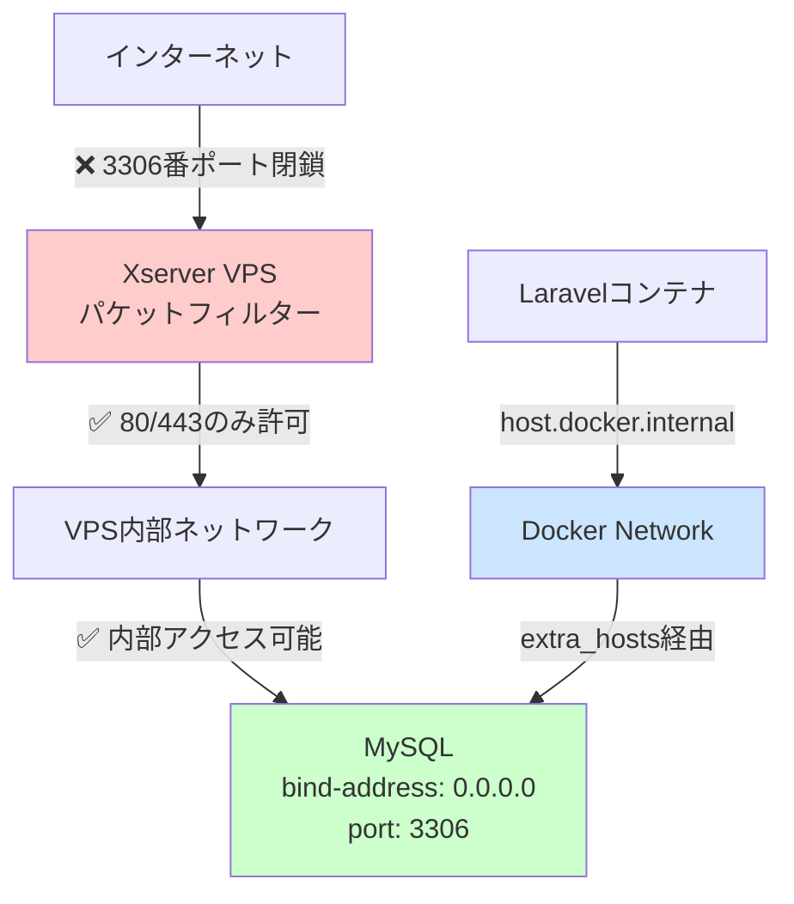
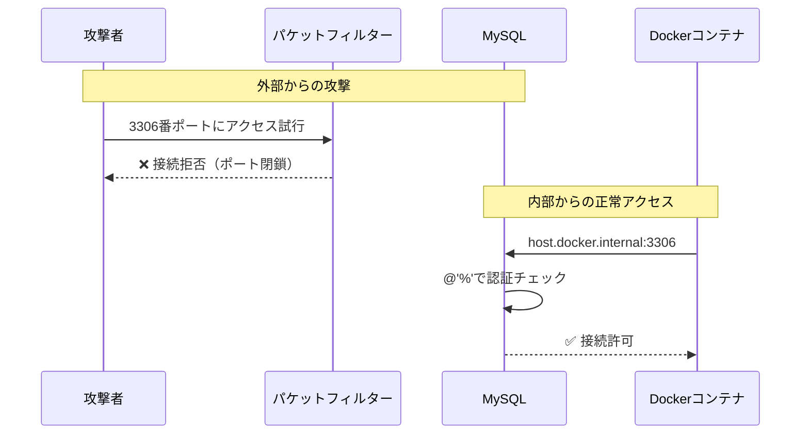

## 概要

本ドキュメントでは、Docker環境からホストMySQLへの接続におけるセキュリティ設計と、多層防御の仕組みを解説します。

### 設定内容

1. セキュリティレイヤーの全体像
2. `extra_hosts`の仕組みと役割
3. `@'%'`と`extra_hosts`の組み合わせ
4. 外部からのアクセス検証方法
5. セキュリティ対策のまとめ

### 構築の全体像



| レイヤー | 設定 | 役割 | 状態 |
| --- | --- | --- | --- |
| パケットフィルター | 3306番閉鎖 | 外部からの物理的遮断 | ✅ 完璧 |
| bind-address | `0.0.0.0` | VPS内部ネットワークで待ち受け | ✅ 適切 |
| MySQLユーザー | `@'%'` | すべてのIPから接続可能 | ⚠️ 理論上は脆弱だが、レイヤー1で保護 |
| extra_hosts | `host.docker.internal` | コンテナからホストへの名前解決 | ✅ 適切 |

---

## 1. セキュリティレイヤーの詳細

### 1-1. レイヤー1: Xserver VPSパケットフィルター

**役割**: VPS外部からの不正アクセスを遮断します。

**設定状態（Xserver VPS管理パネル）**:

```bash
SSH (19000/TCP): 自宅IPのみ許可
HTTP (80/TCP): 全て許可
HTTPS (443/TCP): 全て許可
MySQL (3306/TCP): 閉鎖（デフォルト）
```

### 1-2. レイヤー2: MySQL bind-address設定

**役割**: MySQLがどのネットワークインターフェースで接続を受け付けるか制御します。

```bash
# /etc/mysql/mysql.conf.d/mysqld.cnf
bind-address = 0.0.0.0
```

| 設定値 | 意味 | 接続可能な範囲 |
| --- | --- | --- |
| `127.0.0.1` | ループバックのみ | ✅ VPSホスト内のプロセスのみ<br>❌ Dockerコンテナから不可 |
| `0.0.0.0` | すべてのインターフェース | ✅ VPSホスト内<br>✅ Dockerコンテナ<br>✅ VPS内部ネットワーク |

### 1-3. レイヤー3: MySQLユーザー権限 @'%'

**役割**: 認証されたユーザーがどのIPアドレスから接続できるか制御します。

```sql
CREATE USER 'learntrack_user'@'%' IDENTIFIED BY 'password';
```

| Host指定 | 意味 | 接続可能な範囲 |
| --- | --- | --- |
| `@'localhost'` | ローカルホストのみ | ✅ VPSホスト内<br>❌ Dockerコンテナから不可 |
| `@'172.18.0.%'` | 特定のDockerネットワーク | ✅ 指定したDockerネットワークのみ |
| `@'%'` | すべてのIPアドレス | ✅ VPSホスト内<br>✅ Dockerコンテナ<br>✅ （外部も理論上は可能だが、パケットフィルターで遮断） |

---

## 2. extra_hostsの仕組み

### 2-1. extra_hostsとは

**定義**: Dockerコンテナの`/etc/hosts`ファイルにエントリを追加する設定です。

```yaml
# docker-compose.yml
extra_hosts:
  - "host.docker.internal:host-gateway"
```

**実際の動作確認**:

```bash
# コンテナ内で確認
docker exec -it apache-learntrack-pro bash
cat /etc/hosts
```

**期待される出力**:

```bash
127.0.0.1       [localhost](http://localhost)
::1             [localhost](http://localhost) ip6-[localhost](http://localhost)
172.18.0.2      apache-learntrack-pro
192.168.1.100   host.docker.internal  # ← extra_hostsで追加される
```

### 2-2. host-gatewayの役割

| 値 | 意味 |
| --- | --- |
| `host-gateway` | Dockerホスト（VPS）のゲートウェイIPアドレス |
| 通常の場合 | `172.17.0.1`や`192.168.1.1`など |

<aside>
📌

**仕組み**

1. Dockerが自動的にホストのIPアドレスを検出します
2. `host.docker.internal`というホスト名に紐付けます
3. コンテナから`host.docker.internal`で接続すると、VPSホストのIPアドレスに解決されます
</aside>

### 2-3. MySQL接続方式の比較

| 方式 | 設定 | メリット | デメリット |
| --- | --- | --- | --- |
| `host.docker.internal` | extra_hostsで設定 | ✅ 設定が簡単
✅ IP変更に強い | Docker 18.03以降必須 |
| ホストIP直接指定 | 環境変数で設定 | ✅ 明示的 | ❌ IPアドレス変更時に修正必要 |
| `127.0.0.1` | ループバック | - | ❌ コンテナ自身を指すため動作しない |

---

## 3. @'%'とextra_hostsの組み合わせ

### 3-1. なぜ`@'%'`が必要なのか

**ケース1: `@'localhost'`（❌ Dockerから接続不可）**

```sql
CREATE USER 'learntrack_user'@'[localhost](http://localhost)' IDENTIFIED BY 'password';
```

<aside>
🚫

**問題点**:

- Dockerコンテナから見ると、接続元IPは`172.18.0.2`などになります
- MySQLは[`localhost`](http://localhost)からの接続として認識しません
- 接続が拒否されます
</aside>

**ケース2: `@'172.18.0.%'`（△ 環境依存）**

```sql
CREATE USER 'learntrack_user'@'172.18.0.%' IDENTIFIED BY 'password';
```

<aside>
🚫

**問題点**

- `extra_hosts`を使用する場合、接続元IPが`host-gateway`のIPアドレスになります
- Dockerネットワークの範囲外の可能性があります
- 環境によって動作しない場合があります
</aside>

**ケース3: `@'%'`（✅ すべてのIPから接続可能）**

```sql
CREATE USER 'learntrack_user'@'%' IDENTIFIED BY 'password';
```

<aside>
✅

**利点**

- ✅ `extra_hosts`経由の接続を確実に許可します
- ✅ VPSホストからの直接接続も可能です
- ✅ 環境に依存しません
</aside>

### 3-2. セキュリティの多層防御



---

## 4. 外部からのアクセス検証

### 4-1. 検証方法1: 別のマシンから接続試行

```bash
# 自宅のPCやスマートフォンから実行
mysql -h <VPS-IP-ADDRESS> -P 3306 -u learntrack_user -p
```

**期待される結果**:

```bash
ERROR 2003 (HY000): Can't connect to MySQL server on '<VPS-IP-ADDRESS>' (110)
```

### 4-2. 検証方法2: telnetでポート確認

```bash
# ローカルマシンから実行
telnet <VPS-IP-ADDRESS> 3306
```

**期待される結果**:

```bash
Trying <VPS-IP-ADDRESS>...
telnet: Unable to connect to remote host: Connection refused
```

### 4-3. 検証方法3: nmapでポートスキャン

```bash
# ローカルマシンにnmapをインストール
# macOS
brew install nmap

# Ubuntu/Debian
sudo apt install nmap

# ポートスキャン実行
nmap -p 3306 <VPS-IP-ADDRESS>
```

**期待される結果**:

```bash
PORT     STATE    SERVICE
3306/tcp filtered mysql
```

- `filtered`は、ファイアウォールでブロックされていることを示します。

### 4-4. 検証方法4: VPS内部から確認

```bash
# VPS上で実行
sudo ss -tlnp | grep 3306
```

**期待される結果**:

```bash
LISTEN 0      151          0.0.0.0:3306       0.0.0.0:*    users:(("mysqld",pid=1234,fd=21))
```

`0.0.0.0:3306`で待ち受けているが、パケットフィルターで遮断されているため、外部からは到達不可能です。

---

## セキュリティ設計の確認チェックリスト

- [x]  Xserver VPSパケットフィルターで3306番ポートが閉鎖されている
- [x]  `bind-address = 0.0.0.0`でVPS内部からの接続を許可している
- [x]  `@'%'`でDocker環境からの柔軟な接続を許可している
- [x]  `extra_hosts`でホストMySQLへの名前解決が設定されている
- [x]  外部からのアクセスが遮断されていることを検証済み

---

## まとめ

本セキュリティ設計は以下の特徴を持ちます：

1. **パケットフィルターによる物理的遮断**: 外部からの3306番ポートアクセスを完全に遮断します
2. **bind-address設定**: VPS内部のDockerコンテナからの接続を許可します
3. **`@'%'`と`extra_hosts`の組み合わせ**: 環境に依存しない柔軟な接続を実現します
4. **多層防御**: 一つの防御が突破されても、次の層で保護します

---
