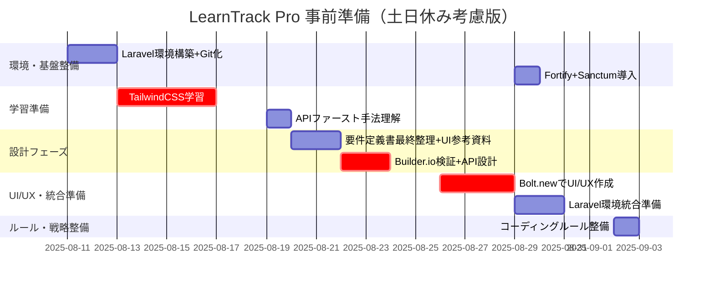
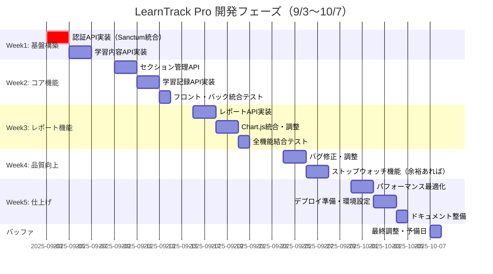

## 相互リンク

[**事前準備タスクリスト（設計・実装分割アプローチ）**](https://www.notion.so/2479d86c12e8805cbaafd6627c171fb8?pvs=21)

.gemini/docs/tasks/事前準備タスクリスト（設計・実装分割アプローチ）.md

---

## 環境・基盤整備

- [x]  類似サービスの調査 ✅ 2025-08-07
- [x]  Laravel基本環境構築 + Gitリポジトリ化期間: 2025-08-11〜08-12（月火・2日間） ✅ 2025-08-10
    - [x]  Docker環境でLaravel 12構築 ✅ 2025-08-10
    - [x]  基本ファイル構成をGitコミット ✅ 2025-08-10
    - [x]  NotionドキュメントをMarkdown転記 ✅ 2025-08-10
    - [x]  Vue.js 3 + Vite環境設定 ✅ 2025-08-10
    
    ⚠️Laravel Fortify + Sanctum認証基盤構築 は*後回し（半日程度）*
    
- [x]  ローカル内のドキュメント整備 ✅ 2025-08-13
    - 画面フロー
    - 機能拡張ロードマップ
    - 要件定義書

---

## 学習準備

- [x]  [TailwindCSS学習期間](https://www.notion.so/TailwindCSS-2529d86c12e880888c6afac0e0b2484b?pvs=21): 2025-08-13〜08-16（水木金月・4日間）
    - [x]  Manus LLMでカスタム教材作成 ✅ 2025-08-07
    - [x]  改訂版学習教材に差し替えととサンプルコードを追加 ✅ 2025-08-14
    - [x]  Tailwind CSS v3へのダウングレードと設定の準拠 ✅ 2025-08-14
    - [x]  カスタム教材作成・学習 ✅ 2025-08-17
        - [x]  Day 1: 環境構築・基本概念・Bootstrap比較（思考プロセス重視） ✅ 2025-08-15
        - [x]  Day 2: レスポンシブ設計・グリッドシステム（実践的課題設定） ✅ 2025-08-15
        - [x]  Day 3: フォーム・ボタン・カードコンポーネント実装（学習者に考えさせる仕組み） ✅ 2025-08-16
        - [x]  Day 4: ダッシュボード画面・統合実践（Vue.js統合とデバッグ） ✅ 2025-08-17
- [ ]  ~~Chart.js基本実装の理解~~
    
    ⚠️実践と並行して進行に変
    
- [ ]  ~~APIファースト開発手法の理解期間: 2025-08-19（火・1日間）~~
    - [ ]  ~~OpenAPI Specification基礎理解~~
    - [ ]  ~~Mockサーバー運用方法の確認~~
    
    ⚠️実践と並行して進める。空き時間にFeloo.AIで生成した資料に目を通す
    

---

## 設計フェーズ（APIファーストアプローチ）

- [x]  要件定義書の最終整理 + UI参考資料準備期間: 2025-08-20〜08-21（水木・2日間）✅ 2025-08-22
    - [x]  StudyPlusスクリーンショット取得・整理✅ 2025-08-18
    - [x]  UI/UX要件の明確化✅ 2025-08-18~2025-08-19
    - [x]  画面設計の修正✅ 2025-08-22
        - [x]  学習内容の登録・編集をウィザード形式に変更✅ 2025-08-22
    - [x]  画面フロー図の詳細化✅ 2025-08-18~2025-08-19
    - [x]  要件定義書（外部用）の作成✅ 2025-08-20
    - [x]  プレゼンテーション資料の作成と提出✅ 2025-08-20
    - [x]  bolt.newアカウント作成✅ 2025-08-21
    - [x]  bolt.new作成用の詳細要件準備✅ 2025-08-21
    - [ ]  デザインガイドライン策定
- [x]  Builder.ioアカウント作成・検証期間: 2025-08-22〜08-23（金月・2日間）✅ 2025-08-22
    - [x]  Vue3出力品質確認✅ 2025-08-20
    - [x]  操作方法習得✅ 2025-08-20
    - [x]  Bolt.newとの連携テスト✅ 2025-08-22
- [ ]  API設計・仕様定義期間: 2025-08-22〜08-23（金月・2日間）
    - [ ]  API設計・仕様定義
        - [x]  認証関連APIの設計 ✅ 2025-08-21
        - [x]  学習内容管理APIの実装 ✅ 2025-08-21
        - [x]  セクション管理APIの設計 ✅ 2025-08-21
    - [ ]  ApidogでのAPI設計
    - [ ]  エンドポイント定義・データモデル設計
    - [ ]  **認証エンドポイント設計** ⚠️ *Fortify統合前提*
    - [ ]  エラーレスポンス設計
    - [ ]  OpenAPI Spec出力・検証
    - [ ]  Mockサーバー構築・テスト

---

## UI/UX作成・統合準備

Bolt.newでのUI/UX作成期間: 2025-08-26〜08-28（火水木・3日間）

### 検証フェーズ

- [x]  要件整理完了後すぐにBolt.new実行✅ 2025-08-21
- [x]  AIアシスタントによるBolt.new用プロンプト生成✅ 2025-08-22
- [x]  ダッシュボード画面作成（基本実装）✅ 2025-08-22

### 実装フェーズ

**総合**

- [x]  Vue.jsアプリケーションのディレクトリ構造整備とファイル再配置✅ 2025-08-25
- [x]  TypeScriptからJavaScriptへの変換と動作確認✅ 2025-08-23
- [x]  Heroiconsへの完全移行（Font Awesome削除）✅ 2025-08-23
- [x]  404ページの追加✅ 2025-08-28
- [x]  `import { defineProps, defineEmits } from 'vue';`の除去✅ 2025-08-29
    - src/components/common/DeleteConfirmModal.vue
    - src/components/common/UnsavedChangesModal.vue
    - src/components/learning/StudyRecordDeleteModal.vue

**コンポーネント細分化**

- [x]  ボタン共通コンポーネントの作成✅ 2025-08-30
- [x]  削除確認モーダルを共通コンポーネント化✅ 2025-08-30
- [x]  DeleteConfirmModalをConfirmModalにリネームし汎用化✅ 2025-08-31

**モックデータ**

- [x]  ファイル設置（テーブル定義書、簡易設計&画面フロー、事前準備タスクリスト）✅ 2025-08-25
- [x]  現在のVueプロパティをテーブル定義書に合わせて変換✅ 2025-08-25
- [x]  useLearningData.jsのデータ構造修正✅ 2025-08-25
- [x]  コンポーネント間のprops整合性確認✅ 2025-08-25
- [x]  サンプルデータの形式統一✅ 2025-08-25
- [x]  composable内のモックデータを更新し、より詳細なデータとステータスを反映✅ 2025-08-28
- [x]  削除時のデータ整合性の修正✅ 2025-08-28
    - 学習記録削除 → 総学習時間の自動再計算
    - セクション状態の自動更新

**サイドバー**

- [x]  64px固定幅に変更（現在の展開状態を修正）✅ 2025-08-25
- [x]  ホバー時の展開アニメーション実装✅ 2025-08-25
- [x]  テキスト表示のフェードイン✅ 2025-08-25
- [x]  ページスクロール時のサイドバーアイコン自動追従機能✅ 2025-08-27

**ダッシュボード**

- [x]  Bootstrap混在修正✅ 2025-08-23
- [x]  削除確認モーダル実装✅ 2025-08-23
    - [x]  フォーカストラップの実装✅ 2025-08-27
- [x]  学習ダッシュボードのカラー変更
    - [x]  平均進捗のアイコンと背景色を青系に変更✅ 2025-08-25
    - [x]  完了セクションのアイコンと背景色をエメラルド系に変更✅ 2025-08-25
- [x]  UIのボタンにアイコンを追加しスタイルを統一✅ 2025-08-29
- [x]  三点メニューの編集にリンク機能追加✅ 2025-08-30

**学習内容一覧**

- [x]  三点メニュー実装✅ 2025-08-23
    - [x]  学習内容の状態に応じて表示内容を動的に変更できるようにする✅ 2025-08-25
    - [x]  三点メニュー選択時に外部要素をクリックした場合、三点メニューを自動的に閉じる機能を実装する✅ 2025-08-27
    - [x]  三点メニューにカーソルを合わせた時にホバー効果が適用されるように修正✅ 2025-08-27
    - [x]  メニューの開閉状態をグローバルで管理するよう変更✅ 2025-08-27
- [x]  学習コンテンツカード
    - [x]  学習コンテンツカードに総学習時間を表示✅ 2025-08-27
    - [x]  学習項目の完了状態を視覚的に強調表示する実装（アイコンやカラーインジケーターの追加）✅ 2025-08-27
    - [x]  学習カード全体をクリックした場合は学習詳細ページへ、「記録を追加」ボタンクリック時は学習記録ページへ遷移するUIの変更✅ 2025-08-28
    - [x]  UIのボタンにアイコンを追加しスタイルを統一✅ 2025-08-29

**認証関連**

- [x]  ログイン画面✅ 2025-08-25
- [x]  登録画面✅ 2025-08-25
- [x]  パスワードリセット画面✅ 2025-08-25
- [ ]  プロフィールページ
- [ ]  プロフィール編集ページ

**学習記録関連**

- [x]  新規作成画面✅ 2025-08-27
- [x]  日付選択モーダル✅ 2025-08-27
- [x]  時間入力モーダル✅ 2025-08-27
- [x]  モーダルのフォーカストラップの実装✅ 2025-08-27
- [x]  学習セクションをAjax予測に変更✅ 2025-08-31
- [x]  コンポーネントの細分化✅ 2025-08-31
- [x]  編集画面✅ 2025-08-31

**学習内容詳細関連**

- [x]  学習内容詳細✅ 2025-08-28
- [x]  UIのボタンにアイコンを追加しスタイルを統一✅ 2025-08-29
- [x]  右上の「戻る」と「内容を編集」アイコンをボタンに変更✅ 2025-08-30
- [x]  学習内容削除ボタンの追加✅ 2025-08-30

**セクション別学習記録**

- [x]  セクション別学習記録一覧✅ 2025-08-28
- [x]  学習記録の削除確認モーダル✅ 2025-08-28

**学習内容の登録関連**

- [x]  新規作成画面✅ 2025-08-29
    - [x]  セクションリストエディタ✅ 2025-08-29
    - [x]  学習内容作成ウィザードのステップ1の技術選択コンポーネント✅ 2025-08-29
    - [x]  学習内容作成ウィザードのナビゲーションボタン✅ 2025-08-29
    - [x]  学習内容作成ウィザードのステップ表示✅ 2025-08-29
- [x]  編集画面✅ 2025-08-30

**レポート・統計関連**

- [ ]  Chart.js統合確認
- [ ]  全体の学習推移
- [ ]  学習推移詳細画面

**レスポンシブ対応**

- [ ]  

### 統合フェーズ

Laravel環境への統合準備期間: 2025-08-29〜09-01（金月・2日間）

- [ ]  Bolt.new成果物のLaravel統合
- [ ]  Vue.js 3 + Vite環境での動作確認
- [ ]  TailwindCSS設定調整
- [ ]  基本ルーティング設定
- [ ]  Fortify + Sanctum統合実装
- [ ]  Laravel Fortify インストール・設定
- [ ]  Laravel Sanctum インストール・設定
- [ ]  認証関連ルーティング設定
- [ ]  CORS設定調整
- [ ]  開発サーバー動作確認

---

## 開発環境統合・ルール整備

- [ ]  コーディングルール・ファイル分割戦略期間: 2025-09-02（火・1日間、統合作業と並行）
    - [x]  Vue.js開発ルール：✅ 2025-08-23
        - Composition API統一
        - Pinia状態管理パターン
        - 認証状態管理パターン
        - コンポーネント設計原則
    - [ ]  Laravel開発ルール：
        - Service層導入
        - API設計原則
        - 認証・認可設定
        - セキュリティ設定
    - [ ]  AIアシスタント活用ルール：
        - Gemini CLI/Claude/ChatGPTの使い分け
        - OpenAPI Spec参照方法
        - フェーズごとのコンテキスト管理

---

## Fortify + Sanctum統合のタイミング

**最適なタイミング**: **2025年8月29日〜9月1日（Laravel環境統合準備期間）**

### 理由

1. **Vue.js環境構築完了後** → フロントエンドとの連携テストが可能
2. **UI/UX作成完了後** → 認証画面の具体的な実装イメージが明確
3. **本格開発直前** → 認証機能が必要になる直前での実装

### 実装内容（半日程度）

- Laravel Fortify設定ファイル調整
- Laravel Sanctum CORS設定
- 認証エンドポイントの動作確認
- フロントエンド認証状態管理の基礎実装

事前準備完了予定: 2025年9月2日（火）

開発期間: 2025年9月3日（水）〜 10月7日（火）

**備考**: Fortify + Sanctumは既存マニュアルがあるため、実装自体は短時間で完了予定。フロントエンド環境が整った段階での統合により、認証フローの動作確認を効率的に行えます。

### 実装優先順位

1. **最優先**: Vue.js 3 + Vite環境設定（現在進行中）
2. **高優先**: TailwindCSS学習・UI/UX作成
3. **統合時**: Fortify + Sanctum実装（8/29-9/1）
4. **開発時**: 認証機能フル活用

この順序により、**APIファーストアプローチ**を維持しながら、認証機能を適切なタイミングで統合できます。

---

## スケジュール

### 事前準備



### 本実装



### 📊 週別の詳細作業内容

**Week 1（9/3-9/6）: 基盤構築**

```markdown
9/3（火）-9/4（水）: 認証API実装
- Sanctum/Fortify統合（既存ドキュメント活用で高速化）
- ログイン/ログアウト/ユーザー情報取得
- フロントエンド認証フロー接続

9/5（木）-9/6（金）: 学習内容CRUD API
- GeminiCLI + Apidogモックを参照して実装
- バリデーション・エラーハンドリング

```

**Week 2（9/9-9/13）: コア機能実装**

```markdown
9/9（月）-9/10（火）: セクション管理API
- セクションCRUD
- カスケード削除ロジック

9/11（水）-9/12（木）: 学習記録API
- 記録の追加/更新/削除
- 統計情報の自動更新処理

9/13（金）: 統合テスト
- フロント・バック接続確認
- データ整合性テスト

```

**Week 3（9/16-9/20）: レポート・ビジュアライゼーション**

```markdown
9/16（月）-9/17（火）: レポートAPI
- 週間学習時間集計
- 技術別学習時間取得

9/18（水）-9/19（木）: Chart.js統合
- グラフ表示の実装
- リアルタイムデータ反映

9/20（金）: 結合テスト
- 全機能の動作確認

```

**Week 4（9/24-9/27）: 品質向上・拡張機能**

```markdown
9/24（火）-9/25（水）: バグ修正
- テストで発見した問題の修正
- UI/UXの微調整

9/26（木）-9/27（金）: ストップウォッチ機能
- 余裕があれば実装
- なければ品質向上に充てる

```

**Week 5（9/30-10/4）: リリース準備**

```
9/30（月）-10/1（火）: パフォーマンス最適化
- N+1問題の解消
- キャッシュ実装

10/2（水）-10/3（木）: デプロイ準備
- 本番環境設定
- CI/CD設定（GitHub Actions）

10/4（金）: ドキュメント整備
- README作成
- ポートフォリオ説明文作成

```

### マイルストーン

| 日付 | マイルストーン | 成果物 |
| --- | --- | --- |
| 9/6（金） | 基本API完成 | 認証・CRUD機能 |
| 9/13（金） | MVP機能完成 | 全コア機能動作 |
| 9/20（金） | β版完成 | レポート含む全機能 |
| 9/27（金） | RC版完成 | 品質保証済み |
| 10/4（金） | **正式版完成** | デプロイ可能 |

### リスク対策

- **遅延リスク**: 各週金曜を調整日として確保
- **技術的課題**: GeminiCLIで即座に解決
- **API連携**: Apidogモックで事前検証済み

**このスケジュールなら10/7完成は十分達成可能です！**
