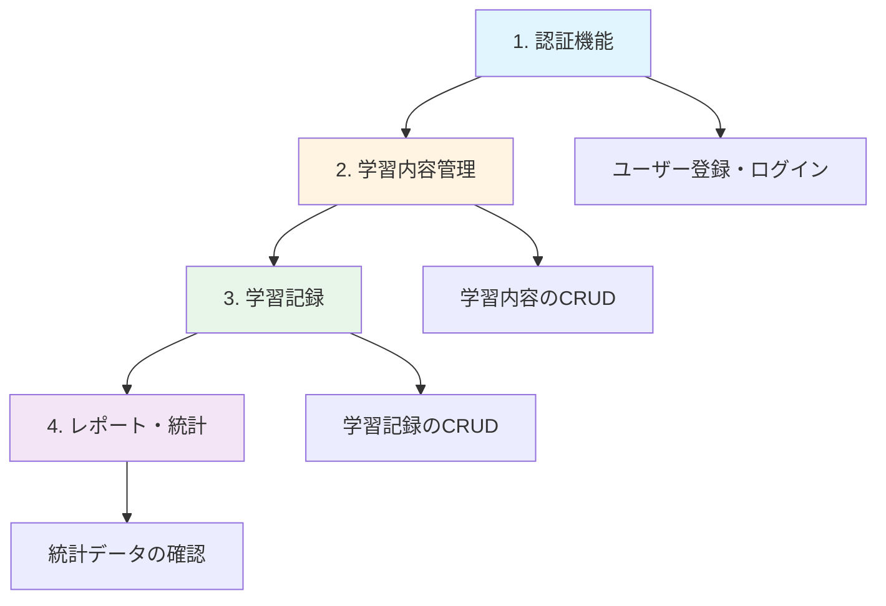

LearnTrack Proの全機能に関する手動テスト手順書です。

本手順書は4つのテストカテゴリで構成されており、認証機能から学習管理、レポート機能まで、アプリケーションの品質保証に必要なすべてのテスト項目を網羅しています。

---

## 概要

### 目的

- **品質保証**: 機能追加・修正後のデグレード防止
- **仕様理解**: 期待される動作の明確化
- **面接対策**: 実装した機能の動作を自信を持って説明できる

### テスト対象

- フロントエンド（Vue.js 3）のUI/UX
- バックエンド（Laravel 12）のAPIレスポンス
- フロントエンド ↔ バックエンド間のデータ整合性

---

## テストカテゴリ一覧

### 1. 認証機能

- [authentication-manual-tests.md](./authentication-manual-tests.md)
- [Notion](https://www.notion.so/28a9d86c12e880be877fe9f3ad278ef4?pvs=21)

**テスト範囲**:

1. ユーザー登録（バリデーション、重複チェック）
2. ログイン（認証成功/失敗）
3. ログアウト（セッション破棄）
4. パスワードリセット（メール送信、トークン検証）
5. プロフィール表示・編集
6. プロフィール画像アップロード

**関連機能**: 認証、ユーザー管理

---

### 2. 学習内容管理

- [learning-content-manual-tests.md](./learning-content-manual-tests.md)
- [Notion](https://www.notion.so/28a9d86c12e8809abd88cae6ab2080b5?pvs=21)

**テスト範囲**:

1. 学習内容一覧（ダッシュボード表示、ソート）
2. 学習内容新規作成（ウィザード形式、バリデーション）
3. 学習内容詳細（進捗表示、セクション一覧）
4. 学習内容編集（既存情報の更新）
5. 学習内容の削除（関連データの削除確認）
6. 学習内容の完了/再開（ステータス切り替え）

**関連機能**: 学習内容管理、セクション管理

---

### 3. 学習記録

- [learning-session-manual-tests.md](./learning-session-manual-tests.md)
- [Notion](https://www.notion.so/28a9d86c12e880fc97bcf38d1c9924c3?pvs=21)

**テスト範囲**:

1. 学習記録作成（日付選択、時刻入力、バリデーション）
2. 学習記録編集（既存記録の更新）
3. 学習記録削除（確認モーダル、統計情報の更新）
4. セクション別学習記録一覧（フィルタリング、ページネーション）

**関連機能**: 学習記録管理、セクション管理

---

### 4. レポート・統計機能

- [reports-manual-tests.md](./reports-manual-tests.md)
- [Notion](https://www.notion.so/28a9d86c12e880e98099fe5f4882845e?pvs=21)

**テスト範囲**:

1. 全体レポート（統計サマリー、月別/技術別グラフ）
2. 個別レポート（日別学習時間グラフ、学習記録一覧）

**関連機能**: レポート・統計

---

## テスト実行の流れ

---

## テスト環境

### 前提条件

- ローカル開発環境またはステージング環境
- テスト用ユーザーアカウント
- 初期データ（技術スタック、カテゴリ）が登録済み

### 推奨ブラウザ

- Chrome（最新版）
- Safari（最新版）
- Firefox（最新版）

---

## 完了チェックリスト

### 認証機能

- [x]  ユーザー登録が正常に動作する
- [x]  ログイン/ログアウトが正常に動作する
- [x]  パスワードリセットが正常に動作する
- [x]  プロフィール編集が正常に動作する
- [x]  プロフィール画像アップロードが正常に動作する

### 学習内容管理

- [x]  学習内容の作成（ウィザード形式）が正常に動作する
- [x]  学習内容の編集が正常に動作する
- [x]  学習内容の削除が正常に動作する
- [x]  学習内容の完了/再開が正常に動作する

### 学習記録

- [x]  学習記録の作成が正常に動作する
- [x]  学習記録の編集が正常に動作する
- [x]  学習記録の削除が正常に動作する
- [x]  セクション別一覧が正常に表示される

### レポート・統計

- [x]  全体レポートが正常に表示される
- [x]  個別レポートが正常に表示される
- [x]  グラフが正しく描画される

---

## トラブルシューティング

各詳細ドキュメントに「APIエラーハンドリング」セクションがあります。テスト中に問題が発生した場合は以下を参照してください：

- 認証エラー
  - [authentication-manual-tests.md](./authentication-manual-tests.md)
  - [Notion](https://www.notion.so/28a9d86c12e880be877fe9f3ad278ef4?pvs=21)
- 学習内容の操作エラー
  - [learning-content-manual-tests.md](./learning-content-manual-tests.md)
  - [Notion](https://www.notion.so/28a9d86c12e8809abd88cae6ab2080b5?pvs=21)
- 学習記録の操作エラー
  - [learning-session-manual-tests.md](./learning-session-manual-tests.md)
  - [Notion](https://www.notion.so/28a9d86c12e880fc97bcf38d1c9924c3?pvs=21)
- レポート表示エラー
  - [reports-manual-tests.md](./reports-manual-tests.md)
  - [Notion](https://www.notion.so/28a9d86c12e880e98099fe5f4882845e?pvs=21)

---

## 参考資料

### 関連ドキュメント

APIエラーハンドリング手動テストリスト

- [api-error-handling-manual-test-list.md](../api-error-handling-manual-test-list.md)
- [Notion](https://www.notion.so/API-c4c56afcb55b45d9af6f9b96e1771e4a?pvs=21)

---
