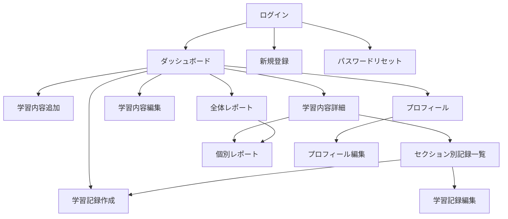
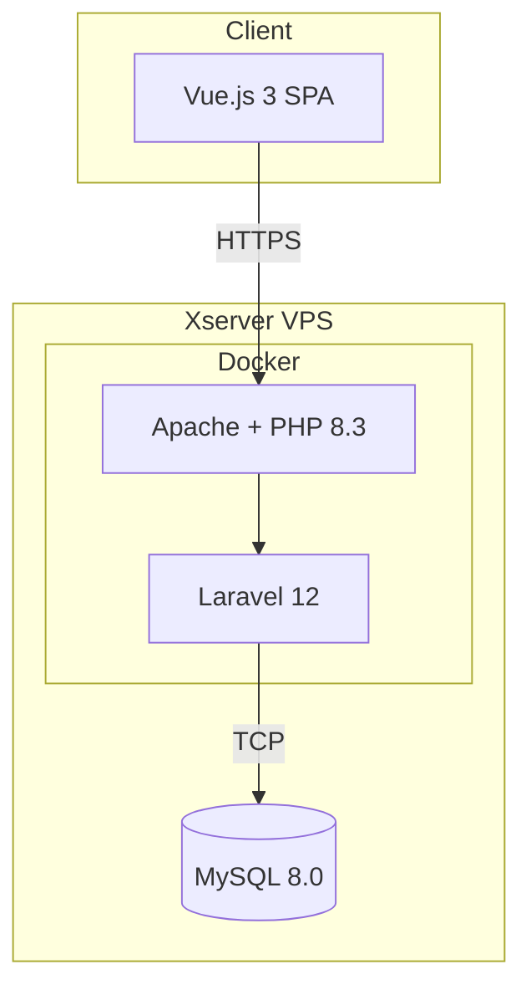
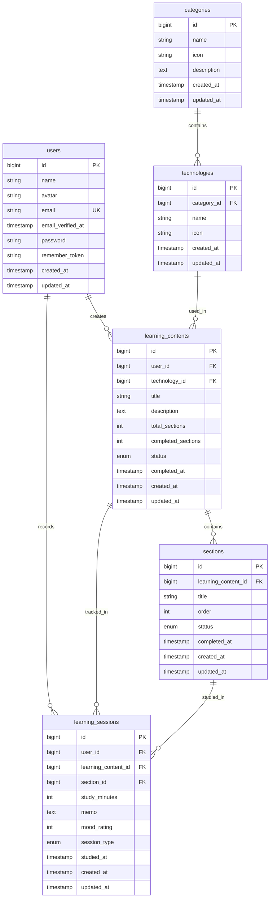

## LearnTrack Pro

**プログラミング学習管理プラットフォーム**

Laravel 12 と Vue.js 3 を用いたモダンなSPAアプリケーション。プログラミング学習に特化した進捗管理・学習記録機能を提供します。

---

## プロジェクト概要

### 開発目的

転職活動用ポートフォリオとして、モダンな技術スタックを用いた実用的なWebアプリケーションを開発。

### ターゲットユーザー

- 企業の採用担当者および技術者
- プログラミング学習者

### StudyPlus（参考アプリ）との差別化

[学習総合サイト Studyplus(スタディプラス)](https://app.studyplus.jp/)

| **項目** | **StudyPlus** | **LearnTrack Pro** |
| --- | --- | --- |
| 対象 | 書籍・教材ベースの汎用学習 | **プログラミング学習特化** |
| 学習内容 | 書籍登録が前提 | **教材に依存しない柔軟な管理** |
| 核心的価値 | 教材の進捗管理 | **「ポートフォリオ作成実践」「環境構築」など書籍が存在しない学習に対応** |

---

## 主な機能

### 1. 認証機能

- ユーザー登録・ログイン・ログアウト
- パスワードリセット（メール送信）
- プロフィール表示・編集

### 2. 学習内容管理

- 技術カテゴリ選択による学習内容登録
- セクション単位での進捗管理（ドラッグ&ドロップ対応）
- 学習内容の完了/再開機能
- カスケード削除（関連する学習記録も削除）

### 3. 学習記録機能

- 手動での学習時間記録
- 学習日時・メモ・調子（1-5段階）の記録
- セクション別の学習履歴一覧

### 4. レポート・統計機能

- 週間/月間学習時間推移チャート（棒グラフ）
- 技術分野別学習時間（円グラフ）
- 個別学習内容の詳細レポート（折れ線グラフ）

---

## 画面フロー



### Figma

https://www.figma.com/design/3QfeLGfKLIqW8MUgVM8P40/%E7%94%BB%E9%9D%A2%E3%83%95%E3%83%AD%E3%83%BC?node-id=0-1&p=f&t=5xCCks9RSP20PNbD-0

---

## デモ

### アプリケーションURL

https://learn-track-pro.xvps.jp/login

### テストアカウント

| 項目 | 値 |
| --- | --- |
| メールアドレス | `taro.yamada@example.com` |
| パスワード | `password` |

### 新規ユーザー登録

| 項目 | 制約 |
| --- | --- |
| 名前 | 1〜50文字（英数字・日本語・空白文字のみ） |
| メールアドレス | 255文字以内（標準的なメールアドレス形式） |
| パスワード | 8文字以上 |

### リポジトリ構成について

本リポジトリは**Laravelアプリケーションのみ**を管理しています。Docker設定やインフラ構成は含まれていないため、ローカル環境でのセットアップ手順は提供していません。

---

## 技術スタック

### Backend

| 技術 | バージョン | 用途 |
| --- | --- | --- |
| PHP | 8.3+ | サーバーサイド言語 |
| Laravel | 12.x | Webフレームワーク |
| Laravel Sanctum | - | SPA認証（Cookieベース） |
| Laravel Fortify | - | 認証バックエンド |
| MySQL | 8.0 | データベース |

### Frontend

| 技術 | バージョン | 用途 |
| --- | --- | --- |
| Vue.js | 3.x | UIフレームワーク（Composition API） |
| Pinia | - | 状態管理 |
| Vue Router | - | ルーティング |
| Tailwind CSS | - | スタイリング |
| Chart.js | - | グラフ描画 |
| Vite | - | ビルドツール |

### Infrastructure

| 技術 | 用途 |
| --- | --- |
| Docker / Docker Compose | 開発・本番環境コンテナ化 |
| Apache | Webサーバー |
| Xserver VPS | 本番ホスティング |
| Let's Encrypt | SSL証明書 |
| fail2ban | セキュリティ（ブルートフォース対策） |

### 開発ツール

| ツール | 用途 |
| --- | --- |
| Git / GitHub | バージョン管理 |
| Apidog | API設計・テスト |
| VS Code/Google Antigravity | エディタ |
| Gemini CLI / Claude | AI駆動開発 |

---

## アーキテクチャ

### システム構成図



### レイヤー構成

```jsx
┌─────────────────────────────────────────────────────┐
│                    Vue.js (SPA)                     │
├─────────────────────────────────────────────────────┤
│  Views → Components → Composables → Stores → API   │
└─────────────────────────────────────────────────────┘
                         ↓ HTTP
┌─────────────────────────────────────────────────────┐
│                   Laravel (API)                     │
├─────────────────────────────────────────────────────┤
│  Routes → Controllers → Models → Database          │
│            ↓                                        │
│      FormRequest (Validation)                       │
│      Resources (Response)                           │
│      Policies (Authorization)                       │
└─────────────────────────────────────────────────────┘
```

### ER図



---

## 開発で工夫した点

### 1. APIファーストアプローチ

- Apidogを用いたAPI設計を先行
- フロントエンド/バックエンドの並行開発を実現
- 明確なインターフェース定義による品質向上

### 2. セキュリティ設計

- Laravel Sanctum による SPA認証（CSRF保護）
- fail2ban によるブルートフォース攻撃対策
- SSL/TLS による通信暗号化
- 環境別設定ファイルの Git 戦略（`.gitattributes` による保護）

### 3. 本番環境の安定性

- MySQL をホスト直接インストール（メモリ2GB環境での安定性確保）
- Docker コンテナのリソース制限（メモリ1GB上限）
- DBの自動バックアップ（cron による毎日4時実行）

### 4. コード品質

- Composables と Stores の責務分離
- FormRequest によるバリデーション一元管理
- API Resources によるレスポンス整形

---

## AI駆動開発の実践

### 開発思想

- AIを「補助ツール」ではなく「**協働パートナー**」として位置づけ
- **最終的な責任はエンジニア自身が負う**という原則を徹底
- AI出力の鵜呑みは禁物、必ず検証が必要

### 活用したAIツール

| **ツール** | **用途** |
| --- | --- |
| Gemini CLI/Google Antigravity | コード生成・ドキュメント検証・ワークフロー自動化 |
| Claude | 設計相談・コードレビュー・ドキュメント整理 |
| Notion AI | ドキュメント要約・整理 |

### 具体的な活用例

- **`GEMINI.md`を単一情報源としたドキュメント整合性検証**
    - バージョン情報・技術スタック・参照ドキュメントを`GEMINI.md`に集約
    - カテゴリ別に段階実行する検証ワークフローを構築
- **AI対話による設計判断の言語化と記録**
    - 「なぜそう設計したか」をAIとの対話履歴として残す
    - 議論の要点を体系的にまとめ、意思決定の根拠を明文化
- **プロンプト設計の体系化**
    - アプリケーションロジック理解用プロンプト集を作成
    - 再利用可能なプロンプトテンプレートの整備

### 学んだこと

- AIとの対話履歴が「なぜそう設計したか」の記録になる
- 検証ロジックはシンプルに保ち、単一情報源を徹底する
- AI協業においても、説明責任・予測可能性・再現性が必須

---

## 開発情報

| 項目 | 内容 |
| --- | --- |
| 事前準備期間：2025年8月4日〜9月8日（23日間） | 要件定義、設計、環境・基盤整備、API設計、UI/UX作成・統合 |
| 開発期間：2025年9月3日〜10月11日（6週間） | Laravel API実装、レイアウト調整、手動テスト |
| 追加対応：10月13日〜10月22日（9日間） | APIエラーハンドリング・例外処理の実装、レスポンシブ対応 |
| VPSデプロイ：10月23日〜11月10日（18日間） | Ubuntu設定、MYSQL設定、Docker設定、アプリケーション動作環境の構築、デプロイ実行 |
| 開発手法 | APIファーストアプローチ + AI駆動開発 |
| 現在の状態 | MVP完成、改善フェーズ |

---

## 今後の展望

### 優先度: 高

- [ ]  CI/CD パイプライン構築（GitHub Actions）
- [ ]  プロフィール画像アップロード機能

### 優先度: 中

- [ ]  Service層リファクタリング
- [ ]  自動テスト拡充

### 優先度: 低

- [ ]  ストップウォッチ機能（リアルタイム計測）
- [ ]  学習目標設定機能

---

## 関連ドキュメント

### プロジェクト情報

- [要件定義書](https://github.com/SHUN5872698/learn-track-pro/blob/main/.gemini/docs/project-infos/requirements-specification.md)
- [ドキュメント構成ディレクトリ](https://github.com/SHUN5872698/learn-track-pro/blob/main/.gemini/docs/project-infos/document-structure.md)

### API

- [API設計](https://github.com/SHUN5872698/learn-track-pro/blob/main/.gemini/docs/apis/endpoint-docs/README.md)

### システム設計

- [APIエラーハンドリング・例外処理の実装仕様書](https://github.com/SHUN5872698/learn-track-pro/blob/main/.gemini/docs/architectures/api-error-handling-specification.md)

### データベース

- [テーブル定義書](https://github.com/SHUN5872698/learn-track-pro/blob/main/.gemini/docs/databases/database-schema-definition.md)

### UI/UXデザイン

- [簡易設計&画面フロー](https://github.com/SHUN5872698/learn-track-pro/blob/main/.gemini/docs/designs/basic-design-and-screen-flow.md)

### 設計上の意思決定

- [開発から学んだこと](https://github.com/SHUN5872698/learn-track-pro/blob/main/.gemini/docs/decisions/lessons-learned.md)
- [レスポンシブ対応の実装方針（TailwindCSS）](https://github.com/SHUN5872698/learn-track-pro/blob/main/.gemini/docs/decisions/responsive-design-strategy.md)

### 開発ワークフロー/コーディング規約

- [Laravel コーディング規約](https://github.com/SHUN5872698/learn-track-pro/blob/main/.gemini/docs/development-processes/laravel-coding-standards.md)
- [Vue.js コーディング規約](https://github.com/SHUN5872698/learn-track-pro/blob/main/.gemini/docs/development-processes/vue-coding-standards.md)
- [コンソールログの扱い](https://github.com/SHUN5872698/learn-track-pro/blob/main/.gemini/docs/development-processes/console-log-handling.md)

### テスト戦略

- [手動テスト手順書（概要）](https://github.com/SHUN5872698/learn-track-pro/blob/main/.gemini/docs/tests/manual/README.md)
- [APIエラーハンドリング手動テストリスト](https://github.com/SHUN5872698/learn-track-pro/blob/main/.gemini/docs/tests/api-error-handling-manual-test-list.md)

---
